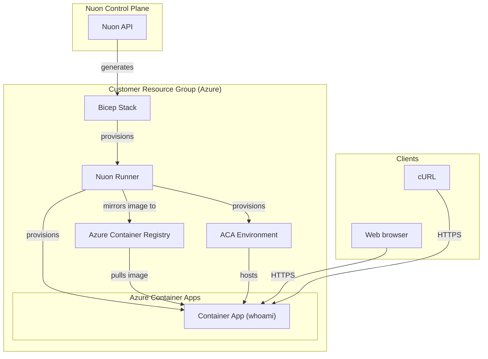

<center>

<h1>ACA Medium</h1>

<small>
{{ if .nuon.install_stack.outputs }} Azure | {{ dig "resource_group_name" "rg-000000" .nuon.install_stack.outputs }} |
{{ .nuon.cloud_account.azure.location }} {{ else }} Azure | rg-000000 | xx-vvvv-00
{{ end }}
</small>

[https://{{.nuon.components.whoami.outputs.fqdn}}](https://{{.nuon.components.whoami.outputs.fqdn}})

</center>

The sandbox provisions `{{.nuon.install.id}}.{{.nuon.inputs.inputs.root_domain}}`
as a Nuon-managed public DNS zone. The DNS delegation action validates its
nameserver delegation after the application deploys.

## Components



### Whoami

A simple HTTP echo service deployed as an Azure Container App with built-in HTTPS ingress.

### DNS

The root domain input defaults to `nuon.co`; use `stage.nuon.co` or another
delegable Nuon-controlled parent domain for non-production environments.

## Prerequisites

The Azure subscription must have the following resource providers registered:

```bash
az provider register --namespace Microsoft.App
az provider register --namespace Microsoft.OperationalInsights
az provider register --namespace Microsoft.ContainerRegistry
```

Check registration status with:

```bash
az provider show --namespace Microsoft.App --query "registrationState"
```


