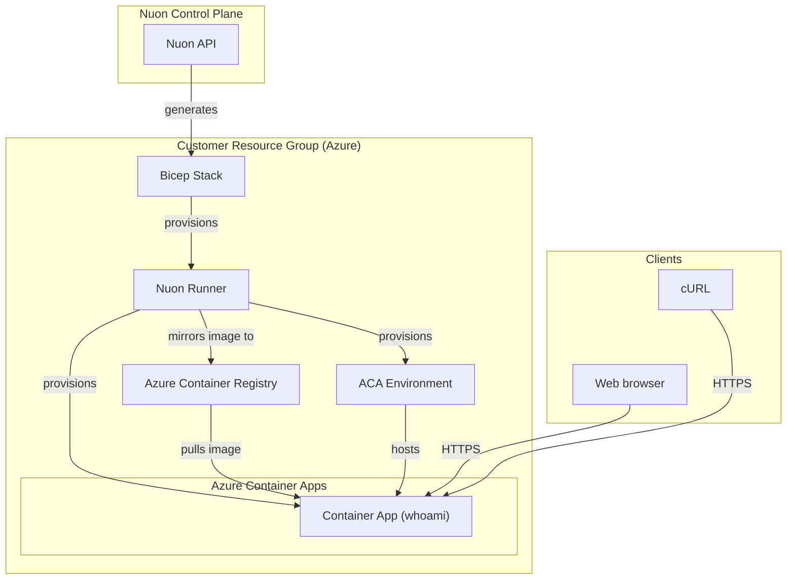

### What this app does?

A simple example of provisioning an Azure Container Apps environment with a `whoami` HTTP server.

### Prerequisites

- Azure subscription connected to Nuon (handled during onboarding)

### How to install/What to expect next?

- Clicking install will generate a link for you to deploy a Bicep template in Azure which creates the VNet, VM, and a runner, an agent that receives jobs to deploy whoami in your resource group
- If configured, you may be prompted to approve plan steps
- Average installation time is 30 minutes due to creating the VNet, VM, ACA environment, and app components

### What gets deployed in your cloud account?

- Dedicated VNet
- Azure Container Apps environment
- whoami container app
- A whoami container image (mirrored to ACR)
- Azure Container Registry
- DNS records

### What inputs can you enter?

- Azure region
- Public domain
- Subdomain

### Security & compliance

- [Nuon BYOC trust center](https://docs.nuon.co/guides/vendor-customers)
- All resource provisioning and scripts are performed by an agent in a VM in your VNet - no cross-account access granted to the vendor

### Nuon concepts

The following terminology is core to the Nuon BYOC platform.

#### Connect Your App | App Config
- App (collection of TOML config files that provision and manage the whoami app in your cloud account)
- Sandbox (the underlying infrastructure, in this case an ACA environment)
- Component (the Terraform to deploy whoami Container App, container image, and DNS record)
- Inputs (dynamic values specific to the install e.g., public domain, subdomain)

#### Support Customer Infrastructure | Customer Config

- Installs (Installs are instances of an application in your (the customer) cloud account.)
- Stack (the Azure Bicep deployment that provisions the VNet, subnets, IAM roles, VM and Runner (agent) Docker service)
- Runners (Egress-only agents deployed in customer cloud accounts that execute all provisioning, deployment, and day-2 operations.)
- Operational Roles (Azure RBAC roles for least-privilege access across sandbox, components, and actions.)

#### Continuous Delivery | Day-2 Operations

- Workflows (Orchestration of the deployment, update & teardown lifecycle of apps, components, and actions)
- Actions (Bash scripts for health checks, migrations, debugging, and day-2 operations)
- Policies (Rego & Kyverno configs to enforce compliance and security rules at infrastructure plan steps)
- Customer Portal (A customer-facing web dashboard to initiate and monitor an app's install in a customer's resource group)
