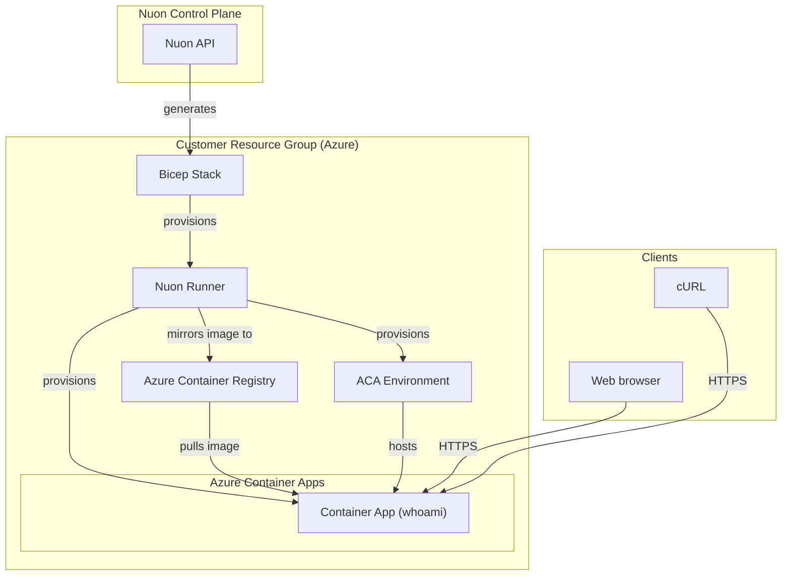

<center>

<h1>ACA Simple</h1>

<small>
{{ if .nuon.install_stack.outputs }} Azure | {{ dig "resource_group_name" "rg-000000" .nuon.install_stack.outputs }} |
{{ .nuon.cloud_account.azure.location }} {{ else }} Azure | rg-000000 | xx-vvvv-00
{{ end }}
</small>

[https://{{.nuon.inputs.inputs.sub_domain}}.{{.nuon.install.sandbox.outputs.public_domain.name}}](https://{{.nuon.inputs.inputs.sub_domain}}.{{.nuon.install.sandbox.outputs.public_domain.name}})

</center>

## Components



### Whoami

A simple HTTP echo service deployed as an Azure Container App with built-in HTTPS ingress.

## Prerequisites

The Azure subscription must have the following resource providers registered:

```bash
az provider register --namespace Microsoft.App
az provider register --namespace Microsoft.OperationalInsights
az provider register --namespace Microsoft.ContainerRegistry
```

Check registration status with:

```bash
az provider show --namespace Microsoft.App --query "registrationState"
```

## Full State

Click "Manage > State"
