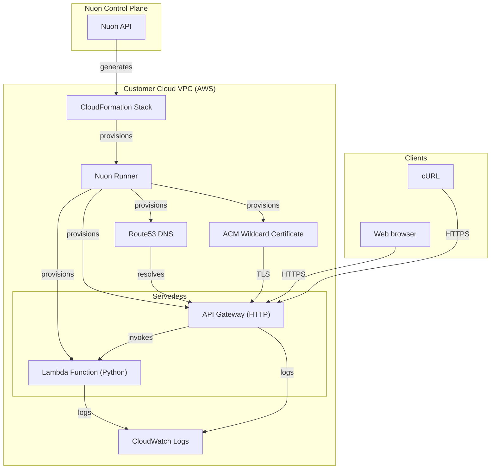

### What this app does?

A serverless API deployed on AWS Lambda with API Gateway and Route53 DNS. The function is packaged as a zip deployment on a managed Python runtime and increments an in-memory counter per widget id on each request.

### Prerequisites

- A valid AWS account

### How to install/What to expect next?

- Clicking install will generate a link for you to log into AWS and create a CloudFormation stack which creates the VPC, EC2 VM, and a runner, an agent that receives jobs to deploy the Lambda API in your VPC
- If configured, you may be prompted to approve plan steps
- Average installation time is 20 minutes due to creating the VPC, VM, Lambda function, API Gateway, and DNS records

### What gets deployed in your cloud account?

- Dedicated VPC with public subnet
- Lambda function on a managed Python runtime (zip deployment)
- API Gateway (HTTP) with route-based Lambda integration
- ACM wildcard certificate
- Route53 DNS records
- CloudWatch Logs for Lambda and API Gateway

### What inputs can you enter?

- Public domain
- Subdomain (default: `api`)

### Security & compliance

- [Nuon BYOC trust center](https://docs.nuon.co/guides/vendor-customers)
- All resource provisioning and scripts are performed by an agent in a VM in your VPC - no cross-account access granted to the vendor
- API Gateway throttled to 100 burst / 100 req/sec

### Nuon concepts

The following terminology is core to the Nuon BYOC platform.

#### Connect Your App | App Config
- App (collection of TOML config files that provision and manage the Lambda API in your cloud account)
- Sandbox (the underlying infrastructure, in this case a minimal VPC with public subnet and Route53 DNS)
- Component (Terraform to deploy the Lambda function, ACM certificate, and API Gateway)
- Inputs (dynamic values specific to the install e.g., public domain, subdomain)
- Secrets (sensitive values either auto-created or entered by the customer during Stack creation - stored in AWS Secrets Manager)

#### Support Customer Infrastructure | Customer Config

- Installs (Installs are instances of an application in your (the customer) cloud account.)
- Stack (the AWS CloudFormation stack that provisions the VPC, subnets, IAM roles, ASG, EC2 VM and Runner (agent) Docker service)
- Runners (Egress-only agents deployed in customer cloud accounts that execute all provisioning, deployment, and day-2 operations.)
- Operational Roles (IAM roles to perform different operations for least-privilege access across sandbox, components, and actions.)

#### Continuous Delivery | Day-2 Operations

- Workflows (Orchestration of the deployment, update & teardown lifecycle of apps, components, and actions)
- Actions (Bash scripts for health checks, migrations, debugging, and day-2 operations)
- Policies (Rego & Kyverno configs to enforce compliance and security rules at infrastructure plan steps)
- Customer Portal (A customer-facing web dashboard to initiate and monitor an app's install in a customer's VPC)
