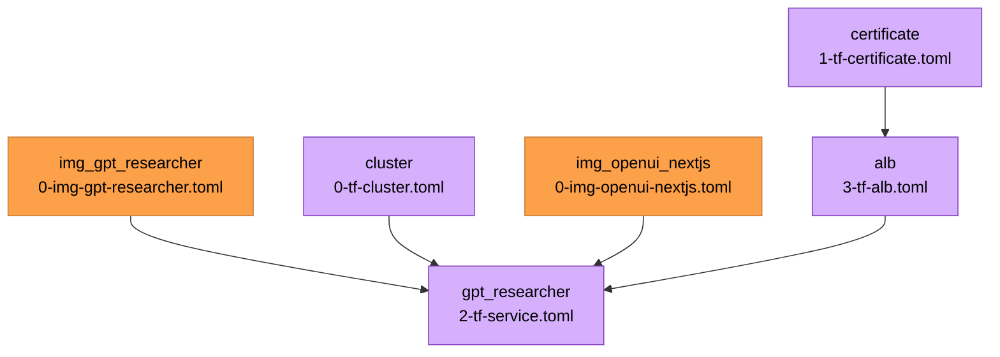

{{ $region := .nuon.cloud_account.aws.region }}

<h1>BYO-LLM: GTP Researcher</h1>

<small>
{{ if .nuon.install_stack.outputs }} AWS | {{ dig "account_id" "000000000000" .nuon.install_stack.outputs }} |
{{ dig "region" "xx-vvvv-00" .nuon.install_stack.outputs }} |
{{ dig "vpc_id" "vpc-000000" .nuon.install_stack.outputs }} {{ else }} AWS | 000000000000 | xx-vvvv-00 | vpc-000000
{{ end }}
</small>

[UI](https://openui.{{.nuon.sandbox.outputs.nuon_dns.public_domain.name}}) |
[API](https://openui.{{.nuon.sandbox.outputs.nuon_dns.public_domain.name}})

## Components

## Application Overview

GPT Researcher is an AI-powered research assistant that leverages large language models to conduct comprehensive
research on any given topic. The application consists of:

- **Backend API** (gpt-researcher): FastAPI-based service running on port 8000 with WebSocket support for real-time
  streaming research results
- **Frontend UI** (openui-nextjs): Next.js web application running on port 3000

### Architecture

- **ECS Fargate**: Both containers run in a single task definition for efficient communication
- **Application Load Balancer**: Routes traffic with WebSocket support enabled
  - API endpoint: `api.<domain>` (port 8000, with `/ws` WebSocket endpoint)
  - UI endpoint: `<subdomain>.<domain>` (port 3000)
- **Security**: Private subnets for ECS tasks, ALB in public subnets with proper security group configurations

### Key Features

- Real-time research streaming via WebSockets
- Persistent WebSocket connections with 1-hour idle timeout
- Session stickiness for stable API connections
- Secrets management via AWS Secrets Manager (OpenAI API key)
