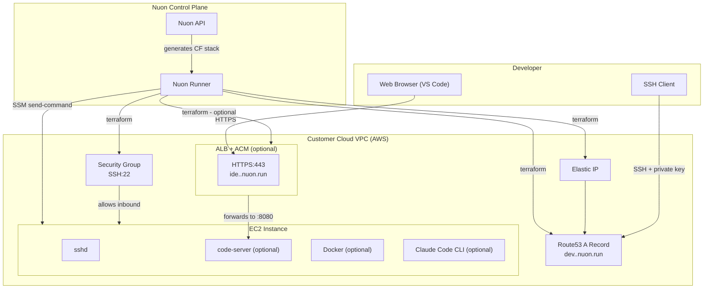

# Cloud Dev Environment

{{ if .nuon.install_stack.outputs }}
AWS | {{ dig "account_id" "000000000000" .nuon.install_stack.outputs }} | {{ .nuon.cloud_account.aws.region }} | {{ dig "vpc_id" "vpc-000000" .nuon.install_stack.outputs }}
{{ else }}
AWS | 000000000000 | xx-xxxx-00 | vpc-000000
{{ end }}

A personal cloud development environment running in your AWS account. Connect via SSH with your private key, or open VS Code in the browser if you enabled it during setup.

SSH: `ssh {{ .nuon.components.ec2.outputs.ssh_user }}@{{ .nuon.components.ec2.outputs.ssh_hostname }}`

{{ if .nuon.components.ec2.outputs.vscode_url }}
VS Code Web: [{{ .nuon.components.ec2.outputs.vscode_url }}]({{ .nuon.components.ec2.outputs.vscode_url }})
{{ end }}

## Architecture

## Cost estimate

Instance cost depends on the type selected at install time. At default (`t3a.xlarge`):

- EC2 (t3a.xlarge, running): ~$3.40/day
- Elastic IP (unattached): $0.005/hr
- ALB (if VS Code Web enabled): ~$0.60/day

Stop the VM via the portal when not in use to pause EC2 billing. The Elastic IP and DNS record persist through stop/start cycles so your SSH hostname never changes.

## About this App Config

Provisions a single EC2 VM with SSH key authentication, optional VS Code Web via HTTPS, optional Docker, and optional Claude Code CLI. The runner uses AWS SSM to execute all post-provision setup — no additional inbound ports required beyond SSH.
