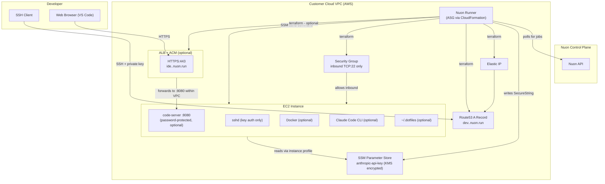

# Cloud Dev Environment

**SSH:** `ssh {{ .nuon.components.ec2.outputs.ssh_user }}@{{ .nuon.components.ec2.outputs.ssh_hostname }}`

**Zed:** `zed ssh://{{ .nuon.components.ec2.outputs.ssh_user }}@{{ .nuon.components.ec2.outputs.ssh_hostname }}`

**VS Code:** open the [Remote - SSH](https://marketplace.visualstudio.com/items?itemName=ms-vscode-remote.remote-ssh) extension, then `Cmd+Shift+P` → `Remote-SSH: Connect to Host` → `{{ .nuon.components.ec2.outputs.ssh_user }}@{{ .nuon.components.ec2.outputs.ssh_hostname }}`

{{ if .nuon.components.ec2.outputs.vscode_url -}}
**VS Code Web:** [{{ .nuon.components.ec2.outputs.vscode_url }}]({{ .nuon.components.ec2.outputs.vscode_url }})

{{ end -}}
A personal cloud development environment running in your AWS account. Connect via SSH with your private key, open VS Code in the browser if enabled, and have your dotfiles installed automatically on first boot.

## Status

{{ if .nuon.actions.populated -}}
{{- $vsCodeEnabled := .nuon.install.inputs.install_vscode_web -}}
{{- $vmStopped := eq (dig "status" "" .nuon.actions.workflows.healthcheck_ec2) "error" -}}
*Checks run every 5 minutes. Last results:*

{{ with .nuon.actions.workflows.healthcheck_ec2 -}}
**EC2 VM ({{ $.nuon.install.inputs.instance_type }}):** {{ if eq .status "finished" }}🟢 running{{ else if eq .status "error" }}🔴 stopped{{ else }}🟡 unknown{{ end }}

{{ end -}}
{{ with .nuon.actions.workflows.healthcheck_ssh -}}
**SSH Access:** {{ if $vmStopped }}🔴 inaccessible (VM stopped){{ else if eq .status "finished" }}🟢 reachable{{ else if eq .status "error" }}🔴 unreachable{{ else }}🟡 unknown{{ end }}

{{ end -}}
{{ if eq $vsCodeEnabled "true" -}}
{{ with .nuon.actions.workflows.healthcheck_code_server -}}
**VS Code Web process:** {{ if $vmStopped }}🔴 not running (VM stopped){{ else if eq .status "finished" }}🟢 running{{ else if eq .status "error" }}🔴 not running{{ else }}🟡 unknown{{ end }}

{{ end -}}
{{ with .nuon.actions.workflows.healthcheck_alb -}}
**ALB (for VS Code Web):** {{ if eq .status "finished" }}{{ if eq .outputs.http_status "503" }}🟡 503 — ALB up, no healthy targets (VM off){{ else }}🟢 reachable{{ end }}{{ else if eq .status "error" }}🔴 unreachable{{ else }}🟡 unknown{{ end }}

{{ end -}}
{{ end -}}
{{ with .nuon.actions.workflows.connections_status -}}
**Active SSH Sessions:** {{ if $vmStopped }}🔴 VM stopped{{ else if eq .status "finished" }}{{ .outputs.ssh_count }}{{ range .outputs.ssh_clients }}
- {{ . }}{{ end }}{{ else if eq .status "error" }}🔴 VM unreachable{{ else }}🟡 unknown{{ end }}

{{ if eq $vsCodeEnabled "true" }}
**Active VS Code Web Sessions:** {{ if $vmStopped }}🔴 VM stopped{{ else if eq .status "finished" }}{{ .outputs.vscode_count }}{{ range .outputs.vscode_clients }}
- {{ . }}{{ end }}{{ else if eq .status "error" }}🔴 VM unreachable{{ else }}🟡 unknown{{ end }}

{{ end }}{{ end -}}
{{ else }}
*Waiting for first healthcheck run — checks run every 5 minutes.*
{{ end -}}

## Actions

**post_provision_setup** (auto on provision, re-runnable) — installs Docker, VS Code Web, Claude Code, and configures git user name/email based on your install inputs.

**install_dotfiles** (auto on provision, re-runnable) — clones your dotfiles repo to `~/.dotfiles` and runs `install.sh`. Re-run any time from the portal to pull updates.

**add_ssh_key** (manual) — appends an additional SSH public key to `~/.ssh/authorized_keys`. Takes a key as input; prints fingerprints of all authorized keys after.

**install_claude_code** (manual) — installs or updates Claude Code CLI to the latest version independently of the initial setup.

**healthcheck_ec2** (cron every 5 min, manual) — checks EC2 instance state via AWS API.

**healthcheck_ssh** (cron every 5 min, manual) — checks SSH port 22 reachability.

**healthcheck_code_server** (cron every 5 min, manual) — checks code-server process is listening on :8080 via SSM. No-op if VS Code not enabled.

**healthcheck_alb** (cron every 5 min, manual) — checks VS Code Web ALB reachability via HTTPS. No-op if VS Code not enabled.

**connections_status** (cron every 5 min, manual) — reports active SSH and VS Code Web connection counts and client IPs via SSM.

**start_dev_env** (manual) — starts a stopped VM and echoes the SSH connect string when ready.

**stop_dev_env** (manual) — stops the VM to pause EC2 billing. Elastic IP and DNS record are preserved.

## Cost Savings

**Inactive auto-stop** — shuts down the VM after N hours of no active SSH or VS Code connections. Configured via the `auto_stop_inactive_hours` install input (default 2h, blank to disable). Installed as a cron job by `post_provision_setup`.

**Force auto-stop** — shuts down the VM after N hours of uptime since last start, regardless of activity. Configured via the `auto_stop_max_hours` install input (default 4h, blank to disable). Installed as a cron job by `post_provision_setup`.

## Architecture

## Security

**Your data stays in your AWS account.** The VM, its storage, and all code you work on run entirely within your VPC. Nuon's control plane never has network access to the instance.

**SSH key authentication only.** The public key you provide at install time is the only key authorized to connect. Password authentication is disabled at provision time, so no other user can access the instance. You can update your SSH public key, git name, git email, and dotfiles repo URL at any time from the install inputs in the portal — re-run the relevant action after saving to apply the change.

**No inbound ports beyond SSH.** The security group allows inbound TCP:22 only. Post-provision setup (Docker, VS Code, Claude Code) is executed by the runner via AWS SSM Run Command — an outbound-only control channel — so no additional ports need to be opened.

**VS Code Web is TLS-only and password-protected.** If enabled, code-server runs on the VM on port 8080 behind password authentication. The ALB terminates HTTPS with an ACM-managed certificate. Traffic from the ALB to code-server stays within the VPC on a separate security group rule that only allows traffic from the ALB. The VS Code Web password is set at install time so it is ready if you enable VS Code Web now or later; it is not used if VS Code Web is disabled.

**Anthropic API key is stored as an SSM SecureString.** The key is entered by you at install time and stored encrypted at rest using AWS KMS in your AWS account. The vendor never sees it and has no access to it. The EC2 instance profile is granted least-privilege access to read only its own parameter path.

**The Nuon runner never touches your secrets directly.** The runner operates using an IAM role with a permissions boundary scoped to only the AWS services this app requires (`ec2`, `iam`, `ssm`, `elasticloadbalancing`, `acm`, `route53`). It cannot access other resources in your account.

## Cost estimate

Instance cost depends on the type selected at install time. At default (`t3a.xlarge`):

- EC2 (t3a.xlarge, running): ~$3.40/day
- Elastic IP (unattached): $0.005/hr
- ALB (if VS Code Web enabled): ~$0.60/day

Stop the VM via the portal when not in use to pause EC2 billing. The Elastic IP and DNS record persist through stop/start cycles so your SSH hostname never changes.

By default, the VM also shuts down automatically after 2 hours of inactivity (no SSH or VS Code connections) and after 4 hours of total uptime since last start. Both limits are vendor-configured inputs and can be changed or disabled at install time.
