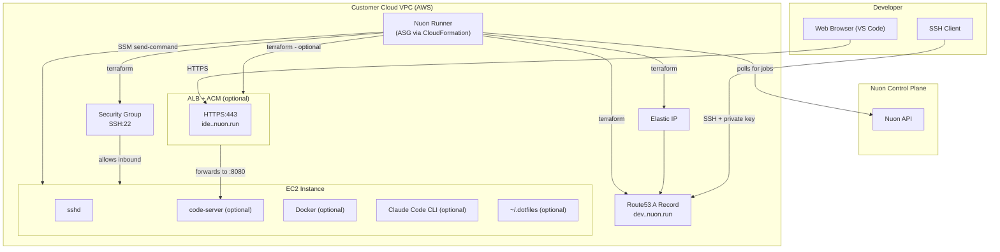

# Cloud Dev Environment

**SSH:** `ssh {{ .nuon.components.ec2.outputs.ssh_user }}@{{ .nuon.components.ec2.outputs.ssh_hostname }}`

**Zed:** `zed ssh://{{ .nuon.components.ec2.outputs.ssh_user }}@{{ .nuon.components.ec2.outputs.ssh_hostname }}`

**VS Code:** open the [Remote - SSH](https://marketplace.visualstudio.com/items?itemName=ms-vscode-remote.remote-ssh) extension, then `Cmd+Shift+P` → `Remote-SSH: Connect to Host` → `{{ .nuon.components.ec2.outputs.ssh_user }}@{{ .nuon.components.ec2.outputs.ssh_hostname }}`

{{ if .nuon.components.ec2.outputs.vscode_url -}}
**VS Code Web:** [{{ .nuon.components.ec2.outputs.vscode_url }}]({{ .nuon.components.ec2.outputs.vscode_url }})

{{ end -}}
A personal cloud development environment running in your AWS account. Connect via SSH with your private key, open VS Code in the browser if enabled, and have your dotfiles installed automatically on first boot.

## Actions

**post_provision_setup** (auto on provision, re-runnable) — installs Docker, VS Code Web, Claude Code, and configures git user name/email based on your install inputs.

**install_dotfiles** (auto on provision, re-runnable) — clones your dotfiles repo to `~/.dotfiles` and runs `install.sh`. Re-run any time from the portal to pull updates.

**add_ssh_key** (manual) — appends an additional SSH public key to `~/.ssh/authorized_keys`. Takes a key as input; prints fingerprints of all authorized keys after.

**install_claude_code** (manual) — installs or updates Claude Code CLI to the latest version independently of the initial setup.

**healthcheck** (manual) — confirms the instance is running and SSH port 22 is reachable. Also checks VS Code Web if enabled.

**start_dev_env** (manual) — starts a stopped VM and echoes the SSH connect string when ready.

**stop_dev_env** (manual) — stops the VM to pause EC2 billing. Elastic IP and DNS record are preserved.

## Architecture

## Security

**Your data stays in your AWS account.** The VM, its storage, and all code you work on run entirely within your VPC. Nuon's control plane never has network access to the instance.

**SSH key authentication only.** The public key you provide at install time is the only key authorized to connect. Password authentication is disabled at provision time, so no other user can access the instance.

**No inbound ports beyond SSH.** The security group allows inbound TCP:22 only. Post-provision setup (Docker, VS Code, Claude Code) is executed by the runner via AWS SSM Run Command — an outbound-only control channel — so no additional ports need to be opened.

**VS Code Web is TLS-only.** If enabled, code-server runs on the VM on port 8080. The ALB terminates HTTPS with an ACM-managed certificate. Traffic from the ALB to code-server stays within the VPC on a separate security group rule that only allows traffic from the ALB.

**Anthropic API key is stored as an SSM SecureString.** The key is entered by you at install time and stored encrypted at rest using AWS KMS in your AWS account. The vendor never sees it and has no access to it. The EC2 instance profile is granted least-privilege access to read only its own parameter path.

**The Nuon runner never touches your secrets directly.** The runner operates using an IAM role with a permissions boundary scoped to only the AWS services this app requires (`ec2`, `iam`, `ssm`, `elasticloadbalancing`, `acm`, `route53`). It cannot access other resources in your account.

## Cost estimate

Instance cost depends on the type selected at install time. At default (`t3a.xlarge`):

- EC2 (t3a.xlarge, running): ~$3.40/day
- Elastic IP (unattached): $0.005/hr
- ALB (if VS Code Web enabled): ~$0.60/day

Stop the VM via the portal when not in use to pause EC2 billing. The Elastic IP and DNS record persist through stop/start cycles so your SSH hostname never changes.

