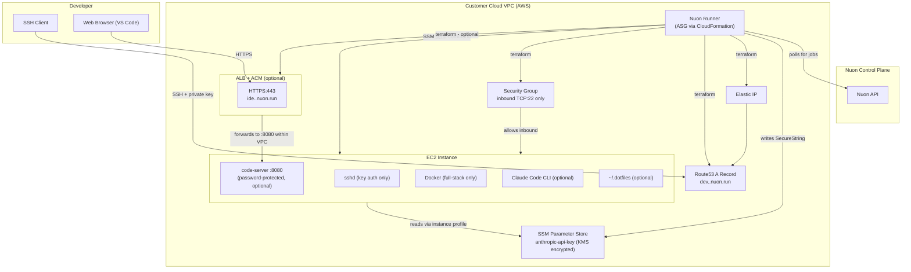

{{ $nuonRoot := default dict .nuon }}
{{ $components := default dict (dig "components" dict $nuonRoot) }}
{{ $ec2 := default dict (dig "ec2" dict $components) }}
{{ $ec2Out := default dict (dig "outputs" dict $ec2) }}
{{ $sshUser := dig "ssh_user" "" $ec2Out }}
{{ $sshHost := dig "ssh_hostname" "" $ec2Out }}
{{ $vscodeURL := dig "vscode_url" "" $ec2Out }}
{{ $labels := default dict (dig "labels" dict $nuonRoot) }}
{{ $tier := dig "tier" "front-end" $labels }}
{{ $pinnedType := ternary "t3a.xlarge" "t3a.medium" (eq $tier "full-stack") }}
{{ $instanceType := dig "instance_type" $pinnedType $ec2Out }}
{{ if eq $instanceType "" }}{{ $instanceType = $pinnedType }}{{ end }}
{{ $actionsMap := default dict (dig "actions" dict $nuonRoot) }}
{{ $workflows := default dict (dig "workflows" dict $actionsMap) }}
{{ $install := default dict (dig "install" dict $nuonRoot) }}
{{ $inputs := default dict (dig "inputs" dict $install) }}
{{ $vsCodeEnabled := dig "install_vscode_web" "" $inputs }}
{{ $actionsPopulated := dig "populated" false $actionsMap }}
{{ $ec2HC := default dict (dig "healthcheck_ec2" dict $workflows) }}
{{ $vmStopped := eq (dig "status" "" $ec2HC) "error" }}

# Cloud Dev Environment

{{ if and $sshUser $sshHost -}}
**SSH:** `ssh {{ $sshUser }}@{{ $sshHost }}`

**Zed:** `zed ssh://{{ $sshUser }}@{{ $sshHost }}`

**VS Code:** open the [Remote - SSH](https://marketplace.visualstudio.com/items?itemName=ms-vscode-remote.remote-ssh) extension, then `Cmd+Shift+P` → `Remote-SSH: Connect to Host` → `{{ $sshUser }}@{{ $sshHost }}`

{{ if $vscodeURL -}}
**VS Code Web:** [{{ $vscodeURL }}]({{ $vscodeURL }})

{{ end -}}
{{ else -}}
**Connect:** SSH host will appear here after the EC2 component finishes provisioning.

{{ end -}}
A personal cloud development environment running in your AWS account. Connect via SSH with your private key, open VS Code in the browser if enabled, and have your dotfiles installed automatically on first boot.

## Status

{{ if $actionsPopulated -}}
*Checks run every 5 minutes. Last results (🟡 means a check is currently running — refresh in a moment):*

{{ with index $workflows "healthcheck_ec2" -}}
**EC2 VM ({{ $instanceType }}):** {{ if eq .status "finished" }}🟢 running{{ else if eq .status "error" }}🔴 stopped{{ else }}🟡 unknown{{ end }}

{{ end -}}
{{ with index $workflows "healthcheck_ssh" -}}
**SSH Access:** {{ if $vmStopped }}🔴 inaccessible (VM stopped){{ else if eq .status "finished" }}🟢 reachable{{ else if eq .status "error" }}🔴 unreachable{{ else }}🟡 unknown{{ end }}

{{ end -}}
{{ if eq $vsCodeEnabled "true" -}}
{{ with index $workflows "healthcheck_code_server" -}}
**VS Code Web process:** {{ if $vmStopped }}🔴 not running (VM stopped){{ else if eq .status "finished" }}🟢 running{{ else if eq .status "error" }}🔴 not running{{ else }}🟡 unknown{{ end }}

{{ end -}}
{{ with index $workflows "healthcheck_alb" -}}
{{- $albOut := default dict (dig "outputs" dict .) -}}
**ALB (for VS Code Web):** {{ if eq .status "finished" }}{{ if eq (dig "http_status" "" $albOut) "503" }}🟡 503 — ALB up, no healthy targets (VM off){{ else }}🟢 reachable{{ end }}{{ else if eq .status "error" }}🔴 unreachable{{ else }}🟡 unknown{{ end }}

{{ end -}}
{{ end -}}
{{ with index $workflows "connections_status" -}}
{{- $connOut := default dict (dig "outputs" dict .) -}}
**Active SSH Sessions:** {{ if $vmStopped }}🔴 VM stopped{{ else if eq .status "finished" }}{{ dig "ssh_count" "0" $connOut }}{{ range dig "ssh_clients" list $connOut }}
- {{ . }}{{ end }}{{ else if eq .status "error" }}🔴 VM unreachable{{ else }}🟡 unknown{{ end }}

{{ if eq $vsCodeEnabled "true" }}
**Active VS Code Web Sessions:** {{ if $vmStopped }}🔴 VM stopped{{ else if eq .status "finished" }}{{ dig "vscode_count" "0" $connOut }}{{ range dig "vscode_clients" list $connOut }}
- {{ . }}{{ end }}{{ else if eq .status "error" }}🔴 VM unreachable{{ else }}🟡 unknown{{ end }}

{{ end }}{{ end -}}
{{ else }}
*Waiting for first healthcheck run — checks run every 5 minutes.*
{{ end -}}

## Actions

**post_provision_setup** (auto on provision, install reprovision, and sandbox reprovision; re-runnable) — installs VS Code Web, Claude Code, and configures git user name/email based on your install inputs. Docker is installed only on `tier=full-stack` installs. Re-runs skip packages already present and only rewrite the code-server password when the install input changes.

**install_dotfiles** (auto on provision, install reprovision, and sandbox reprovision; re-runnable) — clones your dotfiles repo to `~/.dotfiles` and runs `install.sh`. Re-run any time from the portal to pull updates.

**add_ssh_key** (manual) — appends an additional SSH public key to `~/.ssh/authorized_keys`. Takes a key as input; prints fingerprints of all authorized keys after.

**install_claude_code** (manual) — installs or updates Claude Code CLI to the latest version independently of the initial setup.

**healthcheck_ec2** (cron every 5 min, manual) — checks EC2 instance state via AWS API.

**healthcheck_ssh** (cron every 5 min, manual) — checks SSH port 22 reachability.

**healthcheck_code_server** (cron every 5 min, manual) — checks code-server process is listening on :8080 via SSM. No-op if VS Code not enabled.

**healthcheck_alb** (cron every 5 min, manual) — checks VS Code Web ALB reachability via HTTPS. No-op if VS Code not enabled.

**connections_status** (cron every 5 min, manual) — reports active SSH and VS Code Web connection counts and client IPs via SSM.

**start_dev_env** (manual) — starts a stopped VM and echoes the SSH connect string when ready.

**stop_dev_env** (manual) — stops the VM to pause EC2 billing. Elastic IP and DNS record are preserved.

## Cost Savings

**Inactive auto-stop** — shuts down the VM after N hours of no active SSH or VS Code connections. Configured via the `auto_stop_inactive_hours` install input (default 2h, blank to disable). Installed as a cron job by `post_provision_setup`.

**Force auto-stop** — shuts down the VM after N hours of uptime since last start, regardless of activity. Configured via the `auto_stop_max_hours` install input (default 4h, blank to disable). Installed as a cron job by `post_provision_setup`.

## Architecture

```mermaid
graph TD
    subgraph Nuon["Nuon Control Plane"]
        NuonAPI["Nuon API"]
    end

    subgraph Developer["Developer"]
        SSHClient["SSH Client"]
        Browser["Web Browser (VS Code)"]
    end

    subgraph VPC["Customer Cloud VPC (AWS)"]
        Runner["Nuon Runner\n(ASG via CloudFormation)"]
        SSMParam["SSM Parameter Store\nanthropic-api-key (KMS encrypted)"]

        subgraph EC2["EC2 Instance"]
            SSHD["sshd (key auth only)"]
            CodeServer["code-server :8080\n(password-protected, optional)"]
            Docker["Docker (full-stack only)"]
            ClaudeCode["Claude Code CLI (optional)"]
            Dotfiles["~/.dotfiles (optional)"]
        end

        EIP["Elastic IP"]
        DNS["Route53 A Record\ndev.<install-id>.nuon.run"]
        SG["Security Group\ninbound TCP:22 only"]

        subgraph ALB["ALB + ACM (optional)"]
            HTTPS["HTTPS:443\nide.<install-id>.nuon.run"]
        end
    end

    Runner -->|polls for jobs| NuonAPI
    Runner -->|SSM send-command| EC2
    Runner -->|writes SecureString| SSMParam
    Runner -->|terraform| EIP
    Runner -->|terraform| DNS
    Runner -->|terraform| SG
    Runner -->|terraform - optional| ALB

    EC2 -->|reads via instance profile| SSMParam
    EIP --> DNS
    SG -->|allows inbound| EC2
    ALB -->|forwards to :8080 within VPC| CodeServer

    SSHClient -->|SSH + private key| DNS
    Browser -->|HTTPS| HTTPS
```

## Security

**Your data stays in your AWS account.** The VM, its storage, and all code you work on run entirely within your VPC. Nuon's control plane never has network access to the instance.

**SSH key authentication only.** The public key you provide at install time is the only key authorized to connect. Password authentication is disabled at provision time, so no other user can access the instance. You can update your SSH public key, git name, git email, and dotfiles repo URL at any time from the install inputs in the portal — re-run the relevant action after saving to apply the change.

**No inbound ports beyond SSH.** The security group allows inbound TCP:22 only. Post-provision setup (Docker, VS Code, Claude Code) is executed by the runner via AWS SSM Run Command — an outbound-only control channel — so no additional ports need to be opened.

**VS Code Web is TLS-only and password-protected.** If enabled, code-server runs on the VM on port 8080 behind password authentication. The ALB terminates HTTPS with an ACM-managed certificate. Traffic from the ALB to code-server stays within the VPC on a separate security group rule that only allows traffic from the ALB. The VS Code Web password is set at install time so it is ready if you enable VS Code Web now or later; it is not used if VS Code Web is disabled.

**Anthropic API key is stored as an SSM SecureString.** The key is entered by you at install time and stored encrypted at rest using AWS KMS in your AWS account. The vendor never sees it and has no access to it. The EC2 instance profile is granted least-privilege access to read only its own parameter path.

**The Nuon runner never touches your secrets directly.** The runner operates using an IAM role with a permissions boundary scoped to only the AWS services this app requires (`ec2`, `iam`, `ssm`, `elasticloadbalancing`, `acm`, `route53`). It cannot access other resources in your account.

## Tiers

VM size and Docker are pinned by the install `tier` label (not customer inputs):

| Tier | Instance | Docker | Example installs |
|---|---|---|---|
| `front-end` | `t3a.medium` (2 vCPU / 4 GiB) | off | `canary-front-end`, `front-end-1`, `front-end-2` |
| `full-stack` | `t3a.xlarge` (4 vCPU / 16 GiB) | on | `canary-full-stack`, `full-stack-1`, `full-stack-2` |

App branch `main` rolls canary → prod per tier: `canary-front-end` → `front-end` → `canary-full-stack` → `full-stack`. Previews use the front-end canary. Bumping a pin only changes installs on that tier; the other tier no-ops.

## Cost estimate

Cost depends on tier:

**front-end** (`t3a.medium`):
- EC2 (running): ~$0.90/day
- Elastic IP (unattached): $0.005/hr
- ALB (VS Code Web enabled by default): ~$0.60/day

**full-stack** (`t3a.xlarge`):
- EC2 (running): ~$3.60/day
- Elastic IP (unattached): $0.005/hr
- ALB (VS Code Web enabled by default): ~$0.60/day

See [AWS T3a instance sizes and specs](https://aws.amazon.com/ec2/instance-types/t3/) for details.

Stop the VM via the portal when not in use to pause EC2 billing. The Elastic IP and DNS record persist through stop/start cycles so your SSH hostname never changes.

By default, the VM also shuts down automatically after 2 hours of inactivity (no SSH or VS Code connections) and after 4 hours of total uptime since last start. Both limits are vendor-configured inputs and can be changed or disabled at install time.
