{{ $region := .nuon.cloud_account.aws.region }}

<center>

<h1>CockroachDB</h1>

<small>
{{ if .nuon.install_stack.outputs }} AWS | {{ dig "account_id" "000000000000" .nuon.install_stack.outputs }} |
{{ dig "region" "xx-vvvv-00" .nuon.install_stack.outputs }} |
{{ dig "vpc_id" "vpc-000000" .nuon.install_stack.outputs }} {{ else }} AWS | 000000000000 | xx-vvvv-00 | vpc-000000
{{ end }}
</small>

</center>

## Description

A CockroachDB (public) EKS Deployment with Granular Permissions, Break Glass, and Role Delegation + Cross Account
Access. Deploys a single Cockroach DB cluster using the Cockroach Operator and queries it via Nuon Actions.

### Granular Permissions

This demo uses custom, relatively constrainted, non-admin policies for the maintenance role and grants and denies access
to specific resources using tag-based filtering. This is used to show how vendors can use granular IAM policies to
provide customers specific guarantees around what the runner can do.

For example, explicit access is granted to ECR but only to the registry created by the sandbox. Secrets access is
permitted during break glass, but only secrets tagged with `install.nuon.co/id={{.nuon.install.id}}`.

<!-- prettier-ignore-start -->

> [!IMPORTANT]
> The maintenance IAM role policy requires refinement.

<!-- prettier-ignore-end -->

### Break Glass

We include a break glass role that grants admin access to the AWS account with a scoped permission boundary _minus_
SecretManager access with the exception of secrets that belong to this install.

### IAM Role Delegation for Cross Account Access

In some scenarios, it is beneficial for a vendor to retain access to resources in the AWS account to which an install is
deployed for debugging or monitoring purposes. To that end, we include an example for AWS IAM Role Delegation by which a
customer can grant a vendor's IAM role cross-account permissions to a specific subset of resources.

In this demo app config, if a `vendor_role_arn` (originator) is provided during the installation, a component
(`role_delegation`) will create a dedicated role in the customer (target) account and grant the `vendor_role` permission
to assume it. The component explicitly grants the role acces to the EKS Cluster, its tasks and services, and their
CloudWatch logs. This access is limited to the specific resources managed by this app config. For more details, see the
[Role Delegation](#roledelegation) section.

If role delegation is enabled for an install using this config, the vendor role will have access to the EKS Cluster logs
in CloudWatch and EKS Cluster read permissions via the AWS CLI.

## Inputs

<!-- uv run scripts/inputs-table.py -->

| Name               | Display Name     | Description                                                                                        | Group     | Type   | Default    |
| ------------------ | ---------------- | -------------------------------------------------------------------------------------------------- | --------- | ------ | ---------- |
| `domain`           | Domain           | domain for the AWS API Gateway e.g., nuon.run or stage.nuon.run                                    | dns       | string | `nuon.run` |
| `sub_domain`       | Sub Domain       | The sub domain for the AWS API Gateway                                                             | dns       | string | `whoami`   |
| `vendor_role_arn`  | Vendor Role ARN  | ARN of the vendor's IAM role to grant cross-account access to this install's ECS cluster and logs. | iam       | string | _none_     |
| `deploy_tailscale` | Deploy Tailscale | Toggle to enable tailscale for this cluster.                                                       | tailscale | bool   | _none_     |

## Secrets

<!-- uv run ./scripts/secrets-table.py -->

| Name                            | Display Name                  | Description                                                                                         | K8s Sync | K8s Namespace | K8s Secret                      |
| ------------------------------- | ----------------------------- | --------------------------------------------------------------------------------------------------- | -------- | ------------- | ------------------------------- |
| `cockroachdb_admin_pw`          | CockroachDB Admin PW          | Password for the default cockroachdb admin user. This password is used to access the cluster admin. | True     | `cockroach`   | `admin-pw`                      |
| `tailscale_oauth_client_id`     | Tailscale Oauth Client ID     | Client ID for the Oauth Trust Credentials for this cluster.                                         | True     | `tailscale`   | `tailscale-oauth-client-id`     |
| `tailscale_oauth_client_secret` | Tailscale Oauth Client Secret | Client Secret for the Oauth Trust Credentials for this cluster.                                     | True     | `tailscale`   | `tailscale-oauth-client-secret` |

## Sandbox

This app config uses the nuon `aws-eks-karpenter` sandbox to create a cluster.

{{ if .nuon.sandbox.outputs.cluster }}

| Property         | Value                                                  |
| ---------------- | ------------------------------------------------------ |
| Name             | `{{ .nuon.sandbox.outputs.cluster.name }}`             |
| ARN              | `{{ .nuon.sandbox.outputs.cluster.arn }}`              |
| Status           | `{{ .nuon.sandbox.outputs.cluster.status }}`           |
| Platform Version | `{{ .nuon.sandbox.outputs.cluster.platform_version }}` |
| Endpoint         | `{{ .nuon.sandbox.outputs.cluster.endpoint }}`         |
| OIDC Provider    | `{{ .nuon.sandbox.outputs.cluster.oidc_provider }}`    |

{{ else }}

_Cluster information will be available after the sandbox is deployed._

{{ end }}

## Components

```mermaid
graph TD
  role_delegation["role_delegation<br/>4-tf-role-delegation.toml"]
  cockroach_operator_crds["cockroach_operator_crds<br/>2-crd-cockroach-operator.toml"]
  karpenter_nodepools["karpenter_nodepools<br/>1-karpenter-nodepools.toml"]
  crd_tailscale_operator["crd_tailscale_operator<br/>2-crd-tailscale_operator.toml"]
  storage_class["storage_class<br/>1-storage_class.toml"]
  tailscale_proxy["tailscale_proxy<br/>2-km-tailscale_proxy.toml"]
  cockroach_operator["cockroach_operator<br/>3-cockroach-operator.toml"]
  img_tailscale_operator["img_tailscale_operator<br/>0-image-tailscale_operator.toml"]


  class role_delegation,cockroach_operator_crds,karpenter_nodepools,crd_tailscale_operator,storage_class,tailscale_proxy,cockroach_operator tfClass;
  class img_tailscale_operator imgClass;

  classDef tfClass fill:#D6B0FC,stroke:#8040BF,color:#000;
  classDef imgClass fill:#FCA04A,stroke:#CC803A,color:#000;
  classDef extClass fill:#CCCCCC,stroke:#666666,color:#000,stroke-dasharray: 5 5;
```

<!-- uv run ./scripts/generate_diagram.py -->



## Cockroach Cluster

Once the cockroach cluster is deployed and is up and running, it can be queries using this action:

- [`db_select_now`](./{{.nuon.install.id}}/actions/{{.nuon.actions.workflows.db_select_now.id}})

At this point, one could deploy the client however they see fit. For example, behind a tailnet ingress.

## Role Delegation

Ths app config includes a terraform component in `./src/role_delegation` that creates a delegated role in the customer's
account that the vendor can assume for read-only access to the EKS cluster and CloudWatch logs via the AWS CLI.

<!-- prettier-ignore-start -->

> [!IMPORTANT]
> These are IAM permissions not AWS ESK Access Entries. No explicit cluster access via kubectl is granted.

<!-- prettier-ignore-end -->

See [./src/role_delegation](./src/role_delegation) and these
[AWS Docs](https://docs.aws.amazon.com/IAM/latest/UserGuide/tutorial_cross-account-with-roles.html) for additional
details

**Notes for Vendor**

If you, as the vendor, would like to enable role delegation, you will need an IAM role the end-user/customer can use
during installation. We provide a script (`./scripts/vendor-role.sh`) which you can use to create one. Ensure the AWS
profile is configured correctly before running the script.

<!-- prettier-ignore-start -->

> [!IMPORTANT]
> This app config assumes the vendor AWS account is distinct from the AWS account to which the install is deployed.

<!-- prettier-ignore-end -->

{{ if .nuon.inputs.inputs.vendor_role_arn }}

Role delegation is enabled:

| ARN                                                                             | Description                                                                                     |
| ------------------------------------------------------------------------------- | ----------------------------------------------------------------------------------------------- |
| `{{ .nuon.inputs.inputs.vendor_role_arn }}`                                     | The vendor's role that can assume a role for the install. This is provided by the vendor.       |
| `{{ dig "outputs" "delegated_role_arn" "-" .nuon.components.role_delegation }}` | The delegated role arn wich the vendor role can assume. This is created as part of the install. |

### How to use this?

<!-- prettier-ignore-start -->
> [!WARNING]
> When using the scripts for the role delegation, ensure you have properly configured your `AWS_PROFILE` when attaching the policy.
<!-- prettier-ignore-end -->

<!-- prettier-ignore-start -->
> [!WARNING]
> After you have dropped into the vendor or install shell, ensure the `AWS_PROFILE` and `AWS_REGION` env vars are not being inherited.
<!-- prettier-ignore-end -->

1. attach the policy to your vendor role.
   ```bash
   # AWS_PROFILE=vendor.Delegation  # <- may be necessary, if you need it you probably know
   ./scripts/vendor-role-policy.sh {{ .nuon.inputs.inputs.vendor_role_arn }} {{ dig "outputs" "delegated_role_arn" "-" .nuon.components.role_delegation }}
   ```
2. assume the install role and get a shell
   ```bash
   # AWS_PROFILE=vendor.Delegation  # <- may be necessary, if you need it you probably know
   ./scripts/install-shell.sh {{ .nuon.inputs.inputs.vendor_role_arn }} {{ dig "outputs" "delegated_role_arn" "-" .nuon.components.role_delegation }}
   ```

<details>
<summary>Nitty Gritty Details</summary>

In order for the role delegation to work, the vendor_role needs the following policy in place. This can be done in an
automated fashion via webhook or similar, but must, naturally, take place after the `role_delegation` component has been
deployed.

```json
{
  "Version": "2012-10-17",
  "Statement": {
    "Effect": "Allow",
    "Action": "sts:AssumeRole",
    "Resource": "{{ dig "outputs" "delegated_role_arn" "-" .nuon.components.role_delegation }}"
  }
}
```

As such, the order of operation is as follows:

1. An install is created.
2. The `role_delegation` component is deployed creating a role w/ a trust policy allowing the `vendor_role` to assume
   it.
3. The vendor then attaches a policy to the `vendor_role` allowing it to assume the install's `delegated_role`. For this
   demo, this is done manually. In production, this would likely be automated.

To attach the policy, use the provided script:

```bash
# AWS_PROFILE=vendor.Delegation  # <- may be necessary, if you need it you probably know
./scripts/vendor-role-policy.sh {{ .nuon.inputs.inputs.vendor_role_arn }} {{ dig "outputs" "delegated_role_arn" "-" .nuon.components.role_delegation }}
```

</details>

#### Using the delegated role

Once the policy has been attached, the vendor role can now assume the delegated role. For convenience, we provide a
script to open a shell w/ the delegated role credentials.

```bash
# AWS_PROFILE=vendor.Delegation  # <- may be necessary, if you need it you probably know
./scripts/install-shell.sh {{ .nuon.inputs.inputs.vendor_role_arn }} {{ dig "outputs" "delegated_role_arn" "-" .nuon.components.role_delegation }}
```

<details>
<summary>Additional Debugging</summary>

For the purpose of this demonstration, we provide an additional helper scripts to create a shell w/ credentials for the
vendor role.

```bash
# AWS_PROFILE=vendor.Delegation  # <- may be necessary, if you need it you probably know
./scripts/vendor-shell.sh {{ .nuon.inputs.inputs.vendor_role_arn }}
```

Optionally, once in the shell, to see the env vars. you may need to override the `AWS_PROFILE` if it is set to a value
from your dev env.

```bash
env | grep AWS | cut -d '=' -f 1
```

Once in this shell, you can test with the scripts below.

```bash
# AWS_PAGER=""  # disable pager
aws sts get-caller-identity
```

</details>

## AWS CLI using the delegated role

From within the install shell...

#### AWS CLI Commands

```bash
# Get detailed information about the cluster
aws --region {{$region}} eks describe-cluster --name {{.nuon.sandbox.outputs.cluster.name}}
```

```bash
# List node groups in the cluster
aws --region {{$region}} eks list-nodegroups --cluster-name {{.nuon.sandbox.outputs.cluster.name}}
```

```bash
# Describe a specific node group
aws --region {{$region}} eks describe-nodegroup \
  --cluster-name {{.nuon.sandbox.outputs.cluster.name}} \
  --nodegroup-name <nodegroup_name>
```

```bash
# List updates for the cluster
aws --region {{$region}} eks list-updates --name {{.nuon.sandbox.outputs.cluster.name}}
```

```bash
# Describe a specific update
aws --region {{$region}} eks describe-update \
  --name {{.nuon.sandbox.outputs.cluster.name}} \
  --update-id <update_id>
```

```bash
# Update node group scaling configuration
aws --region {{$region}} eks update-nodegroup-config \
  --cluster-name {{.nuon.sandbox.outputs.cluster.name}} \
  --nodegroup-name <nodegroup_name> \
  --scaling-config minSize=2,maxSize=10,desiredSize=4
```

```bash
# Update kubeconfig to access the cluster
aws --region {{$region}} eks update-kubeconfig \
  --name {{.nuon.sandbox.outputs.cluster.name}} \
  --region <region>
```

### CloudWatch Logs Commands

```bash
# List log groups (filtered to EKS cluster logs)
aws --region {{$region}} logs describe-log-groups \
  --log-group-name-prefix /aws/eks/{{.nuon.sandbox.outputs.cluster.name}}
```

```bash
# List log streams in a log group
aws --region {{$region}} logs describe-log-streams \
  --log-group-name /aws/eks/{{.nuon.sandbox.outputs.cluster.name}}/cluster \
  --order-by LastEventTime \
  --descending \
  --limit 10
```

```bash
# Get recent log events from a stream
aws --region {{$region}} logs get-log-events \
  --log-group-name /aws/eks/{{.nuon.sandbox.outputs.cluster.name}}/cluster \
  --log-stream-name <log_stream_name> \
  --limit 100
```

```bash
# Filter log events by pattern
aws --region {{$region}} logs filter-log-events \
  --log-group-name /aws/eks/{{.nuon.sandbox.outputs.cluster.name}}/cluster \
  --filter-pattern "ERROR" \
  --start-time $(date -d '1 hour ago' +%s000) \
  --limit 50
```

```bash
# Start an interactive CloudWatch Logs Insights query
aws --region {{$region}} logs start-query \
  --log-group-name /aws/eks/{{.nuon.sandbox.outputs.cluster.name}}/cluster \
  --start-time $(date -d '1 hour ago' +%s) \
  --end-time $(date +%s) \
  --query-string 'fields @timestamp, @message | sort @timestamp desc | limit 100'
```

```bash
# Get query results (use query-id from start-query response)
aws --region {{$region}} logs get-query-results --query-id <query_id>
```

```bash
# Stop a running query
aws --region {{$region}} logs stop-query --query-id <query_id>
```

```bash
# Get log record details
aws --region {{$region}} logs get-log-record --log-record-pointer <pointer>
```

### Auto Scaling Commands

```bash
# Describe auto scaling groups (for EKS node groups)
aws --region {{$region}} autoscaling describe-auto-scaling-groups \
  --filters "Name=tag:install.nuon.co/id,Values={{.nuon.install.id}}"
```

```bash
# Describe scaling activities
aws --region {{$region}} autoscaling describe-scaling-activities \
  --auto-scaling-group-name <asg_name>
```

```bash
# Set desired capacity for a node group's ASG
aws --region {{$region}} autoscaling set-desired-capacity \
  --auto-scaling-group-name <asg_name> \
  --desired-capacity 5
```

```bash
# Update auto scaling group min/max/desired
aws --region {{$region}} autoscaling update-auto-scaling-group \
  --auto-scaling-group-name <asg_name> \
  --min-size 2 \
  --max-size 10 \
  --desired-capacity 4
```

{{ end }}
