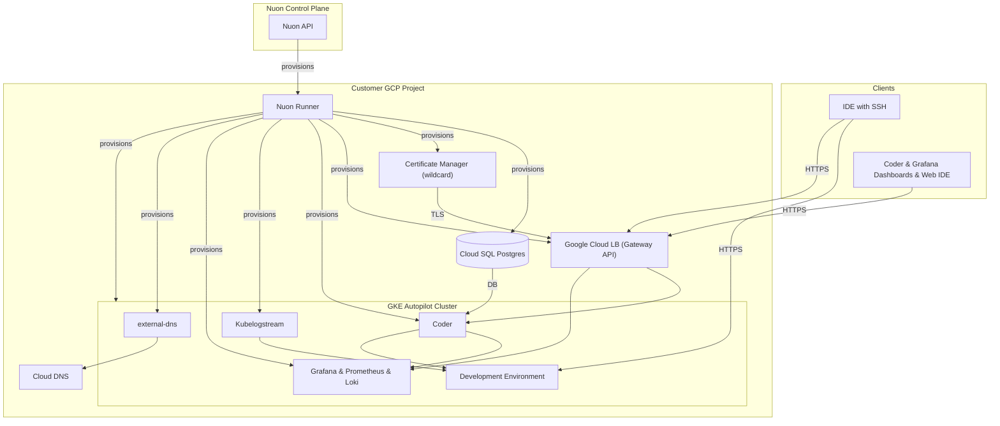

> [!WARNING]
> **Experimental** — this sample app config is a work in progress and is not
> guaranteed to deploy successfully. Use it as a reference only.

  <video autoplay loop muted playsinline width="640" height="360">
    <source src="https://coder.together.agency/videos/logo/sections/0/content/9/value/video.mp4" type="video/mp4">
    Your browser does not support the video tag.
  </video>

Coder Access URL: [https://{{.nuon.install.sandbox.outputs.nuon_dns.public_domain.name}}](https://{{.nuon.install.sandbox.outputs.nuon_dns.public_domain.name}})

Grafana Access URL: [https://{{.nuon.install.sandbox.outputs.nuon_dns.public_domain.name}}/grafana](https://{{.nuon.install.sandbox.outputs.nuon_dns.public_domain.name}}/grafana)

Nuon Install Id: {{ .nuon.install.id }}

GCP Project: {{ .nuon.install_stack.outputs.project_id }}

GCP Region: {{ .nuon.install_stack.outputs.region }}

## Getting Started

Coder is a Cloud Development Environment (CDE) platform that lets your team create and manage cloud-hosted development environments from a central dashboard.

Your Coder instance is fully provisioned and ready to use. Navigate to your Coder Access URL above and log in with the admin credentials provided during setup. From there you can create workspace templates, invite users, and launch development environments.

See the [Coder documentation](https://coder.com/docs) to get started.

## Architecture

## Prerequisites

- **GCP project connected to Nuon** — handled during onboarding; Nuon provisions all infrastructure (GKE Autopilot, VPC, Cloud SQL, GCLB, Cloud DNS, Certificate Manager)
- **Coder CLI** (optional) — install the `coder` binary for CLI-based workspace access: [coder.com/docs/install](https://coder.com/docs/install)
- **GCP quotas** — Nuon manages provisioning, but ensure your project has sufficient quota for GKE Autopilot, Cloud SQL Postgres instances, and global forwarding rules

## Configuration

The following inputs can be changed at any time from **Manage → Edit Inputs** in the Nuon dashboard.

| Input | Default | Description |
|---|---|---|
| `telemetry` | `true` | Send usage telemetry to Coder |
| `max_token_lifetime` | `8760h0m0s` | Maximum lifetime for CLI and API tokens |
| `session_duration` | `168h0m0s` | Session duration before re-authentication is required |
| `block_direct` | `false` | Force all workspace connections through the Coder relay (disables direct peer-to-peer) |

Changing inputs triggers a redeploy of the affected components. The workflow shows a diff and pauses for approval before applying.

## Monitoring

Grafana is available at your Grafana Access URL above, served alongside Coder on the same Google Cloud LB.

**To retrieve your Grafana credentials:**

1. In the Nuon dashboard, go to your Coder installation
2. Open the **Actions** tab
3. Run the `grafana_password` action
4. The output displays the URL, username (`admin`), and generated password

**Available dashboards:**

- Coder Status — overall health overview
- Coder Coderd — control plane metrics
- Workspaces — utilization and performance
- Workspace Detail — per-workspace deep-dive
- Provisioner — Terraform provisioner metrics
- Postgres Database — Cloud SQL performance
- Infrastructure — node-level metrics

## Upgrading

1. Check [Coder Releases](https://github.com/coder/coder/releases/) for the target version
2. In the Nuon dashboard, go to **Manage → Edit Inputs**
3. Update the `release` input to the desired version (e.g. `v2.31.3`)
4. Click **Update Inputs**

The deploy workflow shows a Helm diff and pauses for approval before applying.

## Resources

[Coder Documentation](https://coder.com/docs)

[Coder Releases](https://github.com/coder/coder/releases/)

[Coder Monitoring](https://coder.com/docs/admin/monitoring)

[Coder CLI Reference](https://coder.com/docs/reference/cli/server)

[Coder OSS Repository](https://github.com/coder/coder)

[GCP Machine Types](https://cloud.google.com/compute/docs/machine-resource)

## Cost Estimate
Running this app in your environment will cost around $10/day (GKE Autopilot + regional Cloud SQL + GCLB).
