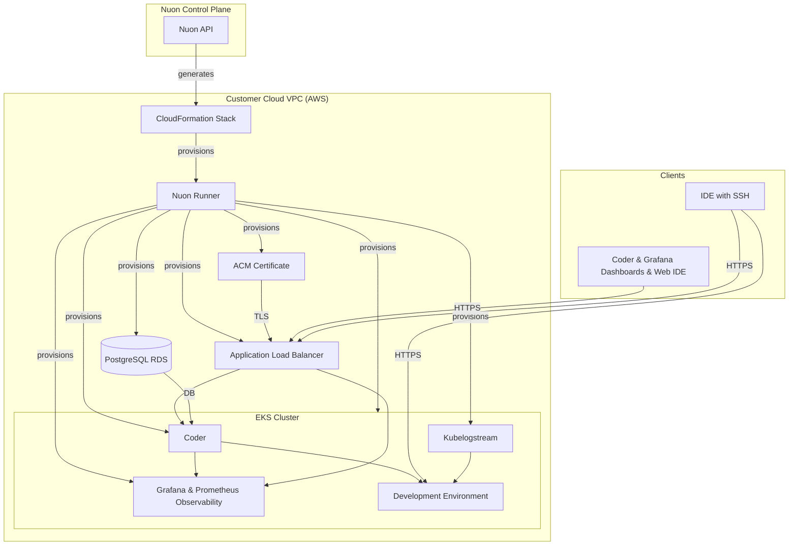

### What this app does?

Coder is a Cloud Development Environment (CDE) platform that enables developers to create, manage, and scale development environments in the cloud. This Nuon app config deploys a production-grade Coder instance on AWS using Amazon EKS, RDS PostgreSQL, and a Grafana and Promethus observability stack. Review the [Coder docs](https://docs.coder.com) for how it deploys on Kubernetes and visit the [Coder OSS repository](https://github.com/coder/coder) for more information.

### Prerequisites

- AWS account connected to Nuon (handled during onboarding
- Coder CLI for workspace CLI access ([link to install](https://coder.com/docs/install/cli))

### How to install/What to expect next?

- Clicking install will generate a link for you to log into AWS and create a CloudFormation stack which creates the VPC, EC2 VM, and a runner, an agent that receives jobs to deploy Coder in your VPC
- If configured, you may be prompted to approve plan steps
- Average installation time is 1 hour due to creating the VPC, ASG, VM,  AWS EKS cluster, RDS cluster, and other app components.

### What gets deployed in your cloud account?

- Dedicated VPC
- AWS EKS Kubernetes cluster with auto mode for auto scaling
- Coder control plane via Helm
- Grafana, Loki and Prometheus via Helm
- Kubernetes logstream via Helm to stream logs into Coder workspace dashboard logs
- AWS certificate
- Application load balancer

### What inputs can you enter?

- AWS region
- Coder CLI & API token lifetime
- Coder dashboard session duration
- Block direct (Tailscale DERP) connections from local IDE

### Monitoring and observability

- Grafana (available in AWS Secrets Manager or ask Coder support run an action script to retrieve it from the coder-observability namespace)

### Upgrading Coder
- Check [the latest Coder releases](https://github.com/coder/coder/releases/tag/v2.30.3)
- Notify Coder support for a maintenance window to perform an upgrade
- When Coder initiates the upgrade, you will receive approval steps in the customer portal

### Support & escalation

- [support@coder.com](@mailto:support@coder.com)
- [https://docs.coder.com](https://docs.coder.com)

### Security & compliance

- [Nuon BYOC trust center](https://docs.nuon.co/guides/vendor-customers)
- All resource provisioning and scripts are performed by an agent in a VM in your VPC - no cross-account access granted to Coder
- All secrets created by you or auto-generated and stored in AWS Secrets Manager in your VPC.

### Nuon concepts

The following terminology is core to the Nuon BYOC platform.

#### Connect Your App | App Config
- App (collection of TOML config files that provision and manage the Coder app in your cloud account)
- Sandbox (the underlying infrastructure, in this case EKS Kubernetes cluster with auto mode)
- Component (the Helm charts and Terraform to deploy Coder, Grafana, AWS TLS certificate, and ALB)
- Inputs (dynamic values specific to the install e.g., Kubernetes release, Coder release, CLI token lifetime)
- Secrets (sensitive values either auto-created or entered by the customer during Stack creation - stored in AWS Secrets Manager)

#### Support Customer Infrastructure | Customer Config

- Installs (Installs are instances of an application in your (the customer) cloud account.)
- Stack (the AWS CloudFormation stack that provisions the VPC, subnets, IAM roles, ASG, EC2 VM and Runner (agent) Docker service)
- Runners (Egress-only agents deployed in customer cloud accounts that execute all provisioning, deployment, and day-2 operations.)
- Operational Roles (IAM roles to perform different operations for least-privilege access across sandbox, components, and actions.)

#### Continuous Delivery | Day-2 Operations

- Workflows (Orchestration of the deployment, update & teardown lifecycle of apps, components, and actions)
- Actions (Bash scripts for health checks, migrations, debugging, and day-2 operations)
- Policies (Rego & Kyverno configs to enforce compliance and security rules at infrastructure plan steps)
- Customer Portal (A customer-facing web dashboard to initiate and monitor an app's install in a customer's VPC)
