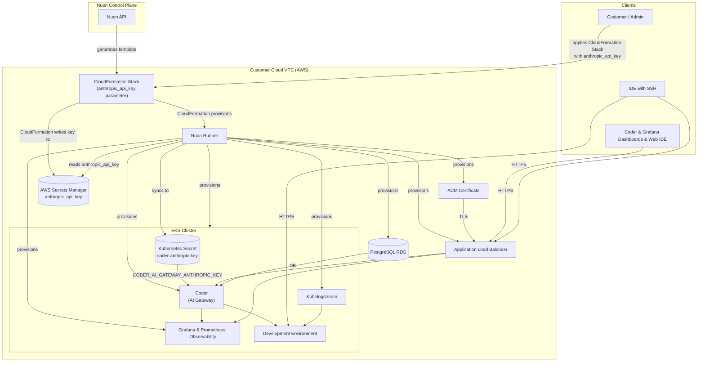

  <video autoplay loop muted playsinline width="640" height="360">
    <source src="https://coder.together.agency/videos/logo/sections/0/content/9/value/video.mp4" type="video/mp4">
    Your browser does not support the video tag.
  </video>

<nuon-banner theme="success">
Coder's Cloud Development Environment platform running in the customer's AWS account. The URLs and component statuses below are bound to this install.
</nuon-banner>

 

<nuon-group gap="8" align="center">
  <nuon-badge theme="info">Coder</nuon-badge>
  <a href="https://{{.nuon.install.sandbox.outputs.nuon_dns.public_domain.name}}">Open Coder</a>
</nuon-group>

 

<nuon-group gap="8" align="center">
  <nuon-badge theme="info">Grafana</nuon-badge>
  <a href="https://{{.nuon.install.sandbox.outputs.nuon_dns.public_domain.name}}/grafana">Open Grafana</a>
</nuon-group>

 

<nuon-group gap="8" align="center">
  <nuon-label-badge label="install:{{ .nuon.install.id }}"></nuon-label-badge>
  <nuon-label-badge label="region:{{ .nuon.install_stack.outputs.region }}"></nuon-label-badge>
  <nuon-label-badge label="sandbox:eks-auto"></nuon-label-badge>
</nuon-group>

<nuon-tabs>

<nuon-tab name="overview">

 

Coder is a Cloud Development Environment (CDE) platform that lets your team create and manage cloud-hosted development environments from a central dashboard.

This install is fully provisioned in your AWS account — EKS, RDS Postgres, ALB, ACM, DNS, and observability are all running in your VPC. Navigate to the Coder URL above and sign in with the admin credentials provided during setup.

### What's deployed

<nuon-group gap="8">
  <nuon-component-card name="rds_subnet"></nuon-component-card>
  <nuon-component-card name="rds_cluster_coder"></nuon-component-card>
  <nuon-component-card name="coder"></nuon-component-card>
  <nuon-component-card name="certificate"></nuon-component-card>
  <nuon-component-card name="application_load_balancer"></nuon-component-card>
  <nuon-component-card name="kubelogstream"></nuon-component-card>
  <nuon-component-card name="observability"></nuon-component-card>
</nuon-group>

> [!TIP]
> Component cards reflect live state for this install. Green = healthy. Click any card to drill into its workflow history and logs.

### First steps

1. Open the Coder URL above and sign in
2. Create a workspace template — start from the [example templates](https://github.com/coder/coder/tree/main/examples/templates)
3. Invite your developers from the Coder admin UI
4. (Optional) Wire up the AI gateway — see the **AI Agents** tab

[Coder documentation](https://coder.com/docs) · [Workspace templates](https://coder.com/docs/templates) · [User management](https://coder.com/docs/admin/users)

</nuon-tab>

<nuon-tab name="quick start">

 

### Prerequisites

- AWS account where you've applied Nuon's CloudFormation stack — the stack provisions a Nuon Runner inside your VPC that phones home to the Nuon control plane to pull deploy steps and day-2 actions
- Sufficient AWS service quota in your target region for EKS, RDS, and ALBs
- Optional — the [Coder CLI](https://coder.com/docs/install) for terminal/SSH workspace access

### Day 1 — get to a working environment

1. Sign in at the Coder URL above with the admin credentials from setup
2. Import a workspace template (use [the examples](https://github.com/coder/coder/tree/main/examples/templates) or write your own)
3. Create your first workspace from that template
4. Invite the rest of the team

### Day 2 — operate it

Switch to the **Operations** tab for common day-2 actions (retrieve Grafana password, run troubleshoot, health-check the ALB) and the **Observability** tab for dashboards.

> [!NOTE]
> All actions run against this install with the credentials Nuon already has — you don't need AWS CLI access or `kubectl` to operate Coder day-to-day.

</nuon-tab>

<nuon-tab name="architecture">

 

<nuon-panel heading="System diagram" trigger="View" size="3/4">

</nuon-panel>

### Where it runs

Coder runs entirely inside your AWS VPC — both its control plane (the Coder server, web UI, and AI gateway) and its data plane (the developer workspaces themselves). Nuon's SaaS control plane only ever sees workflow state and component metadata — never your developers' code, secrets, or workspace contents.

### Components

<nuon-group gap="8">
  <nuon-component-card name="rds_subnet"></nuon-component-card>
  <nuon-component-card name="rds_cluster_coder"></nuon-component-card>
  <nuon-component-card name="coder"></nuon-component-card>
  <nuon-component-card name="certificate"></nuon-component-card>
  <nuon-component-card name="application_load_balancer"></nuon-component-card>
  <nuon-component-card name="kubelogstream"></nuon-component-card>
  <nuon-component-card name="observability"></nuon-component-card>
</nuon-group>

</nuon-tab>

<nuon-tab name="configuration">

 

Inputs split into two groups by who owns the change. Customer-controlled inputs are exposed in **Manage → Edit Inputs** and safe to tune any time. Vendor-controlled inputs are managed by the vendor through app config updates and not visible to the install operator.

### Customer-controlled

Tune these from **Manage → Edit Inputs**. Changes trigger a redeploy of affected components — the workflow shows a diff and pauses for approval before applying.

| Input | Default | Description |
|---|---|---|
| `telemetry` | `true` | Send usage telemetry to Coder |
| `max_token_lifetime` | `8760h0m0s` | Maximum lifetime for CLI and API tokens |
| `session_duration` | `168h0m0s` | Session duration before re-authentication is required |
| `block_direct` | `false` | Force all workspace connections through the Coder relay (disables peer-to-peer) |

### Vendor-controlled

The vendor pins these in the app config and updates them via release. The big one is `release` — the Coder version itself, which the vendor schedules into your install on their cadence.

| Input | Default | Description |
|---|---|---|
| `release` | `v2.31.1` | Coder release version — vendor schedules upgrades |
| `replicas` | `1` | Coder control plane replica count |
| `provisioners` | `3` | Terraform provisioners for workspace lifecycle |
| `cluster_version` | `1.34` | EKS Kubernetes version |
| `coder_db_instance_type` | `db.t4g.micro` | RDS instance type |

> [!IMPORTANT]
> Vendor-side changes to `cluster_version` or `coder_db_instance_type` trigger infrastructure changes that can take 15+ minutes to apply. The vendor stages these during an agreed maintenance window.

</nuon-tab>

<nuon-tab name="Agents">

 

Coder ships a built-in AI gateway that turns this install into a hosted home for [Coder Agents](https://coder.com/docs/ai-coder/agents) — Anthropic-powered coding agents that run in the control plane (not inside the workspace) so prompts, diffs, and tool calls are auditable and isolated from your code.

### What your developers get

- A chat UI in the Coder web app (or via the REST API) for running an agent — the agent loop runs in the Coder control plane, not inside the workspace, so prompts stay isolated from the code being edited
- Centralized auth — developers use their Coder login, not a personal Anthropic key
- An audit trail of every prompt and tool invocation, attributed back to the user

[Coder AI Gateway docs](https://coder.com/docs/ai-coder/ai-gateway)

### How to enable

> [!NOTE]
> Your Anthropic API key never touches Nuon or the vendor. It is written directly to your AWS Secrets Manager by the CloudFormation stack you applied at install time, then synced into the EKS cluster.

1. Grab a key from [console.anthropic.com](https://console.anthropic.com)
2. Re-apply the install stack CloudFormation template with the `anthropic_api_key` parameter populated (or set it the first time around)
3. Nuon stores the value in AWS Secrets Manager and syncs it to a Kubernetes Secret named `coder-anthropic-key` in the `coder` namespace
4. The Coder server picks it up via the `CODER_AI_GATEWAY_ANTHROPIC_KEY` environment variable

If you leave the CloudFormation parameter blank, Coder still boots normally — a Coder admin can add the Anthropic key directly through the Coder dashboard instead.

### Rotating the key

Update the parameter in the install stack and re-run the secret sync from the **Operations** tab.

</nuon-tab>

<nuon-tab name="observability">

 

Grafana is served from the same load balancer as Coder, at <nuon-badge theme="default" variant="code">https://{{.nuon.install.sandbox.outputs.nuon_dns.public_domain.name}}/grafana</nuon-badge>.

### Get the admin password

<nuon-action-card name="grafana_password"></nuon-action-card>

The output shows the URL, username (`admin`), and the generated password.

### Dashboards

- **Coder Status** — overall health overview
- **Coder Coderd** — control plane metrics
- **Workspaces** — utilization and performance
- **Workspace Detail** — per-workspace deep-dive
- **Provisioner** — Terraform provisioner metrics
- **Postgres Database** — RDS performance
- **Infrastructure** — node-level metrics

[Coder monitoring guide](https://coder.com/docs/admin/monitoring)

</nuon-tab>

<nuon-tab name="operations">

 

Day-2 actions you can run from here. Each one executes inside your install with the credentials Nuon already has.

<nuon-group gap="8">
  <nuon-action-card name="grafana_password"></nuon-action-card>
  <nuon-action-card name="troubleshoot"></nuon-action-card>
  <nuon-action-card name="alb_healthcheck"></nuon-action-card>
  <nuon-action-card name="grafana_setup"></nuon-action-card>
  <nuon-action-card name="coder_rds_creds"></nuon-action-card>
</nuon-group>

### Upgrading Coder

Coder release version is vendor-managed (see the **Configuration** tab). The vendor publishes a new `release` value through an app config update; your install picks up the change on its next sync. You'll see a pending deploy in **Workflows** with a Helm diff — review and approve to apply.

> [!WARNING]
> Major Coder upgrades may include database migrations. Review the Coder release notes before approving the workflow — migrations run as part of the helm upgrade and are not separately reversible.

</nuon-tab>

<nuon-tab name="troubleshooting">

 

> [!TIP]
> Most issues are visible from the component cards on the **Overview** tab. A red card → click in to see the failing workflow and logs.

### ALB not provisioning

Symptoms — the ALB component sits in `pending` or `error` for more than 10 minutes after deploy.

<nuon-action-card name="alb_healthcheck"></nuon-action-card>

If the healthcheck reports the ALB exists but targets are unhealthy, check that the Coder pods are running (`kubectl get pods -n coder` via the troubleshoot action below).

### Grafana admin secret missing

Symptoms — Grafana login rejects the password from `grafana_password`, or the action returns empty.

<nuon-action-card name="grafana_setup"></nuon-action-card>

Re-running `grafana_setup` creates (or refreshes) the admin secret. Then `grafana_password` will return it.

### Helm release stuck in `pending-install`

Symptoms — the `coder` component card shows the Helm release exists but Coder pods never come up.

<nuon-action-card name="troubleshoot"></nuon-action-card>

`troubleshoot` will gather pod, event, and helm history for diagnosis. The fix is typically to delete the stuck release and re-sync from the dashboard.

### Database connectivity errors

Symptoms — Coder logs show `dial tcp ...:5432` failures or migration errors on startup.

<nuon-action-card name="coder_rds_creds"></nuon-action-card>

Re-runs the secret copy from RDS into the Coder namespace. Then bounce the Coder deployment from the **Operations** tab.

### When all else fails

Use **Manage → Force Unlock** if a terraform workspace is stuck. The dashboard button uses session auth — CLI `terraform force-unlock` will not work against Nuon's backend.

</nuon-tab>

<nuon-tab name="resources">

 

- [Coder Documentation](https://coder.com/docs)
- [Coder Releases](https://github.com/coder/coder/releases/)
- [Coder Monitoring](https://coder.com/docs/admin/monitoring)
- [Coder CLI Reference](https://coder.com/docs/reference/cli/server)
- [Coder OSS Repository](https://github.com/coder/coder)
- [Coder Agents (AI)](https://coder.com/docs/ai-coder/agents)
- [Coder AI Gateway](https://coder.com/docs/ai-coder/ai-gateway)
- [AWS Instance Types](https://aws.amazon.com/ec2/instance-types/)

<nuon-panel heading="Cost estimate" trigger="View">

Running this app in your environment will cost around **$8/day** at the default sizing. The bulk is EKS Auto Mode nodes + RDS Postgres + ALB hours. Scaling Coder replicas, raising the RDS instance class, or driving high workspace counts will push this higher — check the [AWS Instance Types](https://aws.amazon.com/ec2/instance-types/) reference for marginal cost.

</nuon-panel>

</nuon-tab>

</nuon-tabs>
