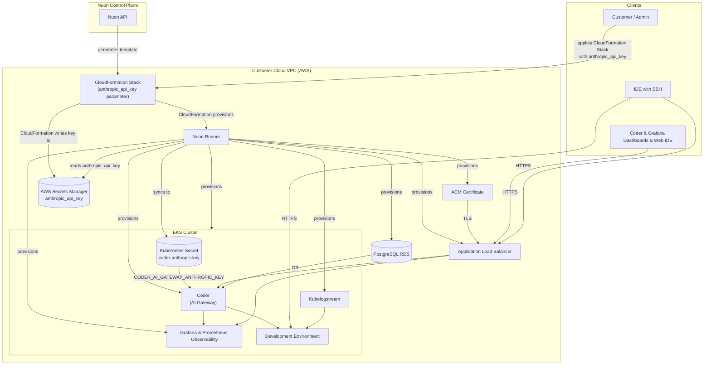

{{ $k8s     := default dict (index (default dict .nuon.actions.workflows) "k8s_status") }}
{{ $coder   := default dict (index (default dict .nuon.actions.workflows) "coder_health") }}
{{ $db      := default dict (index (default dict .nuon.actions.workflows) "db_ping") }}
{{ $alb     := default dict (index (default dict .nuon.actions.workflows) "alb_healthcheck") }}
{{ $grafana := default dict (index (default dict .nuon.actions.workflows) "grafana_health") }}
{{ $prom    := default dict (index (default dict .nuon.actions.workflows) "prom_targets") }}

{{ $k8sOut     := default dict (dig "outputs" dict $k8s) }}
{{ $coderOut   := default dict (dig "outputs" dict $coder) }}
{{ $dbOut      := default dict (dig "outputs" dict $db) }}
{{ $albOut     := default dict (dig "outputs" dict $alb) }}
{{ $grafanaOut := default dict (dig "outputs" dict $grafana) }}
{{ $promOut    := default dict (dig "outputs" dict $prom) }}

{{ $k8sInd   := dig "indicator" "" $k8sOut }}
{{ $coderInd := dig "indicator" "" $coderOut }}
{{ $dbInd    := dig "indicator" "" $dbOut }}
{{ $grafInd  := dig "indicator" "" $grafanaOut }}
{{ $promInd  := dig "indicator" "" $promOut }}

{{ $albCoderMap := default dict (dig "coder" dict $albOut) }}
{{ $albGrafMap  := default dict (dig "grafana" dict $albOut) }}
{{ $albCoder    := dig "indicator" "" $albCoderMap }}
{{ $albGraf     := dig "indicator" "" $albGrafMap }}

{{ $hcAllGreen := and (eq $k8sInd "🟢") (eq $coderInd "🟢") (eq $dbInd "🟢") (eq $albCoder "🟢") (eq $albGraf "🟢") (eq $grafInd "🟢") (eq $promInd "🟢") }}
{{ $hcAnyRed   := or  (eq $k8sInd "🔴") (eq $coderInd "🔴") (eq $dbInd "🔴") (eq $albCoder "🔴") (eq $albGraf "🔴") (eq $grafInd "🔴") (eq $promInd "🔴") }}

{{ $prov   := default dict (index (default dict .nuon.actions.workflows) "coder_provisioners") }}
{{ $provOut    := default dict (dig "outputs" dict $prov) }}
{{ $provReady  := and (dig "populated" false $prov) (eq (dig "status" "" $prov) "finished") }}

{{ $ws     := default dict (index (default dict .nuon.actions.workflows) "coder_workspaces") }}
{{ $wsOut      := default dict (dig "outputs" dict $ws) }}
{{ $wsReady    := and (dig "populated" false $ws) (eq (dig "status" "" $ws) "finished") }}

{{ $ut     := default dict (index (default dict .nuon.actions.workflows) "coder_users_templates") }}
{{ $utOut      := default dict (dig "outputs" dict $ut) }}
{{ $utReady    := and (dig "populated" false $ut) (eq (dig "status" "" $ut) "finished") }}

{{ $bj     := default dict (index (default dict .nuon.actions.workflows) "coder_builds_jobs") }}
{{ $bjOut      := default dict (dig "outputs" dict $bj) }}
{{ $bjReady    := and (dig "populated" false $bj) (eq (dig "status" "" $bj) "finished") }}

{{ $dh    := default dict (index (default dict .nuon.actions.workflows) "coder_deployment_health") }}
{{ $dhOut    := default dict (dig "outputs" dict $dh) }}
{{ $dhSub    := default dict (dig "subsystems" dict $dhOut) }}
{{ $dhReady  := and (dig "populated" false $dh) (eq (dig "status" "" $dh) "finished") }}

{{ $ag    := default dict (index (default dict .nuon.actions.workflows) "coder_agents_health") }}
{{ $agOut    := default dict (dig "outputs" dict $ag) }}
{{ $agReady  := and (dig "populated" false $ag) (eq (dig "status" "" $ag) "finished") }}
{{ $agCount  := dig "count" 0 $agOut }}

{{ $tf    := default dict (index (default dict .nuon.actions.workflows) "coder_template_freshness") }}
{{ $tfOut    := default dict (dig "outputs" dict $tf) }}
{{ $tfReady  := and (dig "populated" false $tf) (eq (dig "status" "" $tf) "finished") }}
{{ $tfCount  := dig "count" 0 $tfOut }}

{{ $promUpdated := dig "updated_at" "" $promOut }}
{{ $dhUpdated   := dig "updated_at" "" $dhOut }}
{{ $wsUpdated   := dig "updated_at" "" $wsOut }}
{{ $utUpdated   := dig "updated_at" "" $utOut }}
{{ $bjUpdated   := dig "updated_at" "" $bjOut }}
{{ $provUpdated := dig "updated_at" "" $provOut }}
{{ $tfUpdated   := dig "updated_at" "" $tfOut }}
{{ $agUpdated   := dig "updated_at" "" $agOut }}

  <video autoplay loop muted playsinline width="480" height="270">
    <source src="https://coder.together.agency/videos/logo/sections/0/content/9/value/video.mp4" type="video/mp4">
    Your browser does not support the video tag.
  </video>
  

    <a href="https://{{.nuon.install.sandbox.outputs.nuon_dns.public_domain.name}}" style="display:inline-flex; align-items:center; justify-content:center; gap:8px; padding:10px 22px; background:#8b5cf6; color:white; border-radius:8px; text-decoration:none; font-weight:600; font-size:15px;">Open Coder →</a>
    <a href="https://{{.nuon.install.sandbox.outputs.nuon_dns.public_domain.name}}/grafana" style="display:inline-flex; align-items:center; justify-content:center; gap:8px; padding:10px 22px; background:transparent; color:#c4b5fd; border:1px solid rgba(139,92,246,0.6); border-radius:8px; text-decoration:none; font-weight:600; font-size:15px;">Open Grafana →</a>
    

      <nuon-run-runbook name="full-healthcheck"></nuon-run-runbook>
      {{ with $promUpdated }}Last run <nuon-time time="{{ . }}" format="relative"></nuon-time>{{ end }}
    

    

      <nuon-run-runbook name="refresh_coder_data"></nuon-run-runbook>
      {{ with $bjUpdated }}Last run <nuon-time time="{{ . }}" format="relative"></nuon-time>{{ end }}
    

  

<nuon-banner theme="success">
Coder's cloud development environment platform — for developers and agents. The links and status below are live for this install.
</nuon-banner>

 

<nuon-group gap="8" align="center">
  <nuon-label-badge label="install:{{ .nuon.install.id }}"></nuon-label-badge>
  <nuon-label-badge label="region:{{ .nuon.install_stack.outputs.region }}"></nuon-label-badge>
  <nuon-label-badge label="sandbox:eks-auto"></nuon-label-badge>
</nuon-group>

<nuon-tabs>

<nuon-tab name="overview">

 

  
Platform health

  {{ with $promUpdated }}Last updated <nuon-time time="{{ . }}" format="relative"></nuon-time>{{ end }}

<nuon-group gap="8" align="center">
  {{ if $hcAllGreen }}<nuon-status status="active" variant="badge"></nuon-status>
  {{ else if $hcAnyRed }}<nuon-status status="error" variant="badge"></nuon-status>
  {{ else }}<nuon-status status="pending" variant="badge"></nuon-status>{{ end }}
  Rolled-up status across cluster, RDS, ALB, Grafana, and Prometheus.
</nuon-group>

<table>
  <thead><tr><th>Subsystem</th><th>Status</th><th>Action</th></tr></thead>
  <tbody>
    <tr><td>Kubernetes</td><td>{{ if eq $k8sInd "🟢" }}<nuon-status status="active" variant="badge"></nuon-status>{{ else if eq $k8sInd "🔴" }}<nuon-status status="error" variant="badge"></nuon-status>{{ else }}<nuon-status status="pending" variant="badge"></nuon-status>{{ end }}</td><td><code style="font-size:0.85em; color:#6b7280;">k8s_status</code></td></tr>
    <tr><td>Coder API</td><td>{{ if eq $coderInd "🟢" }}<nuon-status status="active" variant="badge"></nuon-status>{{ else if eq $coderInd "🔴" }}<nuon-status status="error" variant="badge"></nuon-status>{{ else }}<nuon-status status="pending" variant="badge"></nuon-status>{{ end }}</td><td><code style="font-size:0.85em; color:#6b7280;">coder_health</code></td></tr>
    <tr><td>Database</td><td>{{ if eq $dbInd "🟢" }}<nuon-status status="active" variant="badge"></nuon-status>{{ else if eq $dbInd "🔴" }}<nuon-status status="error" variant="badge"></nuon-status>{{ else }}<nuon-status status="pending" variant="badge"></nuon-status>{{ end }}</td><td><code style="font-size:0.85em; color:#6b7280;">db_ping</code></td></tr>
    <tr><td>ALB · Coder ingress</td><td>{{ if eq $albCoder "🟢" }}<nuon-status status="active" variant="badge"></nuon-status>{{ else if eq $albCoder "🔴" }}<nuon-status status="error" variant="badge"></nuon-status>{{ else }}<nuon-status status="pending" variant="badge"></nuon-status>{{ end }}</td><td><code style="font-size:0.85em; color:#6b7280;">alb_healthcheck</code></td></tr>
    <tr><td>ALB · Grafana ingress</td><td>{{ if eq $albGraf "🟢" }}<nuon-status status="active" variant="badge"></nuon-status>{{ else if eq $albGraf "🔴" }}<nuon-status status="error" variant="badge"></nuon-status>{{ else }}<nuon-status status="pending" variant="badge"></nuon-status>{{ end }}</td><td><code style="font-size:0.85em; color:#6b7280;">alb_healthcheck</code></td></tr>
    <tr><td>Grafana</td><td>{{ if eq $grafInd "🟢" }}<nuon-status status="active" variant="badge"></nuon-status>{{ else if eq $grafInd "🔴" }}<nuon-status status="error" variant="badge"></nuon-status>{{ else }}<nuon-status status="pending" variant="badge"></nuon-status>{{ end }}</td><td><code style="font-size:0.85em; color:#6b7280;">grafana_health</code></td></tr>
    <tr><td>Prometheus</td><td>{{ if eq $promInd "🟢" }}<nuon-status status="active" variant="badge"></nuon-status>{{ else if eq $promInd "🔴" }}<nuon-status status="error" variant="badge"></nuon-status>{{ else }}<nuon-status status="pending" variant="badge"></nuon-status>{{ end }}</td><td><code style="font-size:0.85em; color:#6b7280;">prom_targets</code></td></tr>
  </tbody>
</table>

  
Coder control plane health

  <code style="font-size:0.85em; color:#6b7280;">coder_deployment_health</code>
  {{ with $dhUpdated }}Last updated <nuon-time time="{{ . }}" format="relative"></nuon-time>{{ end }}

{{ if $dhReady }}
<table>
  <thead><tr><th>Subsystem</th><th>Status</th></tr></thead>
  <tbody>
    <tr><td>Access URL</td><td>{{ $s := dig "access_url" "" $dhSub }}{{ if eq $s "🟢" }}<nuon-status status="active" variant="badge"></nuon-status>{{ else if eq $s "🔴" }}<nuon-status status="error" variant="badge"></nuon-status>{{ else }}<nuon-status status="pending" variant="badge"></nuon-status>{{ end }}</td></tr>
    <tr><td>Database</td><td>{{ $s := dig "database" "" $dhSub }}{{ if eq $s "🟢" }}<nuon-status status="active" variant="badge"></nuon-status>{{ else if eq $s "🔴" }}<nuon-status status="error" variant="badge"></nuon-status>{{ else }}<nuon-status status="pending" variant="badge"></nuon-status>{{ end }}</td></tr>
    <tr><td>Provisioner daemons</td><td>{{ $s := dig "provisioner_daemons" "" $dhSub }}{{ if eq $s "🟢" }}<nuon-status status="active" variant="badge"></nuon-status>{{ else if eq $s "🔴" }}<nuon-status status="error" variant="badge"></nuon-status>{{ else }}<nuon-status status="pending" variant="badge"></nuon-status>{{ end }}</td></tr>
    <tr><td>DERP</td><td>{{ $s := dig "derp" "" $dhSub }}{{ if eq $s "🟢" }}<nuon-status status="active" variant="badge"></nuon-status>{{ else if eq $s "🔴" }}<nuon-status status="error" variant="badge"></nuon-status>{{ else }}<nuon-status status="pending" variant="badge"></nuon-status>{{ end }}</td></tr>
    <tr><td>Websocket</td><td>{{ $s := dig "websocket" "" $dhSub }}{{ if eq $s "🟢" }}<nuon-status status="active" variant="badge"></nuon-status>{{ else if eq $s "🔴" }}<nuon-status status="error" variant="badge"></nuon-status>{{ else }}<nuon-status status="pending" variant="badge"></nuon-status>{{ end }}</td></tr>
    <tr><td>Workspace proxy</td><td>{{ $s := dig "workspace_proxy" "" $dhSub }}{{ if eq $s "🟢" }}<nuon-status status="active" variant="badge"></nuon-status>{{ else if eq $s "🔴" }}<nuon-status status="error" variant="badge"></nuon-status>{{ else }}<nuon-status status="pending" variant="badge"></nuon-status>{{ end }}</td></tr>
  </tbody>
</table>
{{ else }}
<nuon-banner theme="warn">Waiting on <code>coder_deployment_health</code> action. Run it from the Operations tab to populate.</nuon-banner>
{{ end }}

{{ if and $agReady (gt $agCount 0.0) }}
<nuon-banner theme="warn">{{ $agCount }} workspace(s) marked running but the agent is disconnected.</nuon-banner>
<table>
  <thead><tr><th>Workspace</th><th>Agent</th><th>Disconnected</th></tr></thead>
  <tbody>
{{ range $d := dig "disconnected" (list) $agOut }}
    <tr>
      <td><code>{{ dig "workspace" "—" $d }}</code></td>
      <td><code>{{ dig "agent" "—" $d }}</code></td>
      <td>{{ dig "disconnected_sec" "—" $d }}s</td>
    </tr>
{{ end }}
  </tbody>
</table>
{{ end }}

  
Workspaces

  <code style="font-size:0.85em; color:#6b7280;">coder_workspaces</code>
  {{ with $wsUpdated }}Last updated <nuon-time time="{{ . }}" format="relative"></nuon-time>{{ end }}

{{ if $wsReady }}
{{ $counts := dig "counts" (dict) $wsOut }}
{{ if eq (len $counts) 0 }}
<nuon-banner theme="info">No workspaces yet.</nuon-banner>
{{ else }}
<table>
  <thead><tr><th>Status</th><th>Count</th></tr></thead>
  <tbody>
{{ range $status, $count := $counts }}
    <tr><td><code>{{ $status }}</code></td><td>{{ $count }}</td></tr>
{{ end }}
  </tbody>
</table>

{{ $recent := dig "recent" (list) $wsOut }}
{{ if gt (len $recent) 0 }}

Recently active

<table>
  <thead><tr><th>Workspace</th><th>Status</th><th>Last used</th></tr></thead>
  <tbody>
{{ range $w := $recent }}
    <tr>
      <td><code>{{ dig "name" "—" $w }}</code></td>
      <td><code>{{ dig "status" "—" $w }}</code></td>
      <td>{{ with dig "last_used_at" "" $w }}<nuon-time time="{{ . }}" format="relative"></nuon-time>{{ else }}—{{ end }}</td>
    </tr>
{{ end }}
  </tbody>
</table>
{{ end }}
{{ end }}
{{ else }}
<nuon-banner theme="warn">Waiting on <code>coder_workspaces</code> action. Run it from the Operations tab to populate.</nuon-banner>
{{ end }}

  
Users

  <code style="font-size:0.85em; color:#6b7280;">coder_users_templates</code>
  {{ with $utUpdated }}Last updated <nuon-time time="{{ . }}" format="relative"></nuon-time>{{ end }}

{{ if $utReady }}
{{ $u := dig "users" (dict) $utOut }}

<table>
  <thead><tr><th>Total users</th><th>Active</th><th>Active 24h</th><th>Dormant</th><th>Suspended</th></tr></thead>
  <tbody>
    <tr>
      <td>{{ dig "total" 0 $u }}</td>
      <td>{{ dig "active" 0 $u }}</td>
      <td>{{ dig "active_24h" 0 $u }}</td>
      <td>{{ dig "dormant" 0 $u }}</td>
      <td>{{ dig "suspended" 0 $u }}</td>
    </tr>
  </tbody>
</table>
{{ else }}
<nuon-banner theme="warn">Waiting on <code>coder_users_templates</code> action. Run it from the Operations tab to populate.</nuon-banner>
{{ end }}

  
Templates

  <code style="font-size:0.85em; color:#6b7280;">coder_users_templates</code>
  {{ with $utUpdated }}Last updated <nuon-time time="{{ . }}" format="relative"></nuon-time>{{ end }}

{{ if $utReady }}
{{ $templates := dig "templates" (list) $utOut }}
{{ if eq (len $templates) 0 }}
<nuon-banner theme="info">No templates configured yet.</nuon-banner>
{{ else }}
<table>
  <thead><tr><th>Template</th><th>Display name</th><th>Workspaces</th></tr></thead>
  <tbody>
{{ range $t := $templates }}
    <tr>
      <td><code>{{ dig "name" "—" $t }}</code></td>
      <td>{{ dig "display_name" "—" $t }}</td>
      <td>{{ dig "workspace_count" 0 $t }}</td>
    </tr>
{{ end }}
  </tbody>
</table>
{{ end }}
{{ else }}
<nuon-banner theme="warn">Waiting on <code>coder_users_templates</code> action. Run it from the Operations tab to populate.</nuon-banner>
{{ end }}

  
Recent builds & job queue

  <code style="font-size:0.85em; color:#6b7280;">coder_builds_jobs</code>
  {{ with $bjUpdated }}Last updated <nuon-time time="{{ . }}" format="relative"></nuon-time>{{ end }}

{{ if $bjReady }}
{{ $queue := dig "queue" (dict) $bjOut }}
{{ if gt (len $queue) 0 }}

Job queue (last hour)

<table>
  <thead><tr><th>Status</th><th>Count</th></tr></thead>
  <tbody>
{{ range $status, $count := $queue }}
    <tr><td><code>{{ $status }}</code></td><td>{{ $count }}</td></tr>
{{ end }}
  </tbody>
</table>
{{ end }}

{{ $builds := dig "recent_builds" (list) $bjOut }}
{{ if gt (len $builds) 0 }}

Last 10 builds

<table>
  <thead><tr><th>Workspace</th><th>Transition</th><th>Job status</th><th>Started</th></tr></thead>
  <tbody>
{{ range $b := $builds }}
    <tr>
      <td><code>{{ dig "workspace_name" "—" $b }}</code></td>
      <td><code>{{ dig "transition" "—" $b }}</code></td>
      <td><code>{{ dig "job_status" "—" $b }}</code></td>
      <td>{{ with dig "created_at" "" $b }}<nuon-time time="{{ . }}" format="relative"></nuon-time>{{ else }}—{{ end }}</td>
    </tr>
{{ end }}
  </tbody>
</table>
{{ end }}
{{ else }}
<nuon-banner theme="warn">Waiting on <code>coder_builds_jobs</code> action. Run it from the Operations tab to populate.</nuon-banner>
{{ end }}

  
Provisioners

  <code style="font-size:0.85em; color:#6b7280;">coder_provisioners</code>
  {{ with $provUpdated }}Last updated <nuon-time time="{{ . }}" format="relative"></nuon-time>{{ end }}

{{ if $provReady }}
{{ $daemons := dig "daemons" (list) $provOut }}
{{ if eq (len $daemons) 0 }}
<nuon-banner theme="info">No provisioner daemons registered yet.</nuon-banner>
{{ else }}
<table>
  <thead><tr><th>Name</th><th>Status</th><th>Last seen</th><th>Version</th></tr></thead>
  <tbody>
{{ range $d := $daemons }}
{{ $age := dig "age_sec" 9999 $d }}
{{ if lt $age 300.0 }}
    <tr>
      <td><code>{{ dig "name" "—" $d }}</code></td>
      <td>{{ if lt $age 60.0 }}<nuon-status status="active" variant="badge"></nuon-status>{{ else }}<nuon-status status="error" variant="badge"></nuon-status>{{ end }}</td>
      <td>{{ $age }}s ago</td>
      <td><code>{{ dig "version" "—" $d }}</code></td>
    </tr>
{{ end }}
{{ end }}
  </tbody>
</table>
{{ end }}
{{ else }}
<nuon-banner theme="warn">Waiting on <code>coder_provisioners</code> action. Run it from the Operations tab to populate.</nuon-banner>
{{ end }}

### What's deployed

<nuon-group gap="8">
  <nuon-component-card name="rds_subnet"></nuon-component-card>
  <nuon-component-card name="rds_cluster_coder"></nuon-component-card>
  <nuon-component-card name="coder"></nuon-component-card>
  <nuon-component-card name="certificate"></nuon-component-card>
  <nuon-component-card name="application_load_balancer"></nuon-component-card>
  <nuon-component-card name="kubelogstream"></nuon-component-card>
  <nuon-component-card name="observability"></nuon-component-card>
</nuon-group>

- [Coder documentation](https://coder.com/docs)
- [Workspace templates](https://coder.com/docs/templates)
- [User management](https://coder.com/docs/admin/users)

</nuon-tab>

<nuon-tab name="architecture">

 

<nuon-panel heading="System diagram" trigger="View" size="3/4">

</nuon-panel>

### Components

<nuon-group gap="8">
  <nuon-component-card name="rds_subnet"></nuon-component-card>
  <nuon-component-card name="rds_cluster_coder"></nuon-component-card>
  <nuon-component-card name="coder"></nuon-component-card>
  <nuon-component-card name="certificate"></nuon-component-card>
  <nuon-component-card name="application_load_balancer"></nuon-component-card>
  <nuon-component-card name="kubelogstream"></nuon-component-card>
  <nuon-component-card name="observability"></nuon-component-card>
</nuon-group>

### Where it runs

Coder runs entirely inside your AWS VPC — both its control plane (the Coder server, web UI, and AI gateway) and its data plane (the RDS database cluster and the developer workspaces themselves). Grafana is also deployed in the VPC. 

</nuon-tab>

<nuon-tab name="configuration">

 

Inputs split into two groups by who owns the change. Customer-controlled inputs are exposed in **Current Inputs** and safe to tune any time. Vendor-controlled inputs are managed by the vendor through app config updates and not visible to the install operator.

### Customer-controlled

Tune these from **Current Inputs → Edit Inputs**. Changes trigger a redeploy of affected components — the workflow shows a diff and pauses for approval before applying.

| Input | Current value | Description |
|---|---|---|
| `telemetry` | `{{ .nuon.install.inputs.telemetry }}` | Send usage telemetry to Coder |
| `max_token_lifetime` | `{{ .nuon.install.inputs.max_token_lifetime }}` | Maximum lifetime for CLI and API tokens |
| `session_duration` | `{{ .nuon.install.inputs.session_duration }}` | Session duration before re-authentication is required |
| `block_direct` | `{{ .nuon.install.inputs.block_direct }}` | Force all workspace connections through the Coder relay (disables peer-to-peer) |

### Vendor-controlled

The vendor pins these in the app config and updates them via release. The big one is `release` — the Coder version itself, which the vendor schedules into your install on their cadence.

| Input | Current value | Description |
|---|---|---|
| `release` | `{{ .nuon.install.inputs.release }}` | Coder release version — vendor schedules upgrades |
| `replicas` | `{{ .nuon.install.inputs.replicas }}` | Coder control plane replica count |
| `provisioners` | `{{ .nuon.install.inputs.provisioners }}` | Terraform provisioners for workspace lifecycle |
| `cluster_version` | `{{ .nuon.install.inputs.cluster_version }}` | EKS Kubernetes version |
| `coder_db_instance_type` | `{{ .nuon.install.inputs.coder_db_instance_type }}` | RDS instance type |

> [!IMPORTANT]
> Vendor-side changes to `cluster_version` or `coder_db_instance_type` trigger infrastructure changes that can take 15+ minutes to apply. The vendor stages these during an agreed maintenance window.

</nuon-tab>

<nuon-tab name="agents">

 

Coder ships a built-in AI gateway that turns this install into a hosted home for [Coder Agents](https://coder.com/docs/ai-coder/agents) — Anthropic-powered coding agents that run in the control plane (not inside the workspace) so prompts, diffs, and tool calls are auditable and isolated from your code.

### What your developers get

- A chat UI in the Coder web app (or via the REST API) for running an agent — the agent loop runs in the Coder control plane, not inside the workspace, so prompts stay isolated from the code being edited
- Centralized auth — developers use their Coder login, not a personal Anthropic key
- An audit trail of every prompt and tool invocation, attributed back to the user

[Coder AI Gateway docs](https://coder.com/docs/ai-coder/ai-gateway)

### How to enable

> [!NOTE]
> Your Anthropic API key never touches Nuon or the vendor. It is written directly to your AWS Secrets Manager by the CloudFormation stack you applied at install time, then synced into the EKS cluster.

1. Grab a key from [console.anthropic.com](https://console.anthropic.com)
2. Re-apply the install stack CloudFormation template with the `anthropic_api_key` parameter populated (or set it the first time around)
3. Nuon stores the value in AWS Secrets Manager and syncs it to a Kubernetes Secret named `coder-anthropic-key` in the `coder` namespace
4. The Coder server picks it up via the `CODER_AI_GATEWAY_ANTHROPIC_KEY` environment variable

If you leave the CloudFormation parameter blank, Coder still boots normally — a Coder admin can add the Anthropic key directly through the Coder dashboard instead.

### Rotating the key

Update the parameter in the install stack and re-run the secret sync from the **Operations** tab.

</nuon-tab>

<nuon-tab name="grafana">

 

Grafana is served from the same load balancer as Coder, at <nuon-badge theme="default" variant="code">https://{{.nuon.install.sandbox.outputs.nuon_dns.public_domain.name}}/grafana</nuon-badge>.

### Get the admin password

<nuon-action-card name="grafana_password"></nuon-action-card>

The output shows the URL, username (`admin`), and the generated password.

### Dashboards

- **Coder Status** — overall health overview
- **Coder Coderd** — control plane metrics
- **Workspaces** — utilization and performance
- **Workspace Detail** — per-workspace deep-dive
- **Provisioner** — Terraform provisioner metrics
- **Postgres Database** — RDS performance
- **Infrastructure** — node-level metrics

[Coder monitoring guide](https://coder.com/docs/admin/monitoring)

</nuon-tab>

<nuon-tab name="upgrade">

 

The Coder version is pinned by the `release` input on this install. Bumping it triggers a helm upgrade — you review the diff, then approve.

### Steps

1. Click **Current Inputs → Edit Inputs**
2. Set the new version. e.g., v2.34.2 Valid tags: [github.com/coder/coder/releases](https://github.com/coder/coder/releases).
3. Save. A workflow appears in **Workflows** with a helm diff. Review and approve to apply.

> [!WARNING]
> Major Coder upgrades may include database migrations. Migrations run as part of the helm upgrade and are **not separately reversible**. Read the [release notes](https://github.com/coder/coder/releases) before approving.

</nuon-tab>

<nuon-tab name="resources">

 

- [Coder Documentation](https://coder.com/docs)
- [Coder Releases](https://github.com/coder/coder/releases/)
- [Coder Monitoring](https://coder.com/docs/admin/monitoring)
- [Coder CLI Reference](https://coder.com/docs/reference/cli/server)
- [Coder OSS Repository](https://github.com/coder/coder)
- [Coder Agents (AI)](https://coder.com/docs/ai-coder/agents)
- [Coder AI Gateway](https://coder.com/docs/ai-coder/ai-gateway)
- [AWS Instance Types](https://aws.amazon.com/ec2/instance-types/)

<nuon-panel heading="Cost estimate" trigger="View">

Running this app in your environment will cost around **$8/day** at the default sizing. The bulk is EKS Auto Mode nodes + RDS Postgres + ALB hours. Scaling Coder replicas, raising the RDS instance class, or driving high workspace counts will push this higher — check the [AWS Instance Types](https://aws.amazon.com/ec2/instance-types/) reference for marginal cost.

</nuon-panel>

</nuon-tab>

</nuon-tabs>
