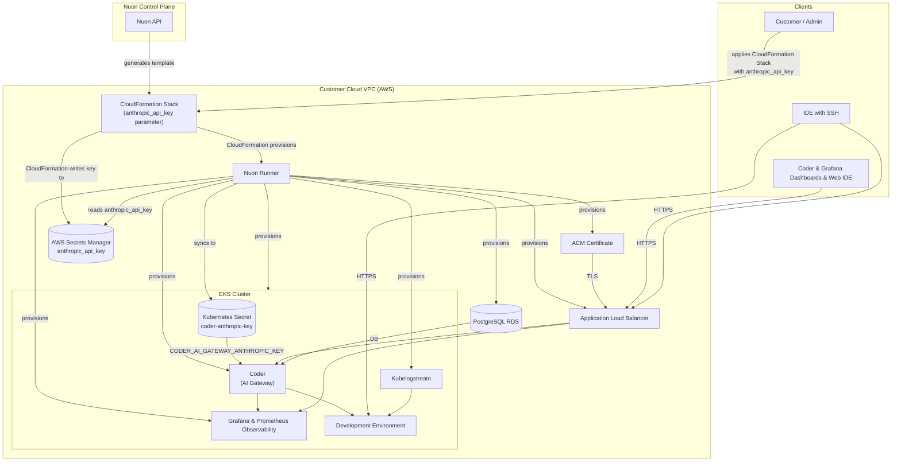

  <video autoplay loop muted playsinline width="640" height="360">
    <source src="https://coder.together.agency/videos/logo/sections/0/content/9/value/video.mp4" type="video/mp4">
    Your browser does not support the video tag.
  </video>

Coder Access URL: [https://{{.nuon.install.sandbox.outputs.nuon_dns.public_domain.name}}](https://{{.nuon.install.sandbox.outputs.nuon_dns.public_domain.name}})

Grafana Access URL: [https://{{.nuon.install.sandbox.outputs.nuon_dns.public_domain.name}}/grafana](https://{{.nuon.install.sandbox.outputs.nuon_dns.public_domain.name}}/grafana)

Nuon Install Id: {{ .nuon.install.id }}

AWS Region: {{ .nuon.install_stack.outputs.region }}

## Getting Started

Coder is a Cloud Development Environment (CDE) platform that lets your team create and manage cloud-hosted development environments from a central dashboard.

Your Coder instance is fully provisioned and ready to use. Navigate to your Coder Access URL above and log in with the admin credentials provided during setup. From there you can create workspace templates, invite users, and launch development environments.

See the [Coder documentation](https://coder.com/docs) to get started.

## Architecture

## Prerequisites

- **AWS account connected to Nuon** — handled during onboarding; Nuon provisions all infrastructure (EKS, VPC, RDS, ALB, DNS, TLS)
- **Coder CLI** (optional) — install the `coder` binary for CLI-based workspace access: [coder.com/docs/install](https://coder.com/docs/install)
- **AWS service quotas** — Nuon manages provisioning, but ensure your account has sufficient quota for EKS node groups, RDS instances, and ALBs

## Configuration

The following inputs can be changed at any time from **Manage → Edit Inputs** in the Nuon dashboard.

| Input | Default | Description |
|---|---|---|
| `enable_telemetry` | `true` | Send usage telemetry to Coder |
| `max_token_lifetime` | `8760h` | Maximum lifetime for CLI and API tokens |
| `session_duration` | `168h` | Session duration before re-authentication is required |
| `block_direct` | `false` | Force all workspace connections through the Coder relay (disables direct peer-to-peer) |

Changing inputs triggers a redeploy of the affected components. The workflow shows a diff and pauses for approval before applying.

## AI Coding Agents (Optional)

Coder ships a built-in AI gateway that turns this install into a hosted home for [Coder Agents](https://coder.com/docs/ai-coder/agents) — Anthropic-powered coding agents that run in the control plane (not inside the workspace) so prompts, diffs, and tool calls are auditable and isolated from your code.

What your developers get when this is turned on:

- A chat UI in the Coder web app (or via the REST API) for running an agent — the agent loop runs in the Coder control plane, not inside the workspace, so prompts stay isolated from the code being edited
- Centralized auth — developers use their Coder login, not a personal Anthropic key
- An audit trail of every prompt and tool invocation, attributed back to the user

Read more in the [Coder AI Gateway docs](https://coder.com/docs/ai-coder/ai-gateway).

### How to enable it

Your Anthropic API key never touches Nuon or the vendor. The flow:

1. Grab a key from [console.anthropic.com](https://console.anthropic.com).
2. When you applied the install stack CloudFormation template, you saw an `anthropic_api_key` parameter. Re-apply the stack with that parameter populated (or set it the first time around).
3. Nuon stores the value in your own AWS Secrets Manager and syncs it as a Kubernetes Secret named `coder-anthropic-key` in the `coder` namespace.
4. The Coder server picks it up from the `CODER_AI_GATEWAY_ANTHROPIC_KEY` environment variable on startup.

If you leave the CloudFormation parameter blank, Coder still boots normally — no key is wired in at deploy time, and a Coder admin would need to add the Anthropic key directly through the Coder dashboard. To rotate the key managed through Nuon, update the parameter in the install stack and use **Manage → Sync Secrets** in the Nuon dashboard.

## Monitoring

Grafana is available at your Grafana Access URL above, served alongside Coder on the same load balancer.

**To retrieve your Grafana credentials:**

1. In the Nuon dashboard, go to your Coder installation
2. Open the **Actions** tab
3. Run the `grafana_password` action
4. The output displays the URL, username (`admin`), and generated password

**Available dashboards:**

- Coder Status — overall health overview
- Coder Coderd — control plane metrics
- Workspaces — utilization and performance
- Workspace Detail — per-workspace deep-dive
- Provisioner — Terraform provisioner metrics
- Postgres Database — RDS performance
- Infrastructure — node-level metrics

## Upgrading

1. Check [Coder Releases](https://github.com/coder/coder/releases/) for the target version
2. In the Nuon dashboard, go to **Manage → Edit Inputs**
3. Update the `coder_release` input to the desired version (e.g. `v2.31.3`)
4. Click **Update Inputs**

The deploy workflow shows a Helm diff and pauses for approval before applying.

## Resources

[Coder Documentation](https://coder.com/docs)

[Coder Releases](https://github.com/coder/coder/releases/)

[Coder Monitoring](https://coder.com/docs/admin/monitoring)

[Coder CLI Reference](https://coder.com/docs/reference/cli/server)

[Coder OSS Repository](https://github.com/coder/coder)

[Coder Agents (AI)](https://coder.com/docs/ai-coder/agents)

[Coder AI Gateway](https://coder.com/docs/ai-coder/ai-gateway)

[AWS Instance Types](https://aws.amazon.com/ec2/instance-types/)

## Cost Estimate
Running this app in your environment will cost around $8/day.
