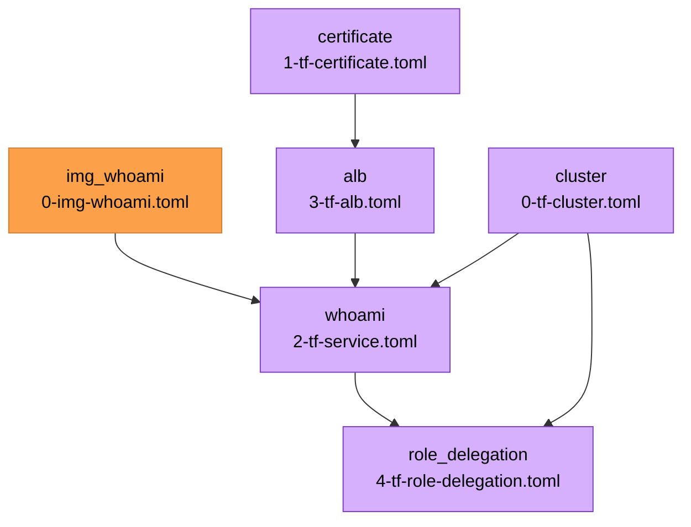

{{ $region := .nuon.cloud_account.aws.region }}

<center>

<h1>ECS Breakglass</h1>

<small>
{{ if .nuon.install_stack.outputs }} AWS | {{ dig "account_id" "000000000000" .nuon.install_stack.outputs }} |
{{ dig "region" "xx-vvvv-00" .nuon.install_stack.outputs }} |
{{ dig "vpc_id" "vpc-000000" .nuon.install_stack.outputs }} {{ else }} AWS | 000000000000 | xx-vvvv-00 | vpc-000000
{{ end }}
</small>

[https://whoami.{{.nuon.sandbox.outputs.nuon_dns.public_domain.name}}](https://whoami.{{.nuon.sandbox.outputs.nuon_dns.public_domain.name}})

</center>

## Description

The purpose of this demo app is to show how a vendor can use break glass an can be used to provide elevated permissions.

## IAM Role Delegation for Cross Account Access

Additionally, we include an example for AWS Iam Role Delegation by which a customer can grant a vendor's IAM role cross
account permissions to a specific subset of resources. In this case, ECS Cluster and CloudWatch log read-access for the
resources created for an install.

## Permission

This demo uses a custom, relatively constrainted, non-admin policy for the maintenance role and grants and denies access
with policies that make heavy use of tag-based filtering. This is used to show how vendors can use granular IAM policies
to provide customers specific guarantees around what the runner can access.

## Break Glass

We include a break glass role that grants admin access to the AWS account with a scoped permission boundary _minus_
SecretManager access.

## Components



### Cluster

A simple ECS cluster with capacity for EC2 based services and Fargate services.

### Certificate

A wildcard certificate for `*.{{.nuon.install.id}}.{{.nuon.inputs.inputs.domain}}`. We opt for a wildcard so it can be
used by multiple ALBs and to prevent subdomain enumeration.

### ALB

An application load balancer that forwards to the `whoami` ECS Service. Uses the certificate component for TLS
termination.

### Whoami

An ECS Service with a single container, `whoami`.

### Role Delegation

Creates a delegated role in the customer's account that the vendor can assume for read-only access to the ECS cluster
and CloudWatch logs.

See [./src/role_delegation](./src/role_delegation) for additional details.

{{ if .nuon.install.inputs.vendor_role_arn }}
{{ if and .nuon.components.cluster.outputs .nuon.components.whoami.outputs .nuon.components.role_delegation.outputs }}

#### Assume the Delegated Role

```bash
aws sts assume-role \
  --role-arn {{ .nuon.components.role_delegation.outputs.delegated_role_arn }} \
  --role-session-name vendor-access \
  --region {{ .nuon.install_stack.outputs.region }}
```

#### AWS CLI Commands

After assuming the role, use these commands to inspect the install's resources:

**Get cluster info:**

```bash
aws ecs describe-clusters \
  --clusters {{ .nuon.components.cluster.outputs.cluster_name }} \
  --region {{ .nuon.install_stack.outputs.region }}
```

**List tasks in the cluster:**

```bash
aws ecs list-tasks \
  --cluster {{ .nuon.components.cluster.outputs.cluster_name }} \
  --region {{ .nuon.install_stack.outputs.region }}
```

**Describe task details:**

```bash
aws ecs describe-tasks \
  --cluster {{ .nuon.components.cluster.outputs.cluster_name }} \
  --tasks $(aws ecs list-tasks --cluster {{ .nuon.components.cluster.outputs.cluster_name }} --region {{ .nuon.install_stack.outputs.region }} --query 'taskArns[0]' --output text) \
  --region {{ .nuon.install_stack.outputs.region }}
```

**Get logs for the whoami container:**

```bash
aws logs tail {{ .nuon.components.whoami.outputs.cloudwatch_log_group_name }} \
  --region {{ .nuon.install_stack.outputs.region }} \
  --follow
```

{{ else }}

> ⏳ Waiting for component outputs... {{ if not .nuon.components.cluster.outputs }}> - Waiting for `cluster` component
> to be deployed. {{ end }} {{ if not .nuon.components.whoami.outputs }}> - Waiting for `whoami` component to be
> deployed. {{ end }} {{ if not .nuon.components.role_delegation.outputs }}> - Waiting for `role_delegation` component
> to be deployed. {{ end }} {{ end }} {{ else }} ℹ️ Set the `vendor_role_arn` input to enable cross-account role
> delegation and see CLI commands here. {{ end }}

## Full State

Click "Manage > State"
