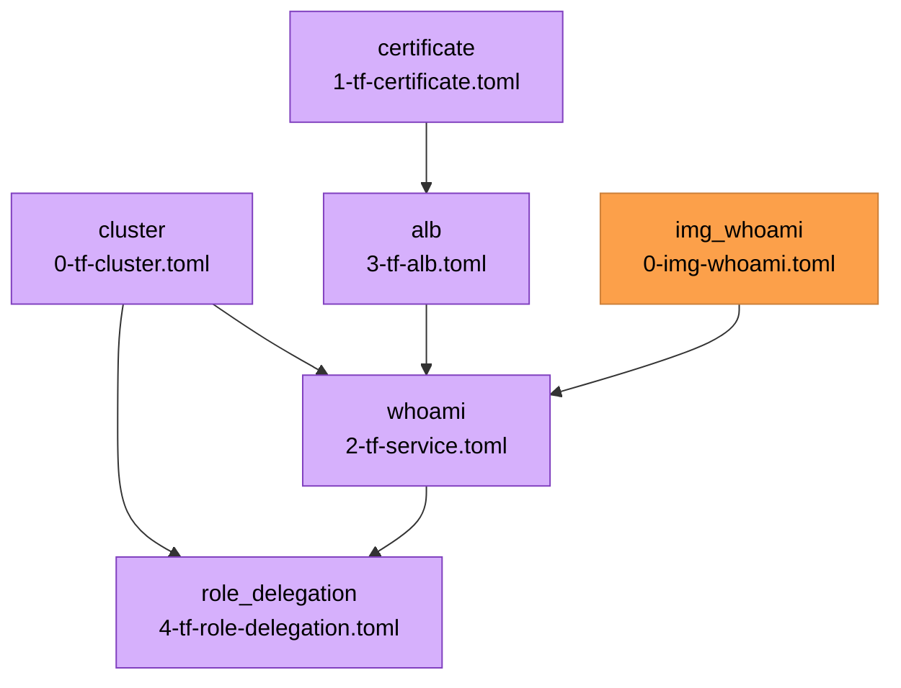

{{ $region := .nuon.cloud_account.aws.region }}

<center>

<h1>ECS Breakglass</h1>

<small>
{{ if .nuon.install_stack.outputs }} AWS | {{ dig "account_id" "000000000000" .nuon.install_stack.outputs }} |
{{ dig "region" "xx-vvvv-00" .nuon.install_stack.outputs }} |
{{ dig "vpc_id" "vpc-000000" .nuon.install_stack.outputs }} {{ else }} AWS | 000000000000 | xx-vvvv-00 | vpc-000000
{{ end }}
</small>

[https://whoami.{{.nuon.sandbox.outputs.nuon_dns.public_domain.name}}](https://whoami.{{.nuon.sandbox.outputs.nuon_dns.public_domain.name}})

</center>

## Description

The purpose of this demo app is to show how a vendor can use break glass an can be used to provide elevated permissions.

### IAM Role Delegation for Cross Account Access

Additionally, we include an example for AWS Iam Role Delegation by which a customer can grant a vendor's IAM role cross
account permissions to a specific subset of resources. In this case, ECS Cluster and CloudWatch log read-access for the
resources created for an install.

### Granular Permissions

This demo uses custom, relatively constrainted, non-admin policies for the maintenance role and grants and denies access
to specific resources ith tag-based filtering. This is used to show how vendors can use granular IAM policies to provide
customers specific guarantees around what the runner can access.

For example, explicit access is granted to ECR but only to the registry created by the sandbox. Secrets access is
permitted during break glass, but only secrets tagged with `install.nuon.co/id={{.nuon.install.id}}`.

### Break Glass

We include a break glass role that grants admin access to the AWS account with a scoped permission boundary _minus_
SecretManager access with the exception of secrets that belong to this install.

## Components



## Cluster

A simple ECS cluster with capacity for EC2 based services and Fargate services.

## Certificate

A wildcard certificate for `*.{{.nuon.install.id}}.{{.nuon.inputs.inputs.domain}}`. We opt for a wildcard so it can be
used by multiple ALBs and to prevent subdomain enumeration.

## ALB

An application load balancer that forwards to the `whoami` ECS Service. Uses the certificate component for TLS
termination.

## Whoami

An ECS Service with a single container, `whoami`.

## Role Delegation

Creates a delegated role in the customer's account that the vendor can assume for read-only access to the ECS cluster
and CloudWatch logs.

See [./src/role_delegation](./src/role_delegation) for additional details.

{{ if .nuon.inputs.inputs.vendor_role_arn }}

Role delegation is enabled:

| ARN                                                                             | Description                                                                                     |
| ------------------------------------------------------------------------------- | ----------------------------------------------------------------------------------------------- |
| `{{ .nuon.inputs.inputs.vendor_role_arn }}`                                     | The vendor's role that can assume a role for the install. This is provided by the vendor.       |
| `{{ dig "outputs" "delegated_role_arn" "-" .nuon.components.role_delegation }}` | The delegated role arn wich the vendor role can assume. This is created as part of the install. |

### How to use this?

> [!WARNING] When using the scripts for the role delegation bits, ensure you have properly configured your AWS_PROFILE.

> [!WARNING] After you have dropped into the vendor or install shell, ensure your AWS_PROFILE is not being provided by
> the calling context.

1. attach the policy to your vendor role.
   ```bash
   # AWS_PROFILE=vendor.Delegation  # <- may be necessary, if you need it you probably know
   ./scripts/vendor-role-policy.sh {{ .nuon.inputs.inputs.vendor_role_arn }} {{ dig "outputs" "delegated_role_arn" "-" .nuon.components.role_delegation }}
   ```
2. assume the install role and get a shell
   ```bash
   # AWS_PROFILE=vendor.Delegation  # <- may be necessary, if you need it you probably know
   ./scripts/install-shell {{ .nuon.inputs.inputs.vendor_role_arn }} {{ dig "outputs" "delegated_role_arn" "-" .nuon.components.role_delegation }}
   ```

<details>
<summary>Nitty Gritty Details</summary>

In order for the role delegation to work, the vendor_role needs the following policy in place. This can be done in an
automated fashion via webhook or similar, but must, naturally, take place after the `role_delegation` component has been
deployed.

```json
{
  "Version": "2012-10-17",
  "Statement": {
    "Effect": "Allow",
    "Action": "sts:AssumeRole",
    "Resource": "{{ dig "outputs" "delegated_role_arn" "-" .nuon.components.role_delegation }}"
  }
}
```

As such, the order of operation is as follows:

1. An install is created.
2. The `role_delegation` component is deployed creating a role w/ a trust policy allowing the `vendor_role` to assume
   it.
3. The vendor then attaches a policy to the `vendor_role` allowing it to assume the install's `delegated_role`. For this
   demo, this is done manually. In production, this would likely be automated.

To attach the policy, use the provided script:

```bash
# AWS_PROFILE=vendor.Delegation  # <- may be necessary, if you need it you probably know
./scripts/vendor-role-policy.sh {{ .nuon.inputs.inputs.vendor_role_arn }} {{ dig "outputs" "delegated_role_arn" "-" .nuon.components.role_delegation }}
```

</details>

#### Using the delegated role

Once the policy has been attached, the vendor role can now assume the delegated role. For convenience, we provide a
script to open a shell w/ the delegated role credentials.

```bash
# AWS_PROFILE=vendor.Delegation  # <- may be necessary, if you need it you probably know
./scripts/install-shell {{ .nuon.inputs.inputs.vendor_role_arn }} {{ dig "outputs" "delegated_role_arn" "-" .nuon.components.role_delegation }}
```

<details>
<summary>Additional Debugging</summary>

For the purpose of this demonstration, we provide an additional helper scripts to create a shell w/ credentials for the
vendor role.

```bash
# AWS_PROFILE=vendor.Delegation  # <- may be necessary, if you need it you probably know
./scripts/vendor-shell.sh {{ .nuon.inputs.inputs.vendor_role_arn }}
```

Optionally, once in the shell, to see the env vars. you may need to override the `AWS_PROFILE` if it is set to a value
from your dev env.

```bash
env | grep AWS | cut -d '=' -f 1
```

Once in this shell, you can test with the scripts below.

```bash
# AWS_PAGER=""  # disable pager
aws sts get-caller-identity
```

</details>

### AWS CLI using the delegated role

From within the install shell...

{{ if and .nuon.components.cluster.outputs .nuon.components.whoami.outputs .nuon.components.role_delegation.outputs }}

#### AWS CLI Commands

After assuming the role, use these commands to inspect the install's resources:

**Get cluster info:**

```bash
aws ecs describe-clusters \
  --clusters {{ .nuon.components.cluster.outputs.cluster_name }} \
  --region {{ .nuon.install_stack.outputs.region }}
```

**List tasks in the cluster:**

```bash
aws ecs list-tasks \
  --cluster {{ .nuon.components.cluster.outputs.cluster_name }} \
  --region {{ .nuon.install_stack.outputs.region }}
```

**Describe task details:**

```bash
aws ecs describe-tasks \
  --cluster {{ .nuon.components.cluster.outputs.cluster_name }} \
  --tasks $(aws ecs list-tasks --cluster {{ .nuon.components.cluster.outputs.cluster_name }} --region {{ .nuon.install_stack.outputs.region }} --query 'taskArns[0]' --output text) \
  --region {{ .nuon.install_stack.outputs.region }}
```

**Get logs for the whoami container:**

```bash
aws logs tail {{ .nuon.components.whoami.outputs.cloudwatch_log_group_name }} \
  --region {{ .nuon.install_stack.outputs.region }} \
  --follow
```

{{ else }}

> ⏳ Waiting for component outputs... {{ if not .nuon.components.cluster.outputs }}> - Waiting for `cluster` component
> to be deployed. {{ end }} {{ if not .nuon.components.whoami.outputs }}> - Waiting for `whoami` component to be
> deployed. {{ end }} {{ if not .nuon.components.role_delegation.outputs }}> - Waiting for `role_delegation` component
> to be deployed. {{ end }} {{ end }} {{ else }} ℹ️ Set the `vendor_role_arn` input to enable cross-account role
> delegation and see CLI commands here.

{{ end }}

## Full State

Click "Manage > State"
