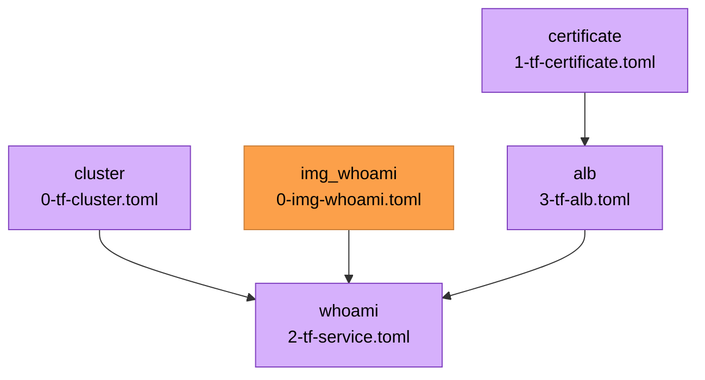

{{ $region := .nuon.cloud_account.aws.region }}

<h1>ECS Simple</h1>

<small>
{{ if .nuon.install_stack.outputs }} AWS | {{ dig "account_id" "000000000000" .nuon.install_stack.outputs }} |
{{ dig "region" "xx-vvvv-00" .nuon.install_stack.outputs }} |
{{ dig "vpc_id" "vpc-000000" .nuon.install_stack.outputs }} {{ else }} AWS | 000000000000 | xx-vvvv-00 | vpc-000000
{{ end }}
</small>

[https://whoami.{{.nuon.sandbox.outputs.nuon_dns.public_domain.name}}](https://whoami.{{.nuon.sandbox.outputs.nuon_dns.public_domain.name}})

## Components

### Cluster

A simple ECS cluster with capacity for EC2 based services and Fargate services.

### Service

The whoami service.

## Full State

Click "Manage > State"
