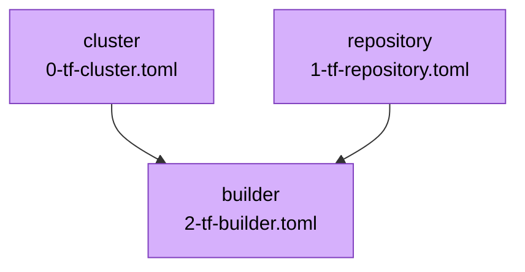

# Scripts

This directory contains utility scripts for the Nuon application.

## generate_diagram.py

This script analyzes the component configuration files in the `components/` directory and generates a MermaidJS diagram
showing the dependency graph of your application components.

It detects dependencies by parsing variables that reference other components' outputs (e.g.
`{{.nuon.components.cluster.outputs.cluster_id}}`) in both the TOML configuration and referenced var files.

### Usage

#### With `uv` (Recommended)

If you have [uv](https://github.com/astral-sh/uv) installed, you can run the script directly. It will automatically
handle dependencies.

```bash
uv run scripts/generate_diagram.py
```

#### Without `uv`

You will need to install the required Python dependencies manually.

1. Install dependencies:

   ```bash
   pip install tomli
   ```

2. Run the script:
   ```bash
   python scripts/generate_diagram.py
   ```

### Output

The script outputs a Mermaid graph definition to stdout. You can copy this output into a Markdown file (like
`README.md`) or a Mermaid live editor.

Example output:


