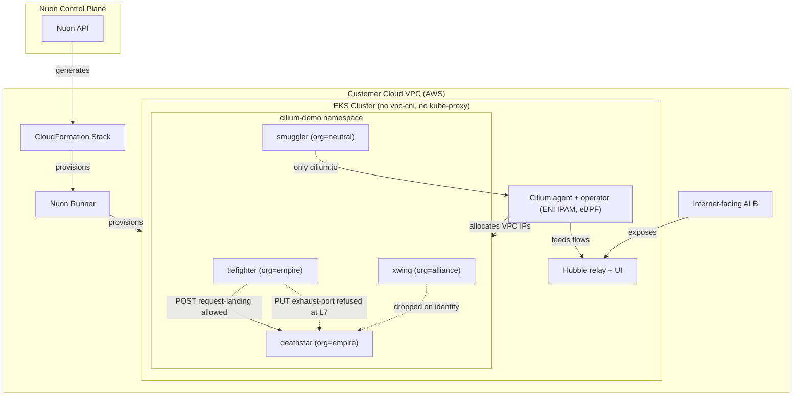

> [!WARNING]
> **Experimental** — this sample app config is a work in progress and is not
> guaranteed to deploy successfully. Use it as a reference only.

<h1> EKS Cilium </h1>
EKS cluster where Cilium replaces both the VPC CNI and kube-proxy and owns the datapath.
Workload identity, not IP address, decides what may talk to what — enforced at L3/L4, at the HTTP layer, and by DNS name — with every verdict visible in Hubble.

Nuon Install Id: {{ .nuon.install.id }}

AWS Region: {{ .nuon.install_stack.outputs.region }}

  <a href="http://hubble.{{ .nuon.install.sandbox.outputs.nuon_dns.public_domain.name }}" style="display:inline-flex; align-items:center; justify-content:center; gap:8px; padding:10px 22px; background:#8b5cf6; color:white; border-radius:8px; text-decoration:none; font-weight:600; font-size:15px;">Open Hubble UI →</a>

## How It Works

1. The sandbox is provisioned with `enable_cilium = true`, so the `vpc-cni` and `kube-proxy` addons are never installed and Cilium is deployed as part of cluster creation.
2. Cilium runs in **ENI IPAM mode** with native routing, so pods still receive VPC-routable addresses. That is what keeps `alb.ingress.kubernetes.io/target-type: ip` working — an overlay would break every ALB ingress in the sandbox.
3. `kubeProxyReplacement` is on, so service handling is done in eBPF rather than iptables.
4. The `demo_app` component deploys the Star Wars workloads: `deathstar` (2 replicas, behind a Service), `tiefighter` and `xwing` as callers, and a `smuggler` used only for the egress demo.
5. The policy components attach `CiliumNetworkPolicy` rules to those workloads.
6. Hubble is enabled with relay and UI; the `hubble_ui` component puts the UI behind an internet-facing ALB.

## Why the runtime must be installed by the sandbox

With no VPC CNI, nodes register but stay **NotReady** until the Cilium agents land and write a CNI config. Anything that waits on pod readiness — including the Nuon runner that installs components — cannot make progress until that happens. Installing Cilium from an app component would therefore deadlock: the component can never run, because the thing it installs is what makes running components possible.

That is why Cilium lives behind a sandbox flag rather than in this app config, and why every other helm release in the sandbox depends on it.

## The demo

Run the actions in order.

### `verify_cilium`

Confirms `aws-node` and `kube-proxy` are genuinely absent, prints the datapath config (`ipam=eni`, `routing-mode=native`, `kube-proxy-replacement=true`), and shows that pod IPs are VPC addresses. Also lists each endpoint's Cilium **identity** — the number that policy is actually written against.

### `demo_policy` — identity at L3/L4, then method and path at L7

One rule on `deathstar` does both jobs:

| Call | Result | Enforced by |
| --- | --- | --- |
| `tiefighter` → `POST /v1/request-landing` | allowed | matches identity and L7 rule |
| `xwing` → `POST /v1/request-landing` | dropped | identity — `org=alliance` is not `org=empire` |
| `tiefighter` → `PUT /v1/exhaust-port` | refused | L7 — allowed caller, disallowed method and path |

The middle row is dropped before any HTTP is parsed; the third gets far enough for Cilium to read the request and reject it. Note there is deliberately **no** separate L3-only rule: Cilium policies are additive, so a broader rule would union away the L7 restriction and quietly let the exhaust-port call through.

### `demo_fqdn` — egress by DNS name

The `smuggler` may reach `cilium.io` and nothing else. Selecting an endpoint for egress makes it default-deny, so DNS itself is allowed explicitly — Cilium inspects the DNS response to learn which IPs the name currently maps to. Both names resolve; only the allowed one is then reachable.

### `hubble_flows`

Prints dropped flows, L7 HTTP flows, and recent verdicts. Flows are labelled by identity rather than IP, so a verdict names the workload. The same data is in the Hubble UI linked above.

## Notes

`hubble.{{ .nuon.install.sandbox.outputs.nuon_dns.public_domain.name }}` is served over plain HTTP by an internet-facing ALB and has no authentication in front of it. That is fine for a demo install and should not be copied into anything real.

## Architecture

