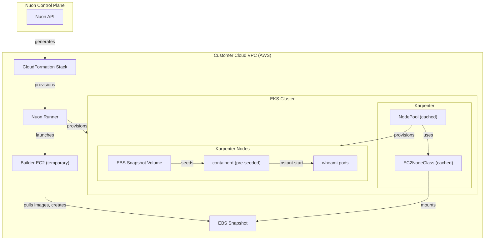

<h1> EKS Karpenter Image Cache </h1>
EKS cluster with Karpenter and pre-cached container images via EBS snapshots.
Large images are pulled once into an EBS snapshot during provisioning, then mounted on every new Karpenter node so pods start instantly without registry pulls.

Nuon Install Id: {{ .nuon.install.id }}

AWS Region: {{ .nuon.install_stack.outputs.region }}

## How It Works

1. The `image_cache` Terraform component launches a temporary EC2 instance, pulls the specified container images, and creates an EBS snapshot.
2. The `node_class` component creates a Karpenter EC2NodeClass that mounts the snapshot as a secondary volume via `blockDeviceMappings`.
3. On node boot, `userData` copies the cached containerd data before the EKS bootstrap starts containerd.
4. The `node_pool` component creates a Karpenter NodePool referencing the cached EC2NodeClass.
5. Workload pods (e.g. `whoami`) are scheduled on cached nodes with images already available.

## Architecture

### Full State

Full Install State

<pre>{{ toPrettyJson .nuon }}</pre>

