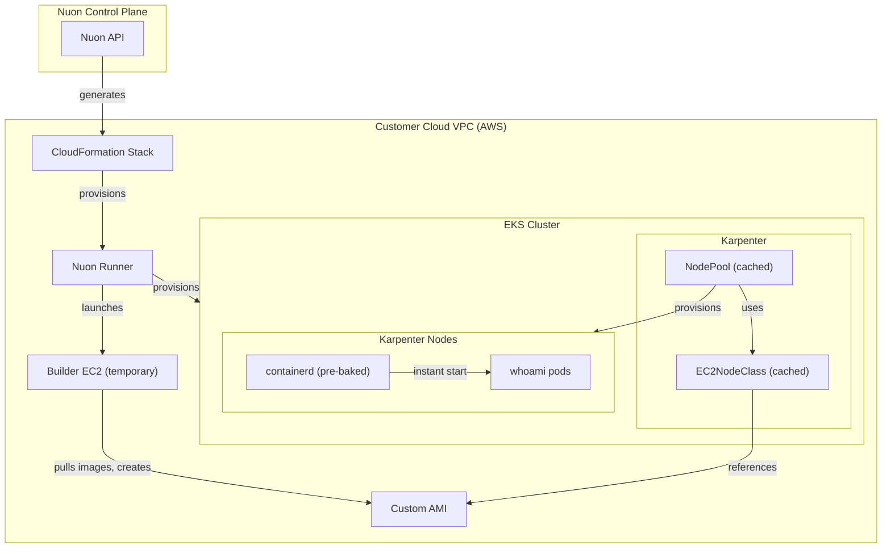

<h1> EKS Karpenter Image Cache </h1>
EKS cluster with Karpenter and pre-cached container images via custom AMIs.
Large images are pulled once into a custom AMI during provisioning. Karpenter nodes launch with images already in containerd so pods start instantly without registry pulls.

Nuon Install Id: {{ .nuon.install.id }}

AWS Region: {{ .nuon.install_stack.outputs.region }}

## How It Works

1. The `image_cache` Terraform component launches a temporary EC2 instance using the EKS-optimized AL2023 AMI, pulls the specified container images into containerd, and creates a custom AMI.
2. The `node_class` component creates a Karpenter EC2NodeClass that references the custom AMI via `amiSelectorTerms`.
3. The `node_pool` component creates a Karpenter NodePool referencing the cached EC2NodeClass.
4. When pods are scheduled, Karpenter launches nodes from the custom AMI with images already present in containerd's content store.
5. Kubelet sees the images as "already present on machine" and skips registry pulls entirely.

## Architecture

### Full State

Full Install State

<pre>{{ toPrettyJson .nuon }}</pre>

