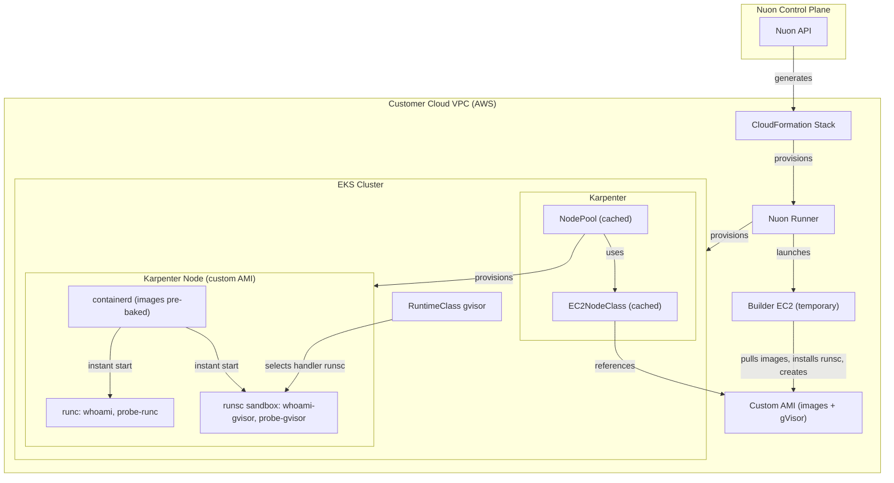

> [!WARNING]
> **Experimental** — this sample app config is a work in progress and is not
> guaranteed to deploy successfully. Use it as a reference only.

<center>
<h1> EKS Karpenter Image Cache + gVisor </h1>
EKS cluster with Karpenter nodes booting from a custom AMI that carries both pre-pulled container images and the gVisor runtime.
Large images are pulled once at provision time so pods start without registry pulls, and `runsc` is baked in so workloads can opt into a sandboxed kernel per pod.

Nuon Install Id: {{ .nuon.install.id }}

AWS Region: {{ .nuon.install_stack.outputs.region }}

<div style="display:flex; gap:10px; align-items:center; justify-content:center; padding-top:1rem;">
  <a href="http://whoami-gvisor.{{ .nuon.install.sandbox.outputs.nuon_dns.public_domain.name }}/kernel" style="display:inline-flex; align-items:center; justify-content:center; gap:8px; padding:10px 22px; background:#8b5cf6; color:white; border-radius:8px; text-decoration:none; font-weight:600; font-size:15px;">gVisor kernel →</a>
  <a href="http://whoami.{{ .nuon.install.sandbox.outputs.nuon_dns.public_domain.name }}/kernel" style="display:inline-flex; align-items:center; justify-content:center; gap:8px; padding:10px 22px; background:transparent; color:#c4b5fd; border:1px solid rgba(139,92,246,0.6); border-radius:8px; text-decoration:none; font-weight:600; font-size:15px;">Host kernel →</a>
</div>

</center>

## How It Works

1. The `image_cache` Terraform component launches a temporary EC2 instance using the EKS-optimized AL2023 AMI, pulls the specified container images into containerd, installs `runsc` and `containerd-shim-runsc-v1`, and creates a custom AMI.
2. The `node_class` component creates a Karpenter EC2NodeClass that references the custom AMI via `amiSelectorTerms`, and registers the `runsc` runtime with containerd through `NodeConfig` in `userData`.
3. The `node_pool` component creates a Karpenter NodePool referencing the cached EC2NodeClass.
4. The `runtime_class` component creates a `RuntimeClass` named `gvisor` with handler `runsc`, carrying the node selector and tolerations for the cached pool.
5. When pods are scheduled, Karpenter launches nodes from the custom AMI with images already present in containerd's content store. Kubelet sees them as "already present on machine" and skips registry pulls entirely.
6. Pods that set `runtimeClassName: gvisor` run inside a gVisor sandbox on those same nodes. Everything else keeps running under `runc`.

## Why the runtime is registered in userData, not the AMI

EKS AL2023 nodes are bootstrapped by `nodeadm`, which regenerates `/etc/containerd/config.toml` on **every** boot. A containerd config baked into the AMI would be overwritten. Only the binaries are baked in; the runtime is registered through the supported `NodeConfig` merge in `EC2NodeClass.spec.userData`:

```yaml
[plugins."io.containerd.grpc.v1.cri".containerd.runtimes.runsc]
  runtime_type = "io.containerd.runsc.v1"
```

That is the legacy containerd 1.7 plugin path, and it is deliberate. The AL2023 EKS AMI ships containerd 2.x even on EKS 1.32 (verified: `containerd://2.2.5`, config `version = 3`), where the runtime lives under `plugins.'io.containerd.cri.v1.runtime'` instead. `nodeadm` migrates the legacy key forward when it merges the snippet, so on a running node the stanza ends up at the 2.x path. Writing the legacy key therefore works on both containerd 1.7 and 2.x; writing the 2.x key directly would only work on 2.x.

## Verifying the sandbox

`traefik/whoami` is a `FROM scratch` image with no shell, so it cannot report its own kernel. Each pod therefore runs a small `busybox` sidecar that writes `uname -a`, `/proc/version` and `dmesg` into a page served at **`/kernel`** on the same hostname. `busybox` is in the pre-cached image list, so the sidecar starts without a pull.

Open `/kernel` on each host and compare:

- **`whoami`** reports the host AL2023 kernel (6.1.x).
- **`whoami-gvisor`** reports gVisor's synthetic kernel and a `Starting gVisor...` banner in `dmesg`.

Both pods land on the **same node**, so the only variable is the runtime. The `verify_runtimes` action prints the same comparison from the CLI.

Two `whoami` deployments are exposed through ingress to show a real HTTP workload under each runtime:

| Component | Runtime | App | Kernel |
| --- | --- | --- | --- |
| `whoami` | `runc` | [whoami.{{ .nuon.install.sandbox.outputs.nuon_dns.public_domain.name }}](http://whoami.{{ .nuon.install.sandbox.outputs.nuon_dns.public_domain.name }}) | [/kernel](http://whoami.{{ .nuon.install.sandbox.outputs.nuon_dns.public_domain.name }}/kernel) |
| `whoami_gvisor` | `runsc` | [whoami-gvisor.{{ .nuon.install.sandbox.outputs.nuon_dns.public_domain.name }}](http://whoami-gvisor.{{ .nuon.install.sandbox.outputs.nuon_dns.public_domain.name }}) | [/kernel](http://whoami-gvisor.{{ .nuon.install.sandbox.outputs.nuon_dns.public_domain.name }}/kernel) |

Each is an internet-facing ALB created by the AWS Load Balancer Controller, with external-dns publishing the record into the install's public zone. The response body names which deployment served it, so the two are easy to tell apart.

## gVisor limitations

`runsc` implements the Linux syscall surface in userspace and does not cover all of it. Sandboxed pods cannot use privileged containers, host namespaces (`hostNetwork`, `hostPID`, `hostIPC`), `hostPath` volumes, or eBPF, and syscall- and network-heavy workloads pay a measurable overhead. The `restrict-gvisor-pod-privileges` Kyverno policy audits sandboxed pods for these requests at admission rather than letting them fail at runtime. `kube-system` DaemonSets are unaffected and keep running under `runc`.

## Rebuilding the AMI

The AMI name and replacement trigger are derived from a hash of the image list plus the gVisor version, so changing either in `components/0-image-cache.toml` rebuilds it. `/etc/nuon-image-cache.json` on each node records what was baked in.

## Architecture


```mermaid

  graph TD

      subgraph Nuon["Nuon Control Plane"]
          NuonAPI["Nuon API"]
      end

      subgraph VPC["Customer Cloud VPC (AWS)"]
          Runner["Nuon Runner"]
          Stack["CloudFormation Stack"]

          subgraph EKS["EKS Cluster"]
              subgraph Karpenter["Karpenter"]
                  EC2NodeClass["EC2NodeClass (cached)"]
                  NodePool["NodePool (cached)"]
              end

              RuntimeClass["RuntimeClass gvisor"]

              subgraph CachedNodes["Karpenter Node (custom AMI)"]
                  Containerd["containerd (images pre-baked)"]
                  Runc["runc: whoami, probe-runc"]
                  Runsc["runsc sandbox: whoami-gvisor, probe-gvisor"]
              end
          end

          Builder["Builder EC2 (temporary)"]
          AMI["Custom AMI (images + gVisor)"]
      end

      NuonAPI -->|generates| Stack
      Stack -->|provisions| Runner
      Runner -->|provisions| EKS
      Runner -->|launches| Builder
      Builder -->|pulls images, installs runsc, creates| AMI
      EC2NodeClass -->|references| AMI
      NodePool -->|uses| EC2NodeClass
      NodePool -->|provisions| CachedNodes
      Containerd -->|instant start| Runc
      Containerd -->|instant start| Runsc
      RuntimeClass -->|selects handler runsc| Runsc

```
