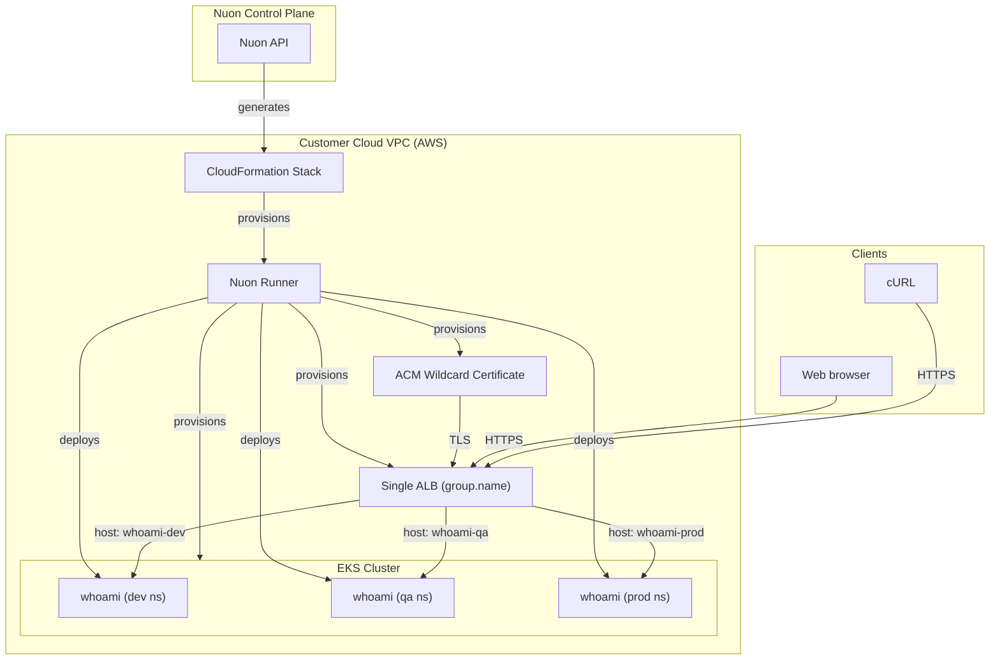

### What this app does?

Provisions a single AWS EKS Kubernetes cluster and deploys the `whoami` HTTP
server into three isolated namespaces (`dev`, `qa`, `prod`) inside it. One
ALB and one wildcard TLS certificate serve all three environments.

This pattern lets you re-use one cluster across dev, qa, and prod to save
cost and operational complexity, while keeping each environment isolated at
the namespace boundary.

### Prerequisites

- AWS account connected to Nuon (handled during onboarding)

### How to install/What to expect next?

- Clicking install will generate a link for you to log into AWS and create a CloudFormation stack which creates the VPC, EC2 VM, and a runner, an agent that receives jobs to deploy whoami in your VPC
- If configured, you may be prompted to approve plan steps
- Average installation time is 45 minutes due to creating the VPC, ASG, VM, AWS EKS cluster, and the three whoami deployments

### What gets deployed in your cloud account?

- Dedicated VPC
- AWS EKS Kubernetes cluster
- Three `whoami` deployments, one per environment (dev/qa/prod), via Helm
- One AWS wildcard ACM certificate covering all three environment hostnames
- One Application Load Balancer, shared across all three environments via
  `alb.ingress.kubernetes.io/group.name`

After install, each environment is reachable at its own hostname:

- `https://{sub_domain}-dev.{install-id}.{domain}`
- `https://{sub_domain}-qa.{install-id}.{domain}`
- `https://{sub_domain}-prod.{install-id}.{domain}`

### What inputs can you enter?

- AWS region
- Public domain
- Subdomain (used as the prefix for all three environment hostnames)

Environment names (`dev`, `qa`, `prod`) are fixed by this app config.

### Security & compliance

- [Nuon BYOC trust center](https://docs.nuon.co/guides/vendor-customers)
- All resource provisioning and scripts are performed by an agent in a VM in your VPC - no cross-account access granted to the vendor
- Environments are isolated at the Kubernetes namespace boundary; traffic, RBAC, secrets, and resource limits are scoped per namespace

### Nuon concepts

The following terminology is core to the Nuon BYOC platform.

#### Connect Your App | App Config
- App (collection of TOML config files that provision and manage the whoami app in your cloud account)
- Sandbox (the underlying infrastructure, in this case an EKS Kubernetes cluster with three pre-created namespaces)
- Component (the Helm charts and Terraform to deploy whoami into each environment, the shared AWS TLS certificate, and the shared ALB)
- Inputs (dynamic values specific to the install e.g., public domain, subdomain)
- Secrets (sensitive values either auto-created or entered by the customer during Stack creation - stored in AWS Secrets Manager)

#### Support Customer Infrastructure | Customer Config

- Installs (Installs are instances of an application in your (the customer) cloud account.)
- Stack (the AWS CloudFormation stack that provisions the VPC, subnets, IAM roles, ASG, EC2 VM and Runner (agent) Docker service)
- Runners (Egress-only agents deployed in customer cloud accounts that execute all provisioning, deployment, and day-2 operations.)
- Operational Roles (IAM roles to perform different operations for least-privilege access across sandbox, components, and actions.)

#### Continuous Delivery | Day-2 Operations

- Workflows (Orchestration of the deployment, update & teardown lifecycle of apps, components, and actions)
- Actions (Bash scripts for health checks, migrations, debugging, and day-2 operations - this app's actions iterate over all three environments)
- Policies (Rego & Kyverno configs to enforce compliance and security rules at infrastructure plan steps)
- Customer Portal (A customer-facing web dashboard to initiate and monitor an app's install in a customer's VPC)
