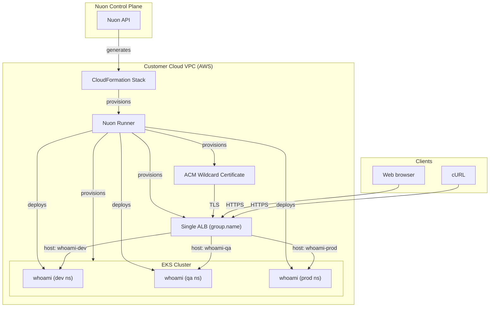

# EKS Multi-Env

## Use case

Re-use one Kubernetes cluster across dev, qa, and prod environments to save
cost and complexity.

This app config demonstrates that pattern. It provisions a single EKS cluster
and uses Nuon to deploy three isolated environments inside it:

- three namespaces (`dev`, `qa`, `prod`), created by Terraform
- one copy of the whoami app deployed into each namespace via Helm
- a single ALB serving all three environments via shared `group.name`
- a single wildcard ACM certificate covering all three hostnames

The result: one cluster, one ALB, one cert, three fully isolated environments
behind their own DNS names. Environments share infrastructure but not workloads,
so traffic, RBAC, secrets, and resource limits remain scoped per namespace.

Nuon Install Id: {{ .nuon.install.id }}

AWS Region: {{ .nuon.install_stack.outputs.region }}

## URLs

After install, each environment is reachable at its own subdomain:

- dev: https://{{.nuon.inputs.inputs.sub_domain}}-dev.{{.nuon.install.sandbox.outputs.nuon_dns.public_domain.name}}
- qa: https://{{.nuon.inputs.inputs.sub_domain}}-qa.{{.nuon.install.sandbox.outputs.nuon_dns.public_domain.name}}
- prod: https://{{.nuon.inputs.inputs.sub_domain}}-prod.{{.nuon.install.sandbox.outputs.nuon_dns.public_domain.name}}

To verify each environment:

```bash
for env in dev qa prod; do
  echo "=== $env ==="
  curl -s "https://{{.nuon.inputs.inputs.sub_domain}}-${env}.{{.nuon.install.sandbox.outputs.nuon_dns.public_domain.name}}/"
done
```

Each response is served from the whoami pod running in that environment's
namespace; the `Hostname:` field in the response reflects the pod name.

## How it works

- `sandbox.tfvars` passes `additional_namespaces = ["dev", "qa", "prod"]` to the
  EKS sandbox, which creates one Kubernetes namespace per environment
- Three `whoami-*` helm components deploy whoami into each namespace
- The `application_load_balancer` helm component renders three Ingress objects
  (one per namespace) that all share the same
  `alb.ingress.kubernetes.io/group.name` annotation, so the AWS Load Balancer
  Controller merges them into one physical ALB with three host-based listener
  rules on port 443
- The `certificate` component issues a single wildcard ACM cert
  `*.{install-id}.{domain}` that covers all three environment hostnames since
  they're each one subdomain level deep

## Architecture



## Cost Estimate

Running this app in your environment will cost around $8/day. Total cost is
roughly equivalent to a single-env EKS install since the cluster, ALB, NAT, and
control plane are shared across all three environments.
