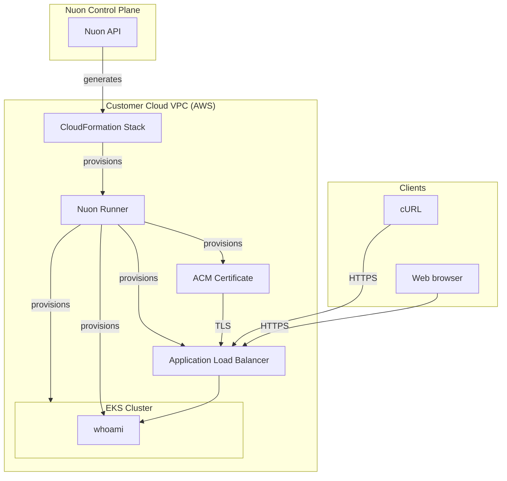

<center>
<h1> EKS Simple </h1>
This is a simple EKS cluster with a whoami app deployed to it.

Nuon Install Id: {{ .nuon.install.id }}

AWS Region: {{ .nuon.install_stack.outputs.region }}

</center>

To test, either click the url [https://{{.nuon.inputs.inputs.sub_domain}}.{{.nuon.install.sandbox.outputs.nuon_dns.public_domain.name}}](https://{{.nuon.inputs.inputs.sub_domain}}.{{.nuon.install.sandbox.outputs.nuon_dns.public_domain.name}}) or open a terminal and run the following command:

```bash
curl https://{{.nuon.inputs.inputs.sub_domain}}.{{.nuon.install.sandbox.outputs.nuon_dns.public_domain.name}}
```

Expected output:

```bash
Hostname: whoami-78ffb6cbf9-w6tcc
IP: 127.0.0.1
IP: ::1
IP: 10.128.134.220
IP: fe80::a0b5:67ff:fe1f:795
RemoteAddr: 10.128.0.152:44048
GET / HTTP/1.1
Host: whoami.inxxxxxxxxxxxxxxxxxxxxxxx.nuon.run
User-Agent: curl/8.7.1
Accept: */*
X-Amzn-Trace-Id: Root=1-689f5793-4409b4cb4c923e0b0189cd69
X-Forwarded-For: xxx.xxx.xxx.xxx
X-Forwarded-Port: 443
X-Forwarded-Proto: https
```

## Architecture



## Optional telemetry demo

`telemetry_collector` is toggleable and disabled by default. Enable it explicitly to collect container stdout/stderr
logs across namespaces on Linux worker nodes, including tainted nodes. It excludes its own collector logs and adds
Kubernetes pod, namespace, and container metadata. It does not collect metrics, traces, application log files outside
the Kubernetes container log directory, or managed AWS service logs. Review log contents before enabling export;
the collector does not redact secrets or personal data.

The path is container logs → collector DaemonSet → private runner collector → BYOC telemetry relay → LGTM.
Backend credentials stay on the relay; the DaemonSet uses the install's private `telemetry_endpoint` stack output
without a Grafana password or runner token.

1. Sync this app config to your BYOC control plane. When testing from a feature branch, select that branch as the
   config source; `branch.toml` remains pointed at `main` for normal releases.
2. Update the install's CloudFormation stack with the pinned VPC `v0.5.0` and runner `v0.6.0` templates and
   `EnableTelemetryIngress=true`. Confirm the `telemetry_endpoint` stack output is nonempty. Existing install-level
   template URL overrides must be updated too; changing app config does not override them.
3. Enable telemetry forwarding for this install in its BYOC control plane and configure that control plane's relay
   to forward to LGTM. A telemetry-capable runner must be running; the stack version alone does not enable forwarding.
4. Enable and deploy `telemetry_collector` using the install's component controls. Rendering fails with a prerequisite
   error if the endpoint is missing or empty. Do not append `/v1/logs` to the endpoint.
5. Check the collector DaemonSet and its logs in namespace `whoami`. After it is ready, emit a fresh, recognizable
   stdout log line from a test pod and find it in LGTM with Kubernetes metadata and verified `nuon.*` identity fields.
   An HTTP response from whoami is not itself a container log; use an actual stdout/stderr log line for the demo.

Collection starts at the end of existing log files. Checkpoints survive collector restarts on the same node, but
the batch processor and export queue are in memory: pending logs can be lost on restart. This is a demo collector,
not a lossless delivery guarantee. Disable the component to stop collection; disabling only runner forwarding
leaves it retrying an unavailable endpoint.

## Continuous delivery via app branches

This app is connected to the `main` branch of
[nuonco/example-app-configs](https://github.com/nuonco/example-app-configs) through its `branch.toml`, so a push to that
branch starts a coordinated update instead of a per-install change. Installs roll out by deployment group in order —
installs labelled `env=stage` first, then `env=prod` — and every group is planned and waits for an approval before
anything is deployed, so you always see the diff first.

To demo the flow you need installs for the groups to deploy to: after `nuon apps sync`, create them from the config
files in [`installs/`](./installs) by running `nuon installs sync -d installs/` — see the
[CLI reference](https://docs.nuon.co/cli-commands) and the
[app branches guide](https://docs.nuon.co/guides/app-branches).

The two installs approve differently on purpose: the stage install has `approval_option = "approve-all"`, so the
first group deploys on its own, while the prod install has `approval_option = "prompt"`. A branch run will finish
stage and then **wait at the production group until someone approves its plan** — if a run looks stalled after stage
succeeds, it is waiting on you. Approve it from the run's deployment plan in the dashboard, or skip the group.

## Cost Estimate
Running this app in your environment will cost around $8/day.
