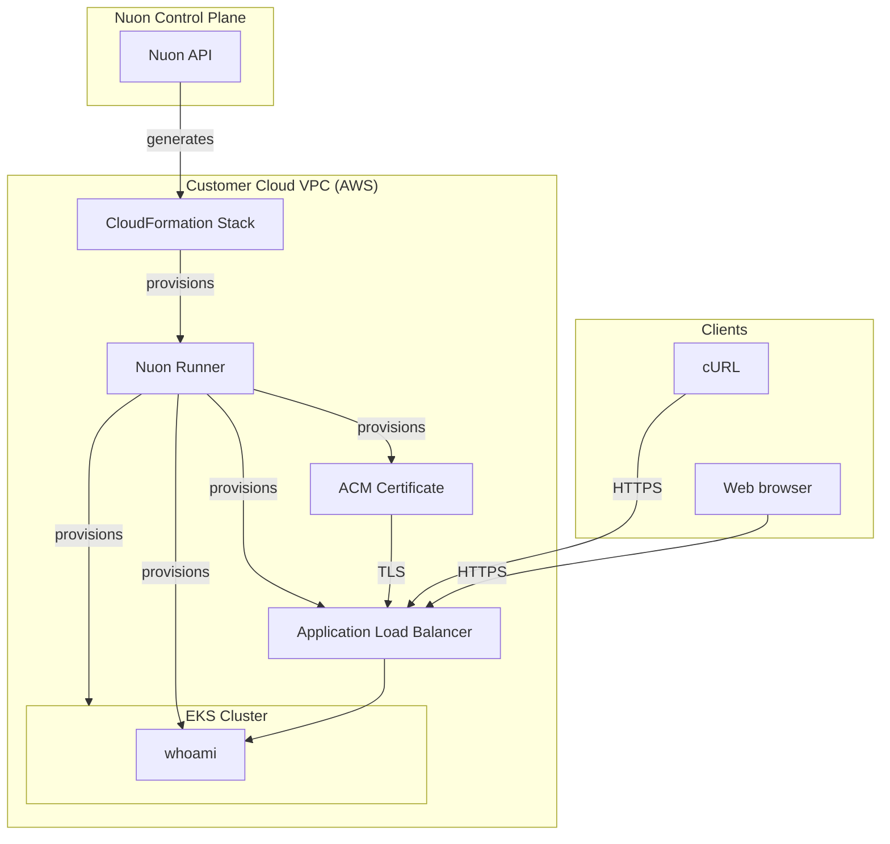

<center>
<h1> EKS Simple </h1>
This is a simple EKS cluster with a whoami app deployed to it.

Nuon Install Id: {{ .nuon.install.id }}

AWS Region: {{ .nuon.install_stack.outputs.region }}

</center>

To test, either click the url [https://{{.nuon.inputs.inputs.sub_domain}}.{{.nuon.install.sandbox.outputs.nuon_dns.public_domain.name}}](https://{{.nuon.inputs.inputs.sub_domain}}.{{.nuon.install.sandbox.outputs.nuon_dns.public_domain.name}}) or open a terminal and run the following command:

```bash
curl https://{{.nuon.inputs.inputs.sub_domain}}.{{.nuon.install.sandbox.outputs.nuon_dns.public_domain.name}}
```

Expected output:

```bash
Hostname: whoami-78ffb6cbf9-w6tcc
IP: 127.0.0.1
IP: ::1
IP: 10.128.134.220
IP: fe80::a0b5:67ff:fe1f:795
RemoteAddr: 10.128.0.152:44048
GET / HTTP/1.1
Host: whoami.inxxxxxxxxxxxxxxxxxxxxxxx.nuon.run
User-Agent: curl/8.7.1
Accept: */*
X-Amzn-Trace-Id: Root=1-689f5793-4409b4cb4c923e0b0189cd69
X-Forwarded-For: xxx.xxx.xxx.xxx
X-Forwarded-Port: 443
X-Forwarded-Proto: https
```

## Architecture



## Optional telemetry demo

`telemetry_collector` is toggleable and disabled by default. It collects container stdout/stderr across namespaces
on Linux worker nodes, excludes its own logs, and adds Kubernetes metadata. Metrics, traces, and managed AWS service
logs are not collected. Review log contents before enabling export; secrets and personal data are not redacted.

Logs flow through the install's private `telemetry_endpoint` → runner collector → BYOC telemetry relay → LGTM.
Backend credentials stay on the relay; no Grafana password or runner token is needed in this app config.

1. Sync this app config, enable telemetry forwarding for the install, and configure the BYOC relay to forward to LGTM.
2. Enable and deploy `telemetry_collector` using the install's component controls.
3. Check the collector DaemonSet in namespace `whoami`, then emit a fresh stdout/stderr log line from a test pod.
   Find it in LGTM with Kubernetes metadata and verified `nuon.*` identity fields.

Collection starts with new logs. Checkpoints survive restarts on the same node, but queued logs are held in memory
and can be lost on restart. Disable the component to stop collection.

## Continuous delivery via app branches

This app is connected to the `main` branch of
[nuonco/example-app-configs](https://github.com/nuonco/example-app-configs) through its `branch.toml`, so a push to that
branch starts a coordinated update instead of a per-install change. Installs roll out by deployment group in order —
installs labelled `env=stage` first, then `env=prod` — and every group is planned and waits for an approval before
anything is deployed, so you always see the diff first.

To demo the flow you need installs for the groups to deploy to: after `nuon apps sync`, create them from the config
files in [`installs/`](./installs) by running `nuon installs sync -d installs/` — see the
[CLI reference](https://docs.nuon.co/cli-commands) and the
[app branches guide](https://docs.nuon.co/guides/app-branches).

The two installs approve differently on purpose: the stage install has `approval_option = "approve-all"`, so the
first group deploys on its own, while the prod install has `approval_option = "prompt"`. A branch run will finish
stage and then **wait at the production group until someone approves its plan** — if a run looks stalled after stage
succeeds, it is waiting on you. Approve it from the run's deployment plan in the dashboard, or skip the group.

## Cost Estimate
Running this app in your environment will cost around $8/day.
