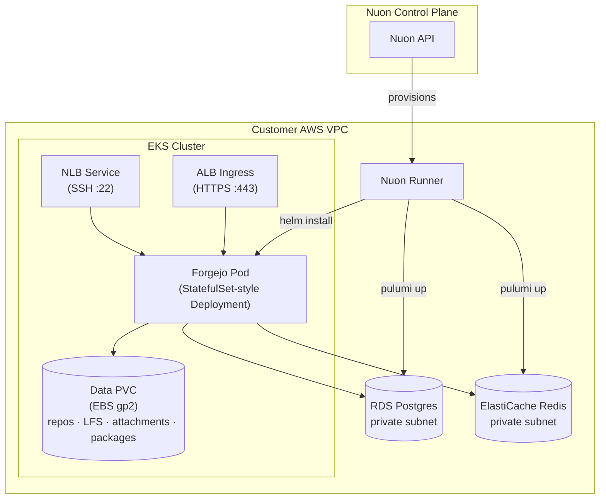

> [!WARNING]
> **Experimental** — this sample app config is a work in progress and is not
> guaranteed to deploy successfully. Use it as a reference only.

<h1>Forgejo (AWS)</h1>

Self-hosted git forge on AWS EKS. **Two Pulumi (Go) components** provision the managed data layer — primary database and cache — alongside the in-cluster app. Repositories, LFS, attachments, and packages are stored locally on the EBS-backed PVC (`local` storage), keeping the demo simple:

- **`pulumi_rds`** — RDS Postgres (private-subnetted, EKS-only SG ingress, generated password)
- **`pulumi_redis`** — ElastiCache Redis (single node) for sessions, queues, and cache

A sibling app config, **`forgejo-gcp`**, runs on GKE using Cloud SQL, Memorystore, and GCS object storage.

Nuon Install Id: {{ .nuon.install.id }}

Public URL: [https://{{ .nuon.install.sandbox.outputs.nuon_dns.public_domain.name }}](https://{{ .nuon.install.sandbox.outputs.nuon_dns.public_domain.name }})

## Architecture

## Components

| Component | Type | Purpose |
|---|---|---|
| `img_forgejo` | container_image | Mirror Forgejo image into ECR (from code.forgejo.org) |
| `pulumi_rds` | pulumi (go) | RDS Postgres + SG + password |
| `pulumi_redis` | pulumi (go) | ElastiCache Redis + SG |
| `forgejo_db_secret` | kubernetes_manifest | Render RDS outputs into k8s Secret |
| `forgejo_cache_secret` | kubernetes_manifest | Render Redis outputs into k8s Secret |
| `forgejo` | helm_chart | Forgejo Deployment, Service, PVC, ServiceAccount |
| `certificate` | terraform_module | ACM certificate (DNS-validated) |
| `application_load_balancer` | helm_chart | ALB Ingress (HTTPS) |
| `forgejo_ssh_lb` | kubernetes_manifest | NLB Service exposing git-over-SSH on :22 |

## Configuration

Editable any time from **Manage → Edit Inputs** in the Nuon dashboard.

### Application
| Input | Default | Description |
|---|---|---|
| `forgejo_admin_user` | `forgejo-admin` | Initial admin username |
| `forgejo_admin_email` | `admin@example.com` | Initial admin email |
| `repo_storage_gb` | `50` | Repo PVC size |

The Forgejo image is mirrored into ECR by the `img_forgejo` component (from `code.forgejo.org`), not pulled from a public registry at runtime.

### Database (RDS Postgres)
| Input | Default | Description |
|---|---|---|
| `db_instance_class` | `db.t4g.small` | RDS instance class |
| `db_storage_gb` | `20` | RDS allocated storage |

### Cache (ElastiCache Redis)
| Input | Default | Description |
|---|---|---|
| `redis_node_type` | `cache.t4g.micro` | Redis node type |

### Compute (EKS)
| Input | Default | Description |
|---|---|---|
| `instance_type` | `t3a.medium` | Node instance type |
| `min_size` / `desired_size` / `max_size` | `2 / 2 / 4` | Node group sizing |

## Secrets

Defined under `secrets/` and synced into the `forgejo` namespace as Kubernetes secrets (value under key `value`).

| Secret | Source | k8s secret | Used for |
|---|---|---|---|
| `forgejo_admin_password` | **required** at install (min 8 chars) | `forgejo-admin-password` | Initial admin, created on first boot by the `bootstrap_admin` action |
| `forgejo_security_secret_key` | auto-generated | `forgejo-security-key` | Forgejo `SECRET_KEY` |
| `forgejo_internal_token` | auto-generated | `forgejo-internal-token` | Forgejo internal API token |
| `forgejo_lfs_jwt_secret` | auto-generated | `forgejo-lfs-jwt` | Git LFS token signing |

## Notes for the Pulumi components

- Pulumi state is persisted by the Nuon runner — no `Pulumi.<stack>.yaml` is committed, and no backend configuration is required in the Go programs.
- `[config]` blocks in each component TOML map to Pulumi stack config (`aws:region`).
- `[env_vars]` blocks pass install/sandbox values into each program at execution time.
- Object storage (repos, LFS, attachments, packages) is `local` on the EBS-backed PVC — no S3/object store is provisioned. Forgejo's minio driver only supports static credentials and can't use IRSA web identity, so local storage keeps the demo simple.

## Sibling

See [`forgejo-gcp/`](../forgejo-gcp) for the GKE / Cloud SQL / Memorystore / GCS variant.
