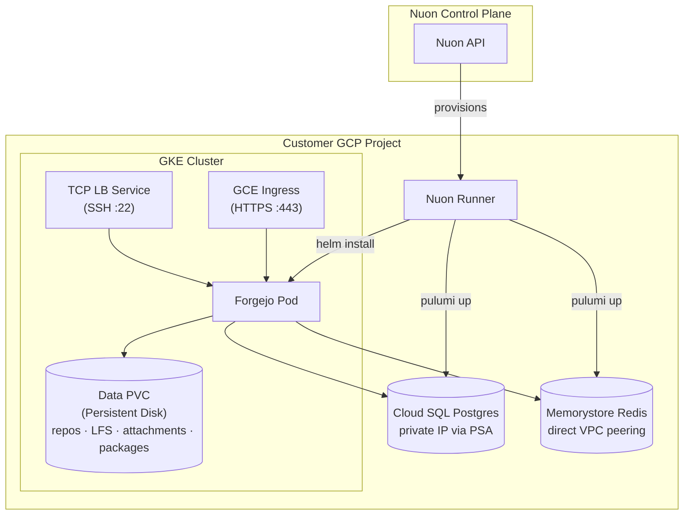

> [!WARNING]
> **Experimental** — this sample app config is a work in progress and is not
> guaranteed to deploy successfully. Use it as a reference only.

<h1>Forgejo (GCP)</h1>

Self-hosted git forge on GKE. **Two Pulumi (Go) components** provision the managed data layer — primary database and cache — alongside the in-cluster app. Repositories, LFS, attachments, and packages are stored locally on the persistent-disk-backed PVC (`local` storage), keeping the demo simple:

- **`pulumi_postgres`** — Cloud SQL Postgres with Private Services Access on the sandbox VPC
- **`pulumi_redis`** — Memorystore Redis (basic tier) on the sandbox VPC

A sibling app config, **`forgejo-aws`**, runs on EKS using RDS and ElastiCache (also local storage).

Nuon Install Id: {{ .nuon.install.id }}

Public URL: [https://{{ .nuon.install.sandbox.outputs.nuon_dns.public_domain.name }}](https://{{ .nuon.install.sandbox.outputs.nuon_dns.public_domain.name }})

## Architecture

## Components

| Component | Type | Purpose |
|---|---|---|
| `img_forgejo` | container_image | Mirror Forgejo image into GAR (from code.forgejo.org) |
| `pulumi_postgres` | pulumi (go) | Cloud SQL Postgres + PSA peering + password |
| `pulumi_redis` | pulumi (go) | Memorystore Redis (basic tier) |
| `forgejo_db_secret` | kubernetes_manifest | Render Cloud SQL outputs into k8s Secret |
| `forgejo_cache_secret` | kubernetes_manifest | Render Memorystore outputs into k8s Secret |
| `forgejo` | helm_chart | Forgejo Deployment, Service, PVC, BackendConfig |
| `certificate` | kubernetes_manifest | GKE ManagedCertificate |
| `external_dns` | terraform_module | external-dns for Cloud DNS |
| `forgejo_ingress` | kubernetes_manifest | GCE Ingress (HTTPS) |
| `forgejo_ssh_lb` | kubernetes_manifest | TCP LoadBalancer Service for git-over-SSH on :22 |

## Configuration

Editable any time from **Manage → Edit Inputs** in the Nuon dashboard.

### Application
| Input | Default | Description |
|---|---|---|
| `forgejo_admin_user` | `forgejo-admin` | Initial admin username |
| `forgejo_admin_email` | `admin@example.com` | Initial admin email |
| `repo_storage_gb` | `50` | Repo PVC size |

### Database (Cloud SQL Postgres)
| Input | Default | Description |
|---|---|---|
| `db_tier` | `db-custom-1-3840` | Cloud SQL tier |
| `db_storage_gb` | `20` | Allocated storage |

### Cache (Memorystore Redis)
| Input | Default | Description |
|---|---|---|
| `redis_memory_gb` | `1` | Memorystore memory size |

## Secrets

Defined under `secrets/` and synced into the `forgejo` namespace as Kubernetes secrets (value under key `value`).

| Secret | Source | k8s secret | Used for |
|---|---|---|---|
| `forgejo_admin_password` | **required** at install (min 8 chars) | `forgejo-admin-password` | Initial admin, created on first boot by the `bootstrap_admin` action |
| `forgejo_security_secret_key` | auto-generated | `forgejo-security-key` | Forgejo `SECRET_KEY` |
| `forgejo_internal_token` | auto-generated | `forgejo-internal-token` | Forgejo internal API token |
| `forgejo_lfs_jwt_secret` | auto-generated | `forgejo-lfs-jwt` | Git LFS token signing |

## Notes for the Pulumi components

- Pulumi state is persisted by the Nuon runner — no `Pulumi.<stack>.yaml` is committed, and no backend configuration is required in the Go programs.
- `[config]` blocks in each component TOML map to Pulumi stack config (`gcp:project`, `gcp:region`).
- `[env_vars]` blocks pass install/sandbox values into each program at execution time.
- Object storage (repos, LFS, attachments, packages) is `local` on the persistent-disk-backed PVC — no GCS bucket is provisioned, keeping the demo simple.
- Cloud SQL is reachable only over private IP. `pulumi_postgres` provisions the PSA range + `servicenetworking.Connection` on the sandbox VPC.

## Sibling

See [`forgejo-aws/`](../forgejo-aws) for the EKS / RDS / ElastiCache variant.
