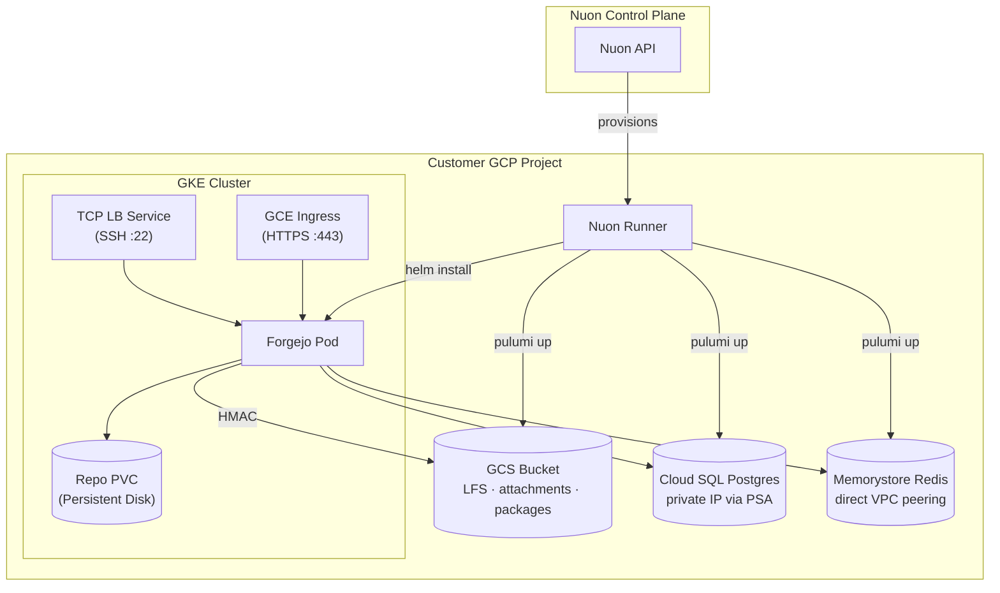

> [!WARNING]
> **Experimental** — this sample app config is a work in progress and is not
> guaranteed to deploy successfully. Use it as a reference only.

<h1>Forgejo (GCP)</h1>

Self-hosted git forge on GKE. **Three Pulumi (Go) components** provision the managed data layer — object storage, primary database, and cache — alongside the in-cluster app:

- **`pulumi_storage`** — GCS bucket + service account + HMAC keys (S3-compat access)
- **`pulumi_postgres`** — Cloud SQL Postgres with Private Services Access on the sandbox VPC
- **`pulumi_redis`** — Memorystore Redis (basic tier) on the sandbox VPC

A sibling app config, **`forgejo-aws`**, mirrors the same shape on EKS using S3, RDS, and ElastiCache.

Nuon Install Id: {{ .nuon.install.id }}

Public URL: [https://{{ .nuon.install.sandbox.outputs.nuon_dns.public_domain.name }}](https://{{ .nuon.install.sandbox.outputs.nuon_dns.public_domain.name }})

## Architecture

## Components

| # | Component | Type | Purpose |
|---|---|---|---|
| 1 | `pulumi_storage` | pulumi (go) | GCS bucket + service account + HMAC keys |
| 2 | `pulumi_postgres` | pulumi (go) | Cloud SQL Postgres + PSA peering + password |
| 3 | `pulumi_redis` | pulumi (go) | Memorystore Redis (basic tier) |
| 4 | `forgejo_db_secret` | kubernetes_manifest | Render Cloud SQL outputs into k8s Secret |
| 5 | `forgejo_cache_secret` | kubernetes_manifest | Render Memorystore outputs into k8s Secret |
| 6 | `forgejo_s3_secret` | kubernetes_manifest | Render GCS bucket + HMAC creds into k8s Secret |
| 7 | `forgejo` | helm_chart | Forgejo Deployment, Service, PVC, BackendConfig |
| 8 | `certificate` | kubernetes_manifest | GKE ManagedCertificate |
| 9 | `forgejo_ingress` | kubernetes_manifest | GCE Ingress (HTTPS) |
| 10 | `forgejo_ssh_lb` | kubernetes_manifest | TCP LoadBalancer Service for git-over-SSH on :22 |

## Configuration

Editable any time from **Manage → Edit Inputs** in the Nuon dashboard.

### Application
| Input | Default | Description |
|---|---|---|
| `forgejo_image` | `codeberg.org/forgejo/forgejo:10.0.1` | Forgejo image |
| `forgejo_admin_user` | `forgejo-admin` | Initial admin username |
| `forgejo_admin_email` | `admin@example.com` | Initial admin email |
| `repo_storage_gb` | `50` | Repo PVC size |

### Database (Cloud SQL Postgres)
| Input | Default | Description |
|---|---|---|
| `db_tier` | `db-custom-1-3840` | Cloud SQL tier |
| `db_storage_gb` | `20` | Allocated storage |

### Cache (Memorystore Redis)
| Input | Default | Description |
|---|---|---|
| `redis_memory_gb` | `1` | Memorystore memory size |

## Notes for the Pulumi components

- Pulumi state is persisted by the Nuon runner — no `Pulumi.<stack>.yaml` is committed, and no backend configuration is required in the Go programs.
- `[config]` blocks in each component TOML map to Pulumi stack config (`gcp:project`, `gcp:region`).
- `[env_vars]` blocks pass install/sandbox values into each program at execution time.
- Forgejo accesses GCS via S3-compatible HMAC keys (no native GCS adapter in Forgejo). The HMAC access ID + secret are emitted by `pulumi_storage` and rendered into `forgejo-s3` k8s secret.
- Cloud SQL is reachable only over private IP. `pulumi_postgres` provisions the PSA range + `servicenetworking.Connection` on the sandbox VPC.

## Sibling

See [`forgejo-aws/`](../forgejo-aws) for the EKS / RDS / ElastiCache / S3 variant.
