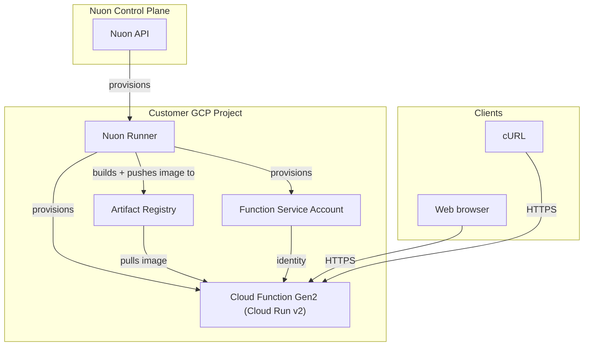

<center>
<h1>GCP Cloud Function</h1>

A serverless Google Cloud Function (Gen2, container-based via Cloud Run) deployed and operated by Nuon.

Nuon Install Id: {{ .nuon.install.id }}

GCP Project: {{ .nuon.install_stack.outputs.project_id }}

GCP Region: {{ .nuon.install_stack.outputs.region }}

</center>

Function URL: [{{.nuon.components.cloud_function.outputs.function_url}}]({{.nuon.components.cloud_function.outputs.function_url}})

To test, click the URL above or run:

```bash
curl {{.nuon.components.cloud_function.outputs.function_url}}
```

## Architecture



## Components

- **docker_image** — builds the Go API source under `src/components/api` and pushes it to Artifact Registry
- **cloud_function** — Cloud Run v2 service backing the Gen2 function, dedicated service account, and public (`allUsers`) invoker binding (terraform module)

## Prerequisites

Enable these GCP APIs on the target project:

```bash
gcloud services enable \
  run.googleapis.com \
  cloudfunctions.googleapis.com \
  cloudbuild.googleapis.com \
  artifactregistry.googleapis.com \
  iam.googleapis.com \
  cloudresourcemanager.googleapis.com \
  --project={{ .nuon.install_stack.outputs.project_id }}
```

`run.googleapis.com` is required — Cloud Functions Gen2 deploys as a Cloud Run v2 service.

## Configuration

| Input | Default | Description |
|---|---|---|
| `region` | `us-central1` | GCP region for the Cloud Function |

## Actions

- **invoke_function** — curls the function URL
- **function_logs** — fetches recent function logs via `gcloud logging read`
- **post_deploy_verify** — post-deploy smoke test (auto-runs after `cloud_function` deploy)

## Resources

- [Cloud Functions Gen2 Documentation](https://cloud.google.com/functions/docs/2nd-gen/overview)
- [Cloud Run v2 Documentation](https://cloud.google.com/run/docs)
- [gcp-min-sandbox](https://github.com/nuonco/gcp-min-sandbox)
