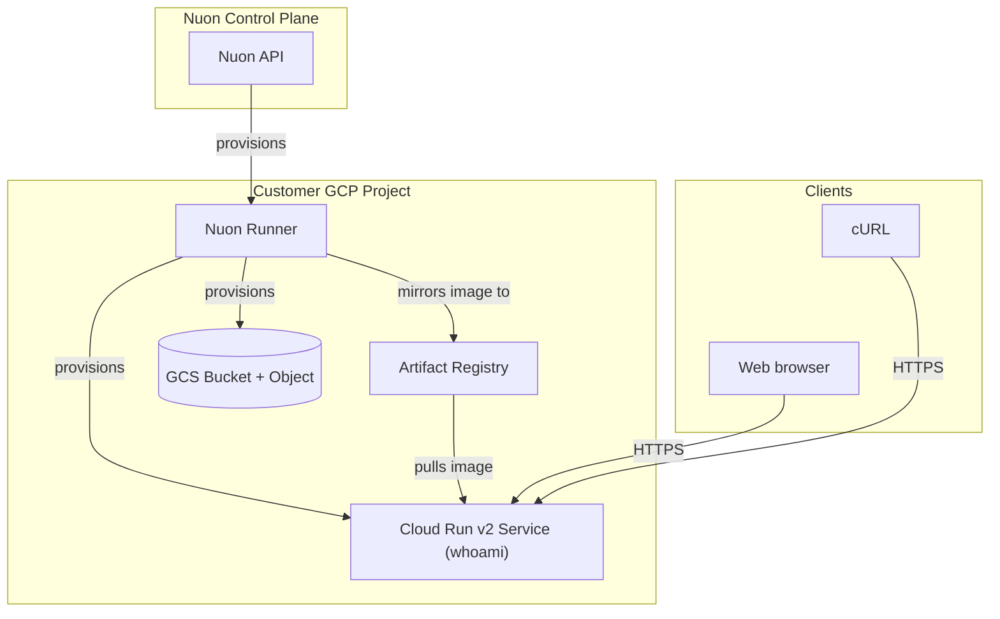

> [!IMPORTANT]
> This app uses a **Pulumi-typed sandbox** (`sandbox.type = "pulumi"`, see `sandbox.toml`).
> Your org must have the **`pulumi-sandbox`** feature flag enabled before installing —
> otherwise the sandbox config sync is rejected. Enable it in org settings (or ask Nuon).

<center>
<h1>GCP Cloud Run</h1>

A managed container deployment on Google Cloud Run without Kubernetes overhead. Also provisions a GCS bucket and object via Pulumi to demonstrate multi-runtime components in a single app config.

Nuon Install Id: {{ .nuon.install.id }}

GCP Project: {{ .nuon.install_stack.outputs.project_id }}

GCP Region: {{ .nuon.inputs.inputs.region }}

</center>

Service URL: [{{.nuon.components.cloud_run.outputs.service_url}}]({{.nuon.components.cloud_run.outputs.service_url}})

To test, click the URL above or run:

```bash
curl {{.nuon.components.cloud_run.outputs.service_url}}
```

Bucket: `{{.nuon.components.pulumi_gcs_bucket.outputs.bucket_name}}`

Object: `{{.nuon.components.pulumi_gcs_object.outputs.object_url}}`

## Architecture



## Components

- **container_image** — mirrors `containous/whoami:latest` into Artifact Registry
- **cloud_run** — Cloud Run v2 service with public (`allUsers`) invoker access (terraform module)
- **pulumi_gcs_bucket** — GCS bucket (pulumi, go runtime)
- **pulumi_gcs_object** — sample object placed in the bucket (pulumi, go runtime)

## Prerequisites

Enable these GCP APIs on the target project:

```bash
gcloud services enable \
  run.googleapis.com \
  artifactregistry.googleapis.com \
  storage.googleapis.com \
  cloudresourcemanager.googleapis.com \
  --project={{ .nuon.install_stack.outputs.project_id }}
```

`run.googleapis.com` is required for the Cloud Run service deployment.

## Configuration

The following inputs can be changed at any time from **Manage → Edit Inputs** in the Nuon dashboard.

| Input | Default | Description |
|---|---|---|
| `region` | `us-central1` | GCP region for Cloud Run deployment |

## Actions

- **curl_endpoint** — curls the Cloud Run service URL
- **service_status** — describes the deployed Cloud Run service via `gcloud`
- **post-deploy-smoke-test** — post-deploy validation

## Resources

- [Cloud Run Documentation](https://cloud.google.com/run/docs)
- [gcp-min-sandbox](https://github.com/nuonco/gcp-min-sandbox)
