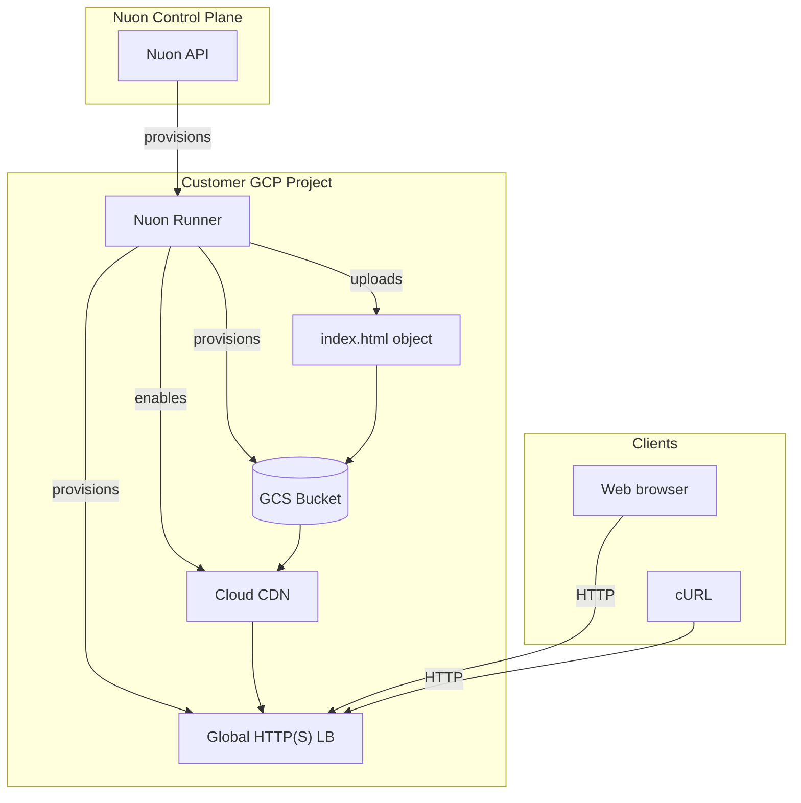

<center>
<h1>GCP Static Site</h1>

A static site hosted on Google Cloud Storage and fronted by a global Cloud CDN / HTTP(S) Load Balancer.

Nuon Install Id: {{ .nuon.install.id }}

GCP Project: {{ .nuon.install_stack.outputs.project_id }}

Domain: `{{.nuon.inputs.inputs.sub_domain}}.{{.nuon.inputs.inputs.domain}}`

</center>

Site URL: [{{.nuon.components.cdn.outputs.site_url}}]({{.nuon.components.cdn.outputs.site_url}})

CDN IP: `{{.nuon.components.cdn.outputs.cdn_ip}}`

Bucket: `{{.nuon.components.gcs_bucket.outputs.bucket_name}}`

To test, click the URL above or run:

```bash
curl {{.nuon.components.cdn.outputs.site_url}}
```

Point your DNS `A` record for `{{.nuon.inputs.inputs.sub_domain}}.{{.nuon.inputs.inputs.domain}}` at `{{.nuon.components.cdn.outputs.cdn_ip}}` to serve the site under your domain.

## Architecture



## Components

- **gcs_bucket** — GCS bucket configured for static website hosting (terraform module)
- **upload_site** — uploads `index.html` into the bucket (terraform module)
- **cdn** — global HTTP(S) load balancer + Cloud CDN with the bucket as the backend (terraform module)

## Prerequisites

Enable these GCP APIs on the target project:

```bash
gcloud services enable \
  storage.googleapis.com \
  compute.googleapis.com \
  cloudresourcemanager.googleapis.com \
  --project={{ .nuon.install_stack.outputs.project_id }}
```

`compute.googleapis.com` is required for the global forwarding rule, URL map, and Cloud CDN. `storage.googleapis.com` is required for the bucket.

## Configuration

The following inputs can be changed at any time from **Manage → Edit Inputs** in the Nuon dashboard.

| Input | Default | Description |
|---|---|---|
| `domain` | `nuon.run` | Root domain for the static site |
| `sub_domain` | `static` | Subdomain for the static site |

## Actions

- **site_url** — prints the site URL and CDN IP
- **invalidate_cache** — invalidates the Cloud CDN cache for `/*`

## Resources

- [Cloud Storage Static Website Hosting](https://cloud.google.com/storage/docs/hosting-static-website)
- [Cloud CDN Documentation](https://cloud.google.com/cdn/docs)
- [gcp-min-sandbox](https://github.com/nuonco/gcp-min-sandbox)
