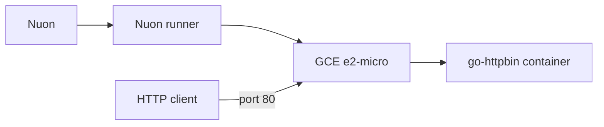

# GCP HTTPBin

{{ $publicIp := dig "public_ip" "" .nuon.components.gce.outputs }}

HTTPBin runs in Docker on a single Google Compute Engine VM.

{{ if $publicIp }}HTTPBin: [http://{{ $publicIp }}](http://{{ $publicIp }}){{ else }}Deploying...{{ end }}

## Test

```bash
curl http://{{ $publicIp }}/get
curl -X POST -H "Content-Type: application/json" \
  http://{{ $publicIp }}/post \
  -d '{"foo":"bar"}'
curl http://{{ $publicIp }}/status/200
```

## Architecture



The GCP install stack provides the VPC, public subnet, and runner. The minimal
GCP sandbox reuses that network and does not create GKE or DNS. The `gce`
component creates the VM, ephemeral public IP, and firewall rule.
