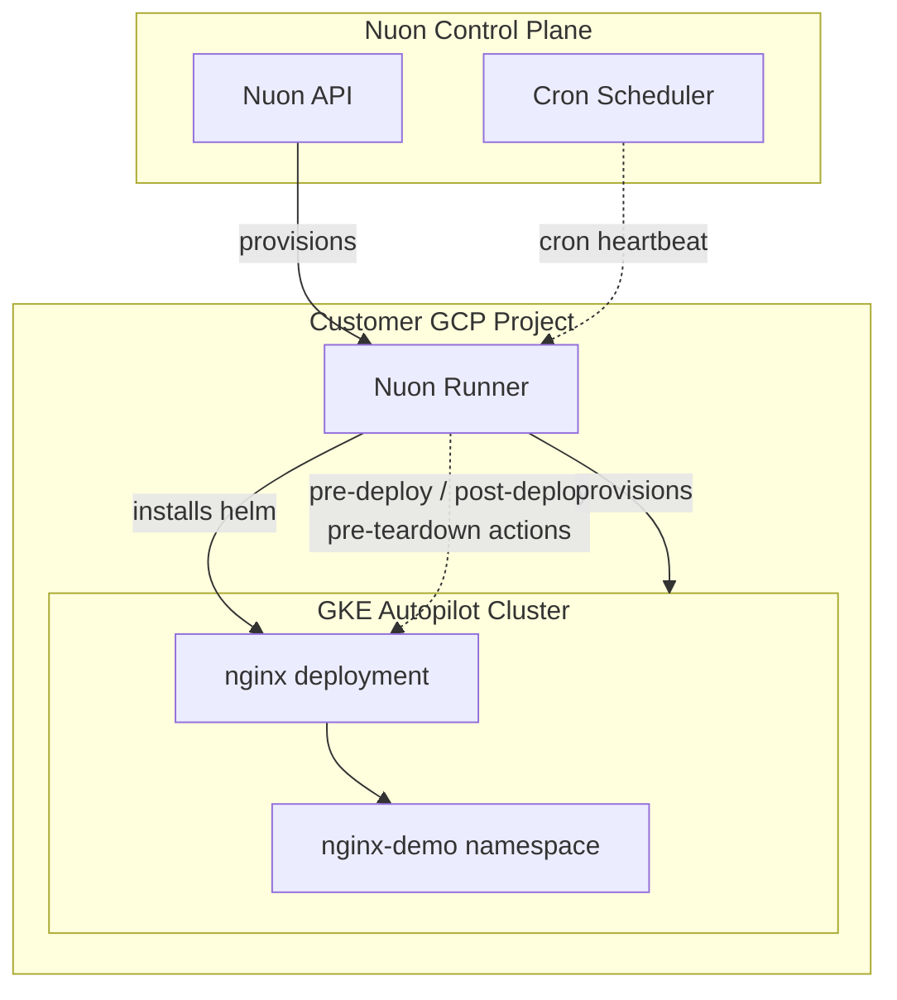

<center>
<h1>GKE Actions</h1>

A minimal GKE Autopilot app that exercises every Nuon action trigger type — `pre-deploy-component`, `post-deploy-component`, `pre-teardown-component`, `post-provision`, `pre-deprovision`, `post-update-inputs`, `cron`, and `manual` — against a single nginx Helm chart.

Nuon Install Id: {{ .nuon.install.id }}

GCP Project: {{ .nuon.install_stack.outputs.project_id }}

Domain: `{{.nuon.inputs.inputs.sub_domain}}.{{.nuon.inputs.inputs.domain}}`

</center>

Use this config as a reference when wiring lifecycle hooks (smoke tests, backups, finalizer cleanup, scheduled heartbeats, input-driven restarts) into your own app.

## Architecture



## Components

- **nginx** — minimal nginx Helm chart deployed into the `nginx-demo` namespace; drift-checked every 6 hours

## Action Triggers Demonstrated

| Action | Trigger |
|---|---|
| `pre_check` | `pre-deploy-component` (nginx) + manual |
| `post_smoke_test` | `post-deploy-component` (nginx) + manual |
| `pre_teardown_cleanup` | `pre-teardown-component` (nginx) + manual |
| `post_provision_setup` | `post-provision` + manual |
| `pre_deprovision_backup` | `pre-deprovision` + manual |
| `post_update_inputs` | `post-update-inputs` + manual |
| `scheduled_heartbeat` | `cron` (`*/5 * * * *`) + manual |
| `manual_restart` | `manual` |

## Prerequisites

Enable these GCP APIs on the target project:

```bash
gcloud services enable \
  compute.googleapis.com \
  container.googleapis.com \
  artifactregistry.googleapis.com \
  cloudresourcemanager.googleapis.com \
  iam.googleapis.com \
  --project={{ .nuon.install_stack.outputs.project_id }}
```

`container.googleapis.com` is required for the GKE Autopilot cluster.

## Configuration

The following inputs can be changed at any time from **Manage → Edit Inputs** in the Nuon dashboard. Any change fires `post_update_inputs`, which restarts the nginx deployment.

| Input | Default | Description |
|---|---|---|
| `domain` | `nuon.run` | Root domain for DNS zones |
| `sub_domain` | `actions-demo` | Subdomain for the application |

## Resources

- [Nuon Actions Documentation](https://github.com/nuonco/nuon/tree/main/docs)
- [gcp-gke-sandbox](https://github.com/nuonco/gcp-gke-sandbox)
