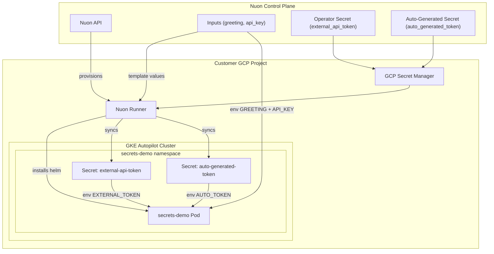

<center>
<h1>GKE Secrets</h1>

Demonstrates Nuon's secrets management on GKE Autopilot — input groups, sensitive inputs, auto-generated platform secrets, and operator-provided secrets synced to Kubernetes.

Nuon Install Id: {{ .nuon.install.id }}

GCP Project: {{ .nuon.install_stack.outputs.project_id }}

</center>

A `secrets-demo` pod boots with four values exercising the four distinct Nuon mechanisms: a non-sensitive input (`greeting`), a sensitive input templated into helm values (`api_key`), an auto-generated platform secret synced into a k8s `Secret` (`auto_generated_token`), and an operator-provided secret captured at install time and synced into a k8s `Secret` (`external_api_token`).

## Architecture



## Components

- **secrets_demo** — Helm chart that deploys a single pod consuming four env vars: `GREETING` (non-sensitive input, templated), `API_KEY` (sensitive input, templated), `AUTO_TOKEN` (auto-generated secret from k8s `Secret`), and `EXTERNAL_TOKEN` (operator-provided secret from k8s `Secret`)

## Inputs and Input Groups

| Group | Input | Sensitive | Description |
|---|---|---|---|
| `app` | `greeting` | no | Greeting message displayed by the demo pod (default `Hello from Nuon`) |
| `credentials` | `api_key` | yes | Sensitive value templated directly into the pod's environment |

## Secrets

| Secret | Source | K8s Secret |
|---|---|---|
| `auto_generated_token` | `auto_generate = true` — install-stack random_password in GCP Secret Manager | `secrets-demo/auto-generated-token` |
| `external_api_token` | `required = true` — operator-provided at install time, stored in GCP Secret Manager | `secrets-demo/external-api-token` |

Both use `kubernetes_sync = true` to materialize values as Kubernetes `Secret` resources in the `secrets-demo` namespace.

## Prerequisites

Enable these GCP APIs on the target project:

```bash
gcloud services enable \
  compute.googleapis.com \
  container.googleapis.com \
  artifactregistry.googleapis.com \
  cloudresourcemanager.googleapis.com \
  iam.googleapis.com \
  --project={{ .nuon.install_stack.outputs.project_id }}
```

`container.googleapis.com` is required for the GKE Autopilot cluster.

## Actions

- **verify_secrets** — lists and describes the synced `Secret` resources (auto-runs after `secrets_demo` deploys)
- **read_greeting** — execs into the pod and prints `GREETING`, plus a present/absent check for `API_KEY`, `AUTO_TOKEN`, and `EXTERNAL_TOKEN`
- **post_secrets_sync** — restarts the deployment after every full deploy so the pod picks up rotated secrets

## Resources

- [Nuon Secrets Documentation](https://github.com/nuonco/nuon/tree/main/docs)
- [gcp-gke-sandbox](https://github.com/nuonco/gcp-gke-sandbox)
