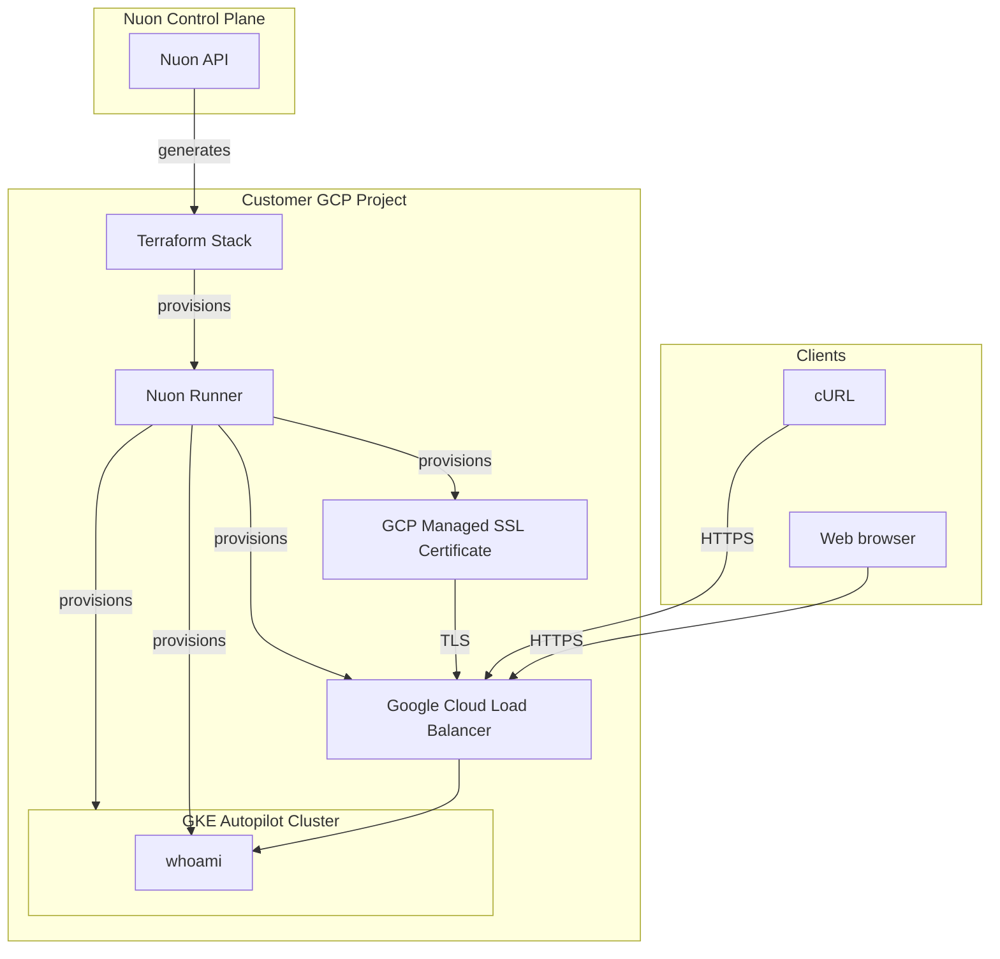

### What this app does?

A simple example of provisioning a GCP GKE Autopilot Kubernetes cluster with a whoami HTTP server.

### Prerequisites

- GCP project connected to Nuon (handled during onboarding)

### How to install/What to expect next?

- Clicking install provisions a GCE VM and runner agent in your GCP project
- If configured, may be prompted to approve plan steps
- ~15 min install time for VPC, GKE Autopilot cluster, and app components

### What gets deployed in your cloud account?

- Dedicated VPC
- GKE Autopilot Kubernetes cluster
- whoami app via Helm
- GCP Managed SSL Certificate
- Google Cloud Load Balancer

### What inputs can you enter?

- Public domain
- Subdomain

### Security & compliance

- [Nuon BYOC trust center](https://docs.nuon.co/guides/vendor-customers)
- All resource provisioning and scripts are performed by an agent in a VM in your VPC - no cross-account access granted to the vendor

### Nuon concepts

The following terminology is core to the Nuon BYOC platform.

#### Connect Your App | App Config
- App (collection of TOML config files that provision and manage the whoami app in your cloud account)
- Sandbox (the underlying infrastructure, in this case a GKE Autopilot cluster)
- Component (the Helm charts and Terraform to deploy whoami, GCP TLS certificate, and load balancer)
- Inputs (dynamic values specific to the install e.g., public domain, subdomain)
- Secrets (sensitive values either auto-created or entered by the customer during installation - stored in GCP Secret Manager)

#### Support Customer Infrastructure | Customer Config

- Installs (Installs are instances of an application in your (the customer) cloud account.)
- Stack (the Terraform stack that provisions the VPC, GCE VM, and Runner (agent) Docker service in your GCP project)
- Runners (Egress-only agents deployed in customer cloud accounts that execute all provisioning, deployment, and day-2 operations.)
- Operational Roles (GCP IAM service account bindings to perform different operations for least-privilege access across sandbox, components, and actions.)

#### Continuous Delivery | Day-2 Operations

- Workflows (Orchestration of the deployment, update & teardown lifecycle of apps, components, and actions)
- Actions (Bash scripts for health checks, migrations, debugging, and day-2 operations)
- Customer Portal (A customer-facing web dashboard to initiate and monitor an app's install in a customer's VPC)
