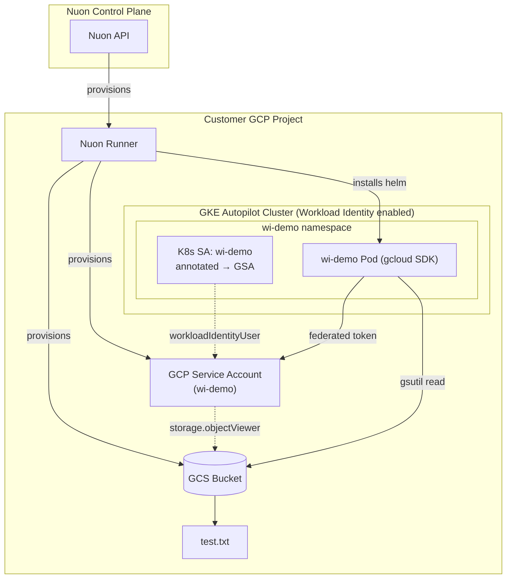

<center>
<h1>GKE Workload Identity</h1>

A minimal GKE Autopilot demo of GCP **Workload Identity** — federated, zero-key pod-to-GCP access. A pod in the `wi-demo` namespace assumes a GCP service account and reads from a private GCS bucket using nothing but its Kubernetes service account token.

Nuon Install Id: {{ .nuon.install.id }}

GCP Project: {{ .nuon.install_stack.outputs.project_id }}

GCP Region: {{ .nuon.inputs.inputs.region }}

</center>

GCP Service Account: `{{.nuon.components.service_account.outputs.service_account_email}}`

GCS Bucket: `gs://{{.nuon.components.gcs_bucket.outputs.bucket_name}}`

Run the `verify_identity` and `list_bucket` actions to exercise the federation end-to-end.

## Architecture



## Components

- **service_account** — GCP service account, bound to the `wi-demo/wi-demo` Kubernetes service account via `roles/iam.workloadIdentityUser`, granted `roles/storage.objectViewer` (terraform module)
- **gcs_bucket** — private GCS bucket with `test.txt`, viewable only by the service account above (terraform module)
- **wi_demo** — Helm chart that creates the annotated Kubernetes service account and a pod with the gcloud SDK (helm chart)

## How Workload Identity Is Wired

1. Terraform creates the GCP service account.
2. Terraform binds the GCP SA to the K8s SA in the `wi-demo` namespace using the workload-identity pool: `<project>.svc.id.goog[wi-demo/wi-demo]`.
3. The Helm chart creates the Kubernetes service account with the `iam.gke.io/gcp-service-account` annotation pointing at the GCP SA email.
4. The pod assumes the GCP SA via the GKE metadata server — no JSON key, no HMAC, no `GOOGLE_APPLICATION_CREDENTIALS`.

## Prerequisites

Enable these GCP APIs on the target project:

```bash
gcloud services enable \
  compute.googleapis.com \
  container.googleapis.com \
  artifactregistry.googleapis.com \
  storage.googleapis.com \
  iam.googleapis.com \
  iamcredentials.googleapis.com \
  cloudresourcemanager.googleapis.com \
  --project={{ .nuon.install_stack.outputs.project_id }}
```

`iamcredentials.googleapis.com` is required for the GCE metadata server to mint federated tokens. `container.googleapis.com` is required for the GKE Autopilot cluster (Workload Identity is enabled by default on Autopilot).

## Configuration

| Input | Default | Description |
|---|---|---|
| `region` | `us-central1` | GCP region for resources |

## Actions

- **verify_identity** — runs `gcloud auth list` inside the pod (auto-runs after `wi_demo` deploys)
- **list_bucket** — `gsutil ls` and `gsutil cat` the bucket from inside the pod, proving federated read works
- **pre_teardown_iam** — scales down the deployment and removes the K8s SA annotation before the GCP SA is destroyed

## Resources

- [GKE Workload Identity Documentation](https://cloud.google.com/kubernetes-engine/docs/concepts/workload-identity)
- [gcp-gke-sandbox](https://github.com/nuonco/gcp-gke-sandbox)
