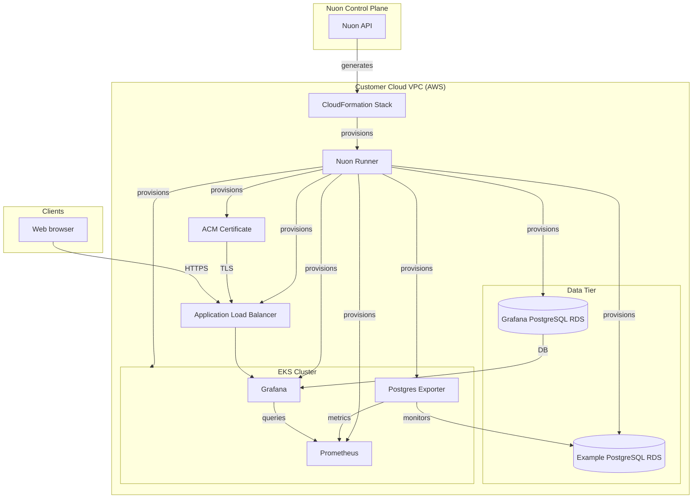

### What this app does?

Grafana is an open-source platform for monitoring and observability that allows users to visualize, analyze, and understand their data through customizable dashboards and alerts. This Nuon app config deploys a production-grade Grafana instance on AWS with an EKS Kubernetes cluster, two PostgreSQL RDS databases (one for Grafana, one example database for monitoring), and Prometheus for metrics collection. Review the [Grafana docs](https://grafana.com/docs/grafana/latest/) for deployment details and visit the [Grafana OSS repository](https://github.com/grafana/grafana) for more information.

### Prerequisites

- AWS account connected to Nuon (handled during onboarding)

### How to install/What to expect next?

- Clicking install will generate a link for you to log into AWS and create a CloudFormation stack which creates the VPC, EC2 VM, and a runner, an agent that receives jobs to deploy Grafana in your VPC
- If configured, you may be prompted to approve plan steps

### What gets deployed in your cloud account?

- Dedicated VPC
- AWS EKS Kubernetes cluster
- Grafana via Helm
- Prometheus via Helm for metrics collection
- Postgres Exporter for PostgreSQL monitoring
- Two RDS PostgreSQL databases (Grafana DB and Example DB)
- AWS certificate
- Application load balancer

### What inputs can you enter?

- AWS region
- Grafana release version
- Admin username and password
- Enterprise license key (optional)
- Kubernetes version
- EKS node instance type and cluster sizing (min/max/desired node count)
- RDS instance types for both databases

### Monitoring and observability

- Grafana dashboard accessible via ALB endpoint (credentials in inputs or AWS Secrets Manager)
- Pre-configured Prometheus data source for metrics visualization
- PostgreSQL monitoring via Postgres Exporter with example queries and dashboards

### Upgrading Grafana

- Check [the latest Grafana releases](https://github.com/grafana/grafana/releases)
- Update the Grafana release version input
- Follow standard Nuon upgrade workflow with approval steps if configured

### Security & compliance

- [Nuon BYOC trust center](https://docs.nuon.co/guides/vendor-customers)
- All resource provisioning and scripts are performed by an agent in a VM in your VPC - no cross-account access granted to the vendor
- All secrets created by you or auto-generated and stored in AWS Secrets Manager in your VPC
- RDS databases use encrypted storage and IAM authentication

### Nuon concepts

The following terminology is core to the Nuon BYOC platform.

#### Connect Your App | App Config
- App (collection of TOML config files that provision and manage the Grafana app in your cloud account)
- Sandbox (the underlying infrastructure, in this case an EKS Kubernetes cluster)
- Component (the Helm charts and Terraform to deploy Grafana, Prometheus, Postgres Exporter, RDS databases, AWS TLS certificate, and ALB)
- Inputs (dynamic values specific to the install e.g., Grafana release, Kubernetes version, instance types, admin credentials)
- Secrets (sensitive values either auto-created or entered by the customer during Stack creation - stored in AWS Secrets Manager)

#### Support Customer Infrastructure | Customer Config

- Installs (Installs are instances of an application in your (the customer) cloud account.)
- Stack (the AWS CloudFormation stack that provisions the VPC, subnets, IAM roles, ASG, EC2 VM and Runner (agent) Docker service)
- Runners (Egress-only agents deployed in customer cloud accounts that execute all provisioning, deployment, and day-2 operations.)
- Operational Roles (IAM roles to perform different operations for least-privilege access across sandbox, components, and actions.)

#### Continuous Delivery | Day-2 Operations

- Workflows (Orchestration of the deployment, update & teardown lifecycle of apps, components, and actions)
- Actions (Bash scripts for health checks, migrations, debugging, and day-2 operations)
- Policies (Rego & Kyverno configs to enforce compliance and security rules at infrastructure plan steps)
- Customer Portal (A customer-facing web dashboard to initiate and monitor an app's install in a customer's VPC)