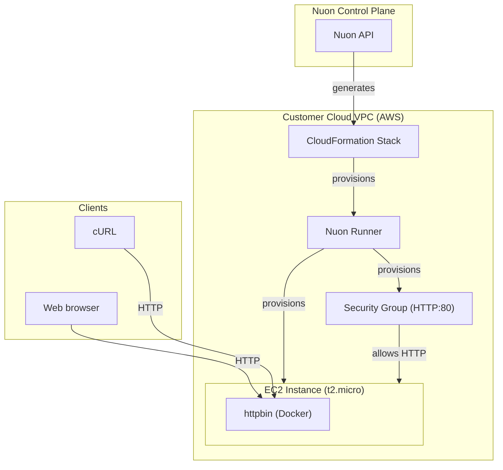

### What this app does?

A minimal example of provisioning an EC2 instance running [httpbin](https://httpbin.org), a simple HTTP request & response testing service.

### Prerequisites

- A valid AWS account

### How to install/What to expect next?

- Clicking install will generate a link for you to log into AWS and create a CloudFormation stack which creates the VPC, EC2 VM, and a runner, an agent that receives jobs to deploy httpbin in your VPC
- If configured, you may be prompted to approve plan steps
- Average installation time is 15 minutes due to creating the VPC, VM, and EC2 instance

### What gets deployed in your cloud account?

- Dedicated VPC with public subnet
- EC2 instance (t2.micro) running httpbin as a Docker container
- Security group allowing HTTP on port 80

### What inputs can you enter?

- AWS region

### Security & compliance

- [Nuon BYOC trust center](https://docs.nuon.co/guides/vendor-customers)
- All resource provisioning and scripts are performed by an agent in a VM in your VPC - no cross-account access granted to the vendor

### Nuon concepts

The following terminology is core to the Nuon BYOC platform.

#### Connect Your App | App Config
- App (collection of TOML config files that provision and manage the httpbin app in your cloud account)
- Sandbox (the underlying infrastructure, in this case a minimal VPC with public subnet)
- Component (the Terraform to deploy an EC2 instance running httpbin via Docker)
- Secrets (sensitive values either auto-created or entered by the customer during Stack creation - stored in AWS Secrets Manager)

#### Support Customer Infrastructure | Customer Config

- Installs (Installs are instances of an application in your (the customer) cloud account.)
- Stack (the AWS CloudFormation stack that provisions the VPC, subnets, IAM roles, ASG, EC2 VM and Runner (agent) Docker service)
- Runners (Egress-only agents deployed in customer cloud accounts that execute all provisioning, deployment, and day-2 operations.)
- Operational Roles (IAM roles to perform different operations for least-privilege access across sandbox, components, and actions.)

#### Continuous Delivery | Day-2 Operations

- Workflows (Orchestration of the deployment, update & teardown lifecycle of apps, components, and actions)
- Actions (Bash scripts for health checks, migrations, debugging, and day-2 operations — includes a healthcheck action that verifies the httpbin endpoint)
- Customer Portal (A customer-facing web dashboard to initiate and monitor an app's install in a customer's VPC)
