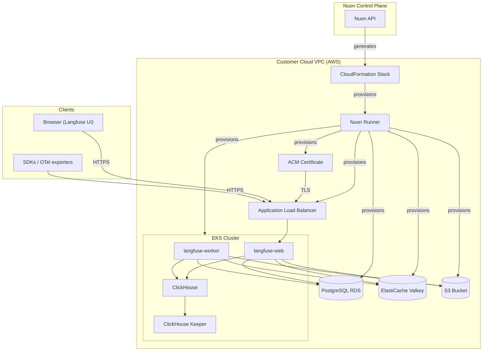

Langfuse Dashboard URL: [https://{{.nuon.install.sandbox.outputs.nuon_dns.public_domain.name}}](https://{{.nuon.install.sandbox.outputs.nuon_dns.public_domain.name}})

Nuon Install Id: {{ .nuon.install.id }}

AWS Region: {{ .nuon.install_stack.outputs.region }}

[Langfuse](https://langfuse.com) is an open-source LLM observability and tracing platform. Your install runs full-plane in your AWS account — every component (web, worker, Postgres, ClickHouse, Keeper, Valkey, S3) lives in your VPC with no tether back to Langfuse Cloud.

## Sign In

To retrieve your admin credentials, run the `admin_password` action:

1. In the Nuon dashboard, open this install
2. Go to the **Actions** tab
3. Run `admin_password`
4. The output prints the Dashboard URL, email (`admin@langfuse.local`), and the generated password

The action also fires automatically after the `langfuse` component deploys, so credentials show up in the install's workflow output the first time it comes up — no need to dig for them on first install.

Then open the Langfuse Dashboard URL above and sign in. The org (`Demo Organization`), project (`Demo Project`), and a starter public/secret API key pair are pre-seeded by Langfuse's headless init.

## Verify with a Real Trace

The `seed_demo_traces` action runs a small tool-using Claude agent against this install's Langfuse API and writes a real trace tree.

1. Set `anthropic_api_key` on the install (**Manage → Edit Inputs**).
2. Run the action: **Actions → `seed_demo_traces` → Run**.
3. Open the Langfuse Dashboard URL, log in, navigate to `Demo Project` → Traces. The agent run should appear within seconds.

## Architecture

## Configuration

The following inputs can be changed at any time from **Manage → Edit Inputs** in the Nuon dashboard.

| Input | Default | Description |
|---|---|---|
| `anthropic_api_key` | _(empty)_ | Anthropic API key used by the `seed_demo_traces` action to generate a real trace tree |
| `telemetry` | `true` | Send anonymized usage telemetry to Langfuse |
| `license_key` | _(empty)_ | Langfuse Enterprise license key (optional; OSS features work without it) |
| `web_replicas` | `2` | Number of `langfuse-web` pods |
| `worker_replicas` | `2` | Number of `langfuse-worker` pods |
| `langfuse_db_instance_type` | `db.t4g.micro` | RDS Postgres instance class |
| `langfuse_db_storage_gb` | `20` | RDS Postgres allocated storage (GB) |
| `clickhouse_replicas` | `1` | ClickHouse cluster replica count (single-shard only — scale vertically, not by sharding) |
| `clickhouse_disk_size` | `20Gi` | ClickHouse pod EBS volume size |

Changing inputs triggers a redeploy of the affected components. The workflow shows a diff and pauses for approval before applying.

## What This Deploys

- EKS Auto Mode cluster (`nuonco/aws-eks-auto-sandbox`)
- RDS PostgreSQL (single instance) — transactional store: users, orgs, projects, encrypted API keys
- ClickHouse cluster (Altinity operator, single-shard, replicated) — OLAP store: traces, observations, scores
- ClickHouse Keeper (vanilla StatefulSet, single node) — raft coordination for replicated tables
- ElastiCache Valkey (`cache.t4g.micro`, single node) — BullMQ queue + cache, `maxmemory-policy=noeviction`
- S3 bucket with KMS encryption + IRSA — raw event payloads, multimodal media, batch exports
- Langfuse Helm release — `langfuse-web` and `langfuse-worker` deployments
- ALB + ACM certificate — public HTTPS access to the Langfuse UI and API

## Sizing

This app config is shaped for fast, low-cost demo provisioning. Defaults trade HA and headroom for shorter install times (~25–35 min on a fresh AWS account) and the lowest possible AWS bill — smallest instance classes, single-AZ, single-replica everywhere, no provisioned IOPS, no premium features. A demo install at idle runs in the low single-digit dollars per day; production sizing (next section) is materially more. Concrete current values:

| Component | Demo Default | Why |
|---|---|---|
| RDS Postgres | `db.t4g.micro`, 20 GB, no multi-AZ, 7-day backups | smallest free-tier-eligible Postgres |
| ClickHouse | 1 replica × 1 shard × 20 Gi EBS gp3 | single-node, no replication overhead |
| ClickHouse Keeper | 1 replica × 5 Gi EBS gp3 | no raft quorum, fastest to provision |
| ElastiCache Valkey | `cache.t4g.micro`, 1 node, no TLS, no auth | smallest Valkey node, security via private subnet + SG |
| Langfuse web / worker | 2 / 2 replicas | minimum for rolling deploys |
| S3 | no lifecycle, no versioning | demo retention only |

### Scaling for production

Recommended changes when moving past demo:

- **RDS Postgres** (knobs are inputs): bump `langfuse_db_instance_type` to `db.r6g.large` or larger based on org/project count, `langfuse_db_storage_gb` to 100+, enable multi-AZ and longer backup retention in the TF, turn on deletion protection.
- **ClickHouse** (knobs are inputs): still single-shard (Langfuse hard requirement — do not shard), but raise `clickhouse_replicas` to 3 for HA and `clickhouse_disk_size` to 100Gi+. Consider pinning the CH pod to a ClickHouse-optimized EC2 family via a dedicated node pool.
- **ClickHouse Keeper** (manifest edit): scale `replicas` in `components/manifests/clickhouse_keeper.yaml` to 3 for raft quorum HA, bump the volume claim to 10 Gi. Don't forget to scale the `zookeeper.nodes` list in `clickhouse_cluster.yaml` to match.
- **ElastiCache Valkey** (TF edit): switch to `cache.r6g.large`+, enable `transit_encryption_enabled` + `auth_token` in `src/components/elasticache_redis/main.tf`, add a replica with multi-AZ failover. Wire the auth token through to Langfuse via the helm values' `redis.auth` block.
- **Langfuse** (knobs are inputs): scale `web_replicas` to match query load and `worker_replicas` to match trace ingest rate — start 5/5 and tune from Langfuse's `/metrics` endpoint.
- **S3** (TF edit): add lifecycle rules for old event payloads (e.g. `events/` → Glacier after 90 days, expire after 365). Enable versioning if compliance requires it.
- **Monitoring**: Langfuse exposes Prometheus metrics on `/metrics`; ClickHouse + Keeper expose them on port 7000. Wire to your existing Prometheus stack, or add a Grafana component (see the coder app config in this repo for an example pattern).
- **Backups**: RDS auto-backups are already enabled. For ClickHouse, add the [clickhouse-backup](https://github.com/Altinity/clickhouse-backup) operator or schedule EBS snapshots of the CH PVCs.

## Notes

- ClickHouse is deployed via the [Altinity clickhouse-operator](https://github.com/Altinity/clickhouse-operator), but Keeper is deployed as a vanilla StatefulSet — the operator's `ClickHouseKeeperInstallation` reconciler is incomplete in current chart versions and creates the surrounding resources but never the StatefulSet itself.
- Langfuse only supports single-shard ClickHouse clusters; scale vertically by raising replica count and disk size, not by sharding.
- `ENCRYPTION_KEY`, `NEXTAUTH_SECRET`, and `SALT` are generated by an install-time action and persisted in `langfuse-secrets`. Re-running the action is idempotent — it does not rotate keys, since rotating `ENCRYPTION_KEY` would break encrypted column reads.
- Postgres, ClickHouse, and Redis/Valkey all run UTC (a Langfuse requirement).
- ElastiCache Valkey runs without auth or TLS; security is the private subnet + SG ingress restriction. For production, enable `transit_encryption` and `auth_token` in the TF module and wire `existingSecret` into the helm values.

## What `seed_demo_traces` Does

The `seed_demo_traces` action is a smoke test for the full end-to-end install. It runs a single-shot tool-using Claude agent that makes real Anthropic API calls and writes a real trace tree back to this install's Langfuse — confirming every layer works.

### Flow

1. `run.sh` reads `anthropic_api_key` from the install inputs, pulls the bootstrapped Langfuse public/secret keys from the `langfuse-secrets` Kubernetes secret, installs `langfuse` and `anthropic` Python SDKs, and runs `agent.py`.
2. `agent.py` defines three small tools for Claude to call:
   - `current_time` — returns UTC now
   - `add_days(iso_date, days)` — date math
   - `knowledge_lookup(topic)` — canned facts about Langfuse, BYOC, and Nuon
3. Claude is prompted with: *"Get today's date, add 100 days, look up langfuse/byoc/nuon, then write a 3-sentence summary."* This forces a multi-step agent loop — Claude requests tool calls, the script runs them, results feed back into the next Claude call, until Claude returns `end_turn`.
4. Every step is wrapped with Langfuse `@observe` decorators that POST traces to your install's Langfuse API:
   - `demo-agent` (parent trace) — full prompt → final answer
   - `agent-step` (generation) for each Anthropic call — model name, messages in, content blocks out, token usage
   - `tool` (span) for each tool invocation — name, args, result

### What you see in the Langfuse Dashboard

Navigate to `Demo Project` → Traces:

- One `demo-agent` trace row
- Nested generation spans for each Claude call (cost, latency, and token counts auto-computed from usage)
- Nested tool spans alongside, showing tool inputs and outputs
- Token usage and cost rolled up to the trace level

### What this proves end-to-end

- ALB → `langfuse-web` accepts trace POSTs from outside the cluster
- The bootstrapped Langfuse API keys authenticate
- Postgres + ClickHouse write paths work for trace ingestion
- The worker processes queued events into ClickHouse
- The web UI reads back from ClickHouse

If the action succeeds and the trace appears in the UI within seconds, every layer of the install is functional. If anything fails, the action errors at the broken layer — a deliberate smoke test, not just a demo.

## Resources

[Langfuse Documentation](https://langfuse.com/docs)

[Langfuse Self-Hosting Guide](https://langfuse.com/self-hosting)

[Langfuse Helm Chart](https://github.com/langfuse/langfuse-k8s)

[Langfuse GitHub](https://github.com/langfuse/langfuse)

[Anthropic API Console](https://console.anthropic.com)
