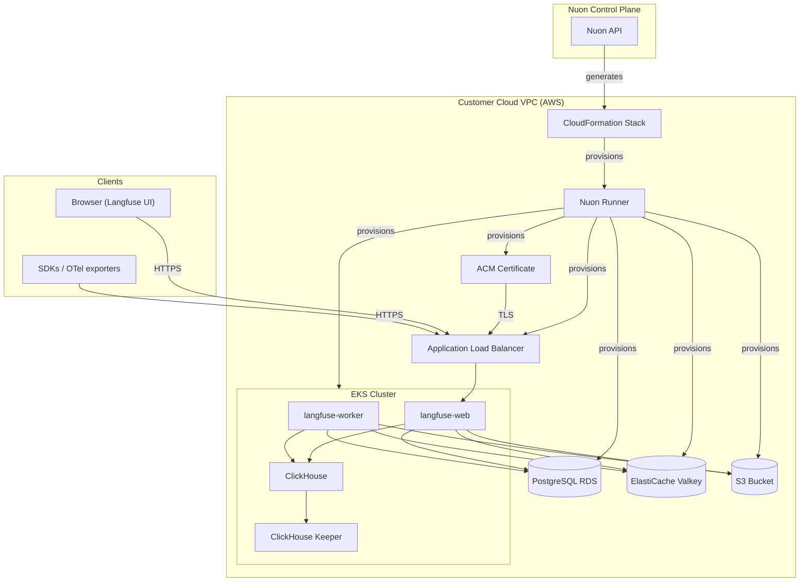

Langfuse Access URL: [https://{{.nuon.install.sandbox.outputs.nuon_dns.public_domain.name}}](https://{{.nuon.install.sandbox.outputs.nuon_dns.public_domain.name}})

Nuon Install Id: {{ .nuon.install.id }}

AWS Region: {{ .nuon.install_stack.outputs.region }}

## Getting Started

[Langfuse](https://langfuse.com) is an open-source LLM observability and tracing platform. Your install runs full-plane in your AWS account — every component (web, worker, Postgres, ClickHouse, Keeper, Valkey, S3) lives in your VPC with no tether back to Langfuse Cloud.

Open the Langfuse Access URL above and sign in with the headless-init admin user.

**To retrieve your admin credentials:**

1. In the Nuon dashboard, go to this install
2. Open the **Actions** tab
3. Run the `admin_password` action
4. The output displays the URL, email (`admin@langfuse.local`), and the generated password

The `admin_password` action also runs automatically post-deploy, so the credentials appear in the install's workflow output the first time langfuse comes up.

The org (`Demo Organization`), project (`Demo Project`), and a starter public/secret API key pair are also pre-seeded by the headless init — see `LANGFUSE_INIT_*` env vars in `components/values/langfuse.yaml`.

## Verify with a Real Trace

The `seed_demo_traces` action runs a small tool-using Claude agent against this install's Langfuse API and writes a real trace tree.

1. Set `anthropic_api_key` on the install (**Manage → Edit Inputs**).
2. Run the action: **Actions → `seed_demo_traces` → Run**.
3. Open the Langfuse Access URL, log in, navigate to `Demo Project` → Traces. The agent run should appear within seconds.

## Architecture

## Configuration

The following inputs can be changed at any time from **Manage → Edit Inputs** in the Nuon dashboard.

| Input | Default | Description |
|---|---|---|
| `anthropic_api_key` | _(empty)_ | Anthropic API key used by the `seed_demo_traces` action to generate a real trace tree |
| `telemetry` | `true` | Send anonymized usage telemetry to Langfuse |
| `license_key` | _(empty)_ | Langfuse Enterprise license key (optional; OSS features work without it) |
| `web_replicas` | `2` | Number of `langfuse-web` pods |
| `worker_replicas` | `2` | Number of `langfuse-worker` pods |
| `langfuse_db_instance_type` | `db.t4g.micro` | RDS Postgres instance class |
| `langfuse_db_storage_gb` | `20` | RDS Postgres allocated storage (GB) |
| `clickhouse_replicas` | `1` | ClickHouse cluster replica count (single-shard only — scale vertically, not by sharding) |
| `clickhouse_disk_size` | `20Gi` | ClickHouse pod EBS volume size |

Changing inputs triggers a redeploy of the affected components. The workflow shows a diff and pauses for approval before applying.

## What This Deploys

- EKS Auto Mode cluster (`nuonco/aws-eks-auto-sandbox`)
- RDS PostgreSQL (single instance) — transactional store: users, orgs, projects, encrypted API keys
- ClickHouse cluster (Altinity operator, single-shard, replicated) — OLAP store: traces, observations, scores
- ClickHouse Keeper (vanilla StatefulSet, single node) — raft coordination for replicated tables
- ElastiCache Valkey (`cache.t4g.micro`, single node) — BullMQ queue + cache, `maxmemory-policy=noeviction`
- S3 bucket with KMS encryption + IRSA — raw event payloads, multimodal media, batch exports
- Langfuse Helm release — `langfuse-web` and `langfuse-worker` deployments
- ALB + ACM certificate — public HTTPS access to the Langfuse UI and API

## Notes

- ClickHouse is deployed via the [Altinity clickhouse-operator](https://github.com/Altinity/clickhouse-operator), but Keeper is deployed as a vanilla StatefulSet — the operator's `ClickHouseKeeperInstallation` reconciler is incomplete in current chart versions and creates the surrounding resources but never the StatefulSet itself.
- Langfuse only supports single-shard ClickHouse clusters; scale vertically by raising replica count and disk size, not by sharding.
- `ENCRYPTION_KEY`, `NEXTAUTH_SECRET`, and `SALT` are generated by an install-time action and persisted in `langfuse-secrets`. Re-running the action is idempotent — it does not rotate keys, since rotating `ENCRYPTION_KEY` would break encrypted column reads.
- Postgres, ClickHouse, and Redis/Valkey all run UTC (a Langfuse requirement).
- ElastiCache Valkey runs without auth or TLS; security is the private subnet + SG ingress restriction. For production, enable `transit_encryption` and `auth_token` in the TF module and wire `existingSecret` into the helm values.

## Resources

[Langfuse Documentation](https://langfuse.com/docs)

[Langfuse Self-Hosting Guide](https://langfuse.com/self-hosting)

[Langfuse Helm Chart](https://github.com/langfuse/langfuse-k8s)

[Langfuse GitHub](https://github.com/langfuse/langfuse)

[Anthropic API Console](https://console.anthropic.com)
