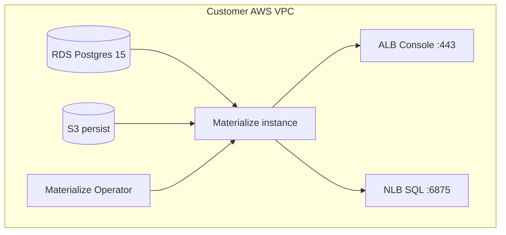

Console URL: [https://{{.nuon.install.sandbox.outputs.nuon_dns.public_domain.name}}](https://{{.nuon.install.sandbox.outputs.nuon_dns.public_domain.name}})

SQL host: `sql.{{.nuon.install.sandbox.outputs.nuon_dns.public_domain.name}}` (port `6875`)

Nuon Install Id: {{ .nuon.install.id }}

AWS Region: {{ .nuon.install_stack.outputs.region }}

[Materialize](https://materialize.com) is a real-time data platform with a Postgres-compatible SQL interface. You define views and materialized views over streaming and transactional sources; Materialize keeps those results continuously up to date as the underlying data changes—useful for live dashboards, operational “current state” queries, CQRS-style read offload, and feeding fresh context into apps or AI pipelines.

This Nuon app config installs **Self-Managed Materialize** in your AWS VPC (BYOC): EKS, RDS Postgres (metadata), S3 (persist), the Materialize Operator, and one Materialize instance. Your data stays in your account; you connect via the Console URL and SQL host above.

## License key (required)

Self-Managed Materialize v26+ requires a license key. This install will not start without one: the `license_key` Nuon secret is required, and the `backend_secret` action fails if it is missing.

Get a key before installing:

- Community (free): [https://materialize.com/self-managed/community-license/](https://materialize.com/self-managed/community-license/) — or the License page in Materialize Cloud if you already have an account
- Enterprise: [https://materialize.com/self-managed/enterprise-license/](https://materialize.com/self-managed/enterprise-license/)

Set the value as the install’s **license_key** secret (CloudFormation parameter / Nuon secrets). Nuon syncs it into the `materialize-environment` namespace as Kubernetes Secret `materialize-license`.

## Connect to the Console

1. Open the Console URL above.
2. Log in as `mz_system` with the password from the `mz_system_password` action (Actions tab), or:

```bash
kubectl -n materialize-environment get secret materialize-backend \
  -o jsonpath='{.data.external_login_password_mz_system}' | base64 -d; echo
```

3. Create your own users, then avoid day-to-day use of `mz_system` (the operator uses it for maintenance).

## Connect with SQL (psql / Postgres clients)

Materialize speaks the Postgres wire protocol on port **6875** via an NLB Service (`mz-sql`).

```bash
psql "postgres://mz_system@sql.{{.nuon.install.sandbox.outputs.nuon_dns.public_domain.name}}:6875/materialize"
```

When prompted, use the same `mz_system` password as the Console.

Any Postgres-compatible driver or tool (JDBC, psycopg, BI tools with a Postgres connector) can use the same host and port.

## Demo data (Auction load generator)

Materialize does not ship a separate downloadable dataset. Demo data comes from built-in [load generators](https://materialize.com/docs/sql/create-source/load-generator/). This install seeds the official [quickstart](https://materialize.com/docs/get-started/quickstart/) **AUCTION** generator via the `seed_auction_demo` action (runs automatically after the SQL NLB deploys; also runnable from the Actions tab).

After seeding, try in the Console SQL Shell or `psql`:

```sql
SELECT * FROM auctions LIMIT 5;
SELECT * FROM bids LIMIT 5;
SELECT * FROM winning_bids ORDER BY bid_time DESC LIMIT 10;
```

## Architecture



## Components

| Component | Purpose |
| --- | --- |
| `rds_subnet` / `rds_materialize` | Metadata Postgres |
| `s3_persist` | Persist bucket + EKS Pod Identity for SA `main` |
| `materialize_operator` | Operator Helm chart (`v1` CRD) |
| `materialize_cluster_issuer` | Self-signed ClusterIssuer for internal certs |
| `materialize_instance` | Materialize CR (`main`) |
| `certificate` / `application_load_balancer` | HTTPS Console |
| `sql_nlb` | Public NLB for SQL on 6875 |

## Actions

| Action | Purpose |
| --- | --- |
| `backend_secret` | Builds `materialize-backend` from RDS + S3 + license (runs after operator deploy) |
| `mz_system_password` | Prints Console URL, SQL host, and `mz_system` password |
| `seed_auction_demo` | Creates AUCTION load-generator source, tables, `winning_bids` view + index |
