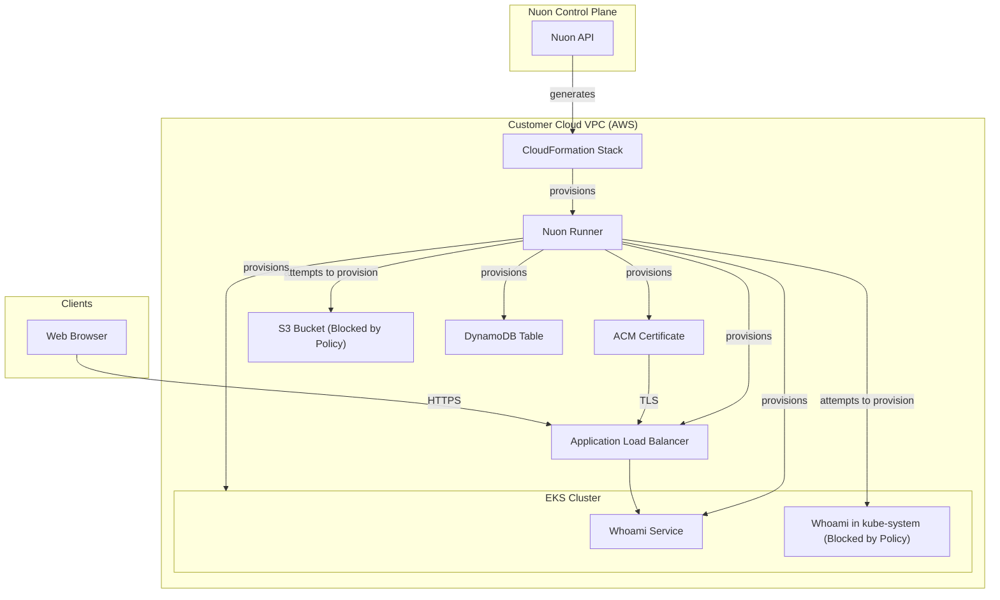

### What this app does?

This is a demonstration application that showcases [Nuon Policies](https://docs.nuon.co/concepts/policies) in action. It deploys a simple whoami service on AWS EKS Auto Mode alongside intentionally misconfigured components that trigger various policy violations. This app helps you understand how Nuon enforces security, compliance, and operational guardrails on production BYOC deployments.

### Prerequisites

- AWS account connected to Nuon (handled during onboarding)

### How to install/What to expect next?

- Clicking install will generate a link for you to log into AWS and create a CloudFormation stack which creates the VPC, EC2 VM, and a runner, an agent that receives jobs to deploy the app in your VPC
- **Expected behavior**: Several components will fail to deploy due to intentional policy violations — this is the demonstration working as designed
- If configured, you may be prompted to approve plan steps
- Average installation time is 45 minutes due to creating the VPC, AWS EKS cluster with auto mode, and app components
- Navigate to the Workflow tab to view Policy Evaluation results for each step

### What gets deployed in your cloud account?

- Dedicated VPC
- AWS EKS Kubernetes cluster with auto mode
- Whoami service deployment (intentionally uses non-ECR image, triggering policy)
- ACM wildcard certificate
- Application load balancer
- S3 bucket component (blocked by policy)
- DynamoDB table (update blocked by policy after first deploy)
- Additional whoami deployment to kube-system namespace (blocked by policy)

### Policy Scenarios Demonstrated

This app includes 6 policy scenarios that automatically trigger during installation and redeployment:

**1. Public EKS Endpoint** (Sandbox / OPA)
- **Enforcement**: warn
- **What Happens**: Warns about public cluster endpoint but allows deployment

**2. S3 Bucket Creation** (Terraform / OPA)
- **Enforcement**: deny
- **What Happens**: Blocks S3 bucket creation entirely

**3. Database Modification** (Terraform / OPA)
- **Enforcement**: deny
- **What Happens**: Allows initial deploy, blocks subsequent updates

**4. Restricted Namespaces** (Helm / OPA)
- **Enforcement**: deny
- **What Happens**: Blocks deployments to kube-system namespace

**5a. Runner-Only Access** (Sandbox / OPA)
- **Enforcement**: deny
- **What Happens**: Blocks non-runner IAM principals (latent)

**5b. ECR Images Only** (Helm / OPA)
- **Enforcement**: deny
- **What Happens**: Blocks non-ECR container images

### What inputs can you enter?

- AWS region
- Whoami service name and subdomain
- DynamoDB billing mode (change after first deploy to trigger policy #3)

### Viewing Policy Results

1. Navigate to your install in the Nuon Dashboard
2. Click the **Workflow** tab
3. Select any workflow step to view the **Policy Evaluation** card
4. Green checkmarks indicate passed policies, red indicators show denials with violation messages, orange shows warnings

### Testing Policy Violations

**Scenario 3 (Database Modification)**: To trigger this policy after initial deployment:
1. Go to **Manage → Edit Inputs**
2. Change `billing_mode` from `PAY_PER_REQUEST` to `PROVISIONED`
3. Click **Update Inputs** and redeploy
4. The policy will deny the update with: *"Database modification denied: changes could cause downtime"*

### Break Glass Access

This app includes a break-glass IAM role configuration that grants emergency administrative access to your AWS account while denying access to Secrets Manager. The break-glass role can be assumed when immediate troubleshooting is required outside normal operational workflows.

### Security & compliance

- [Nuon BYOC trust center](https://docs.nuon.co/guides/vendor-customers)
- All resource provisioning and scripts are performed by an agent in a VM in your VPC - no cross-account access granted to the vendor
- All secrets created by you or auto-generated and stored in AWS Secrets Manager in your VPC
- Policies enforce security boundaries on infrastructure and Kubernetes resources

### Nuon concepts

The following terminology is core to the Nuon BYOC platform.

#### Connect Your App | App Config
- App (collection of TOML config files that provision and manage the app in your cloud account)
- Sandbox (the underlying infrastructure, in this case EKS Kubernetes cluster with auto mode)
- Component (the Terraform modules, Helm charts, and Kubernetes manifests that deploy the application resources)
- Inputs (dynamic values specific to the install e.g., subdomain, database billing mode)
- Policies (OPA rules that enforce compliance and security guardrails on Terraform plans, Helm charts, and Kubernetes manifests)
- Break Glass (emergency access IAM roles with elevated permissions for incident response)

#### Support Customer Infrastructure | Customer Config

- Installs (Installs are instances of an application in your (the customer) cloud account.)
- Stack (the AWS CloudFormation stack that provisions the VPC, subnets, IAM roles, ASG, EC2 VM and Runner (agent) Docker service)
- Runners (Egress-only agents deployed in customer cloud accounts that execute all provisioning, deployment, and day-2 operations.)
- Operational Roles (IAM roles to perform different operations for least-privilege access across sandbox, components, and actions.)

#### Continuous Delivery | Day-2 Operations

- Workflows (Orchestration of the deployment, update & teardown lifecycle of apps, components, and actions)
- Actions (Bash scripts for health checks, migrations, debugging, and day-2 operations)
- Policies (Rego & Kyverno configs to enforce compliance and security rules at infrastructure plan steps)
- Customer Portal (A customer-facing web dashboard to initiate and monitor an app's install in a customer's VPC)

### Resources

- [Nuon Policies Documentation](https://docs.nuon.co/concepts/policies)
- [Getting Started Guide](https://docs.nuon.co/get-started/quickstart)
- [Nuon App Install Lifecycle](https://docs.nuon.co/guides/app-install-life-cycle)