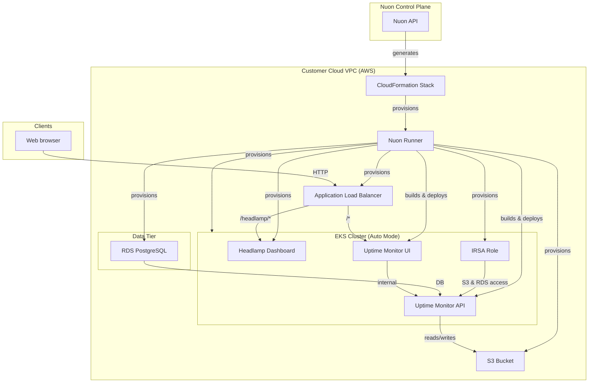

### What this app does?

A real-time website uptime monitoring service with a web UI, API backend, PostgreSQL database, S3 storage, and a Kubernetes dashboard (Headlamp). This app also demonstrates Nuon's drift detection across Terraform, Kubernetes, and Helm components.

### Prerequisites

- A valid AWS account

### How to install/What to expect next?

- Clicking install will generate a link for you to log into AWS and create a CloudFormation stack which creates the VPC, EC2 VM, and a runner, an agent that receives jobs to deploy the Uptime Monitor in your VPC
- If configured, you may be prompted to approve plan steps
- Average installation time is 45 minutes due to creating the VPC, ASG, VM, AWS EKS cluster, RDS database, and other app components

### What gets deployed in your cloud account?

- Dedicated VPC
- AWS EKS Kubernetes cluster (Auto Mode)
- Uptime Monitor API and UI (Docker images built and deployed to EKS)
- RDS PostgreSQL database
- S3 bucket for storage
- IAM Roles for Service Accounts (IRSA)
- Headlamp Kubernetes dashboard via Helm
- Application load balancer with path-based routing
- Automated actions: RDS credential sync, Headlamp auth token, hourly healthcheck data cleanup

### What inputs can you enter?

- Healthcheck interval (seconds) — how often sites are checked for uptime

### Security & compliance

- [Nuon BYOC trust center](https://docs.nuon.co/guides/vendor-customers)
- All resource provisioning and scripts are performed by an agent in a VM in your VPC - no cross-account access granted to the vendor
- RDS credentials managed via AWS Secrets Manager and synced to Kubernetes secrets
- IRSA provides least-privilege S3 and RDS access scoped to this install

### Nuon concepts

The following terminology is core to the Nuon BYOC platform.

#### Connect Your App | App Config
- App (collection of TOML config files that provision and manage the Uptime Monitor app in your cloud account)
- Sandbox (the underlying infrastructure, in this case an EKS Kubernetes cluster with Auto Mode)
- Component (Docker builds, Terraform, Kubernetes manifests, and Helm charts to deploy the API, UI, Headlamp, RDS, S3, IRSA, and ALB)
- Inputs (dynamic values specific to the install e.g., healthcheck interval)
- Secrets (sensitive values either auto-created or entered by the customer during Stack creation - stored in AWS Secrets Manager)

#### Support Customer Infrastructure | Customer Config

- Installs (Installs are instances of an application in your (the customer) cloud account.)
- Stack (the AWS CloudFormation stack that provisions the VPC, subnets, IAM roles, ASG, EC2 VM and Runner (agent) Docker service)
- Runners (Egress-only agents deployed in customer cloud accounts that execute all provisioning, deployment, and day-2 operations.)
- Operational Roles (IAM roles to perform different operations for least-privilege access across sandbox, components, and actions.)

#### Continuous Delivery | Day-2 Operations

- Workflows (Orchestration of the deployment, update & teardown lifecycle of apps, components, and actions)
- Actions (Bash scripts for health checks, migrations, debugging, and day-2 operations — including RDS credential sync, Headlamp token generation, and hourly healthcheck data cleanup)
- Customer Portal (A customer-facing web dashboard to initiate and monitor an app's install in a customer's VPC)
